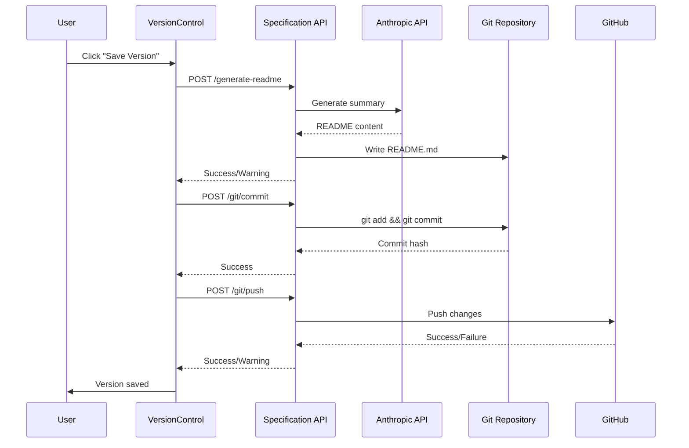

# Enabler: Execute Git Commit Operations

## Metadata
- **ID**: ENB-100021
- **Name**: Execute Git Commit Operations
- **Type**: Enabler
- **Parent Capability**: CAP-100003 (Version Control Integration)
- **Status**: Implemented
- **Approval**: Approved
- **Priority**: High
- **Last Updated**: 2025-12-30

## Purpose

Handle the creation of git commits including README generation, local commit, and remote push operations. This enabler orchestrates the "Save Version" workflow that preserves specification changes.

## Technical Context

### Implementation Location
- **File**: `web-ui/src/context/VersionControlContext.tsx`
- **Function**: `saveVersion`

### Dependencies
- Specification API git endpoints
- Anthropic API for README generation
- GitHub token for push authentication

## Requirements

### Functional Requirements

#### FR-1: Save Version Workflow
**Description**: Execute the complete save version workflow.

**Steps**:
1. Generate/update README.md from conception folder
2. Commit all changes with user message
3. Push to remote repository

**Input**:
```typescript
message: string; // Commit message from user
```

**Output**:
```typescript
success: boolean;
```

**Business Rules**:
1. README generation failure doesn't fail commit
2. Push failure doesn't fail commit (local success)
3. Files list comes from git status

#### FR-2: README Generation
**Description**: Generate README.md from conception folder contents.

**Input**:
```typescript
{
  workspace: string;  // Path to workspace
  apiKey?: string;    // Anthropic API key
}
```

**Output**:
- README.md created/updated in workspace root
- Uses AI to summarize conception folder contents

**Business Rules**:
1. Optional - warn but don't fail if no API key
2. Silent failure - commit proceeds regardless

#### FR-3: Push to Remote
**Description**: Push committed changes to remote repository.

**Input**:
```typescript
{
  workspace: string;
  setUpstream: boolean;
  token?: string;  // GitHub personal access token
}
```

**Business Rules**:
1. Optional - commit succeeds even if push fails
2. Set upstream on first push
3. Use token for authentication if provided

### Non-Functional Requirements

#### NFR-1: Error Isolation
- Each step can fail independently
- Partial success is acceptable
- User informed of partial failures

#### NFR-2: Logging
- Console logging for debug purposes
- Status messages for user feedback

## Technical Specifications

### Save Version Implementation

```typescript
const saveVersion = useCallback(async (message: string): Promise<boolean> => {
  if (!workspacePath) return false;

  setLoading(true);
  try {
    // Step 0: Generate/Update README.md
    try {
      const apiKey = getAnthropicApiKey();
      const readmeResponse = await fetch(`${SPEC_API_URL}/generate-readme`, {
        method: 'POST',
        headers: { 'Content-Type': 'application/json' },
        body: JSON.stringify({
          workspace: workspacePath,
          apiKey: apiKey || undefined,
        }),
      });

      if (readmeResponse.ok) {
        console.log('[Version Control] README.md generated successfully');
      } else {
        console.warn('[Version Control] README generation skipped');
      }
    } catch (readmeErr) {
      console.warn('[Version Control] Could not generate README:', readmeErr);
    }

    // Step 1: Create commit locally
    const commitResponse = await fetch(`${SPEC_API_URL}/git/commit`, {
      method: 'POST',
      headers: { 'Content-Type': 'application/json' },
      body: JSON.stringify({
        workspace: workspacePath,
        message,
        files: state.status?.unstaged || [],
      }),
    });

    if (!commitResponse.ok) {
      const error = await commitResponse.json();
      throw new Error(error.message || 'Failed to save version');
    }

    // Step 2: Push to remote (optional)
    try {
      const token = getGitHubToken();
      const pushResponse = await fetch(`${SPEC_API_URL}/git/push`, {
        method: 'POST',
        headers: { 'Content-Type': 'application/json' },
        body: JSON.stringify({
          workspace: workspacePath,
          setUpstream: true,
          token: token || undefined,
        }),
      });

      if (!pushResponse.ok) {
        console.warn('Push failed (commit succeeded)');
      }
    } catch (pushErr) {
      console.warn('Could not push to remote:', pushErr);
    }

    await refreshStatus();
    return true;
  } catch (err) {
    setError(err instanceof Error ? err.message : 'Failed to save version');
    return false;
  }
}, [workspacePath, state.status, refreshStatus]);
```

### API Key Retrieval

```typescript
const getAnthropicApiKey = (): string | null => {
  // Primary: Settings page
  const settingsKey = localStorage.getItem('anthropic_api_key');
  if (settingsKey && settingsKey.trim()) {
    return settingsKey;
  }

  // Secondary: Integrations config
  const config = localStorage.getItem('integration_config_anthropic');
  if (config) {
    try {
      const parsed = JSON.parse(config);
      // Look for key in various field names
      const keyFieldNames = [
        'api_key', 'API Key', 'apiKey', 'ANTHROPIC_API_KEY'
      ];
      for (const fieldName of keyFieldNames) {
        if (parsed.fields[fieldName]) {
          return parsed.fields[fieldName];
        }
      }
    } catch {
      // Ignore parse errors
    }
  }

  return null;
};
```

## Sequence Diagram



## Test Scenarios

| ID | Scenario | Expected Result |
|----|----------|-----------------|
| TS-100040 | Save with valid message | Commit created, pushed |
| TS-100041 | Save without API key | README skipped, commit succeeds |
| TS-100042 | Save without GitHub token | Commit succeeds, push fails silently |
| TS-100043 | Save with no changes | Commit fails with message |
| TS-100044 | Save with no remote | Commit succeeds, push skipped |
