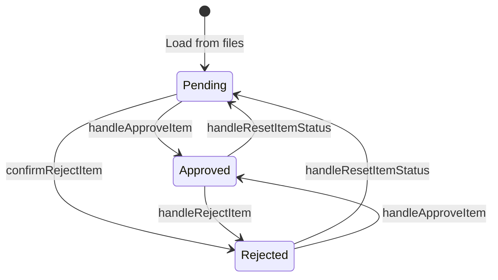

# Enabler: Execute Item Approval Processing

## Metadata
- **ID**: ENB-100001
- **Name**: Execute Item Approval Processing
- **Type**: Enabler
- **Parent Capability**: CAP-100001 (Intent Phase Approval Management)
- **Status**: Implemented
- **Approval**: Approved
- **Priority**: High
- **Last Updated**: 2025-12-30

## Purpose

Handle the approval, rejection, and reset of individual intent declaration items (vision, ideation, storyboard cards). This enabler ensures that approval decisions are persisted to the database as the single source of truth and provides optimistic UI updates for responsive user experience.

## Technical Context

### Implementation Location
- **File**: `web-ui/src/pages/IntentApproval.tsx`
- **Functions**: `handleApproveItem`, `handleRejectItem`, `confirmRejectItem`, `handleResetItemStatus`

### Dependencies
- EntityStateContext for database operations
- WorkspaceContext for workspace identification
- INTENT State Model types

## Requirements

### Functional Requirements

#### FR-1: Approve Item
**Description**: Allow users to approve an intent item, updating its state in the database.

**Input**:
```typescript
item: IntentItem {
  id: string;
  entityId: string;
  name: string;
  type: 'vision' | 'ideation' | 'storyboard';
  path?: string;
}
```

**Output**:
- Database updated with approved status
- UI updated optimistically
- Success feedback message displayed

**Business Rules**:
1. Item must have valid entityId
2. Workspace must be selected
3. If item exists in DB: use updateStoryCard (preserves position)
4. If item is new: use syncStoryCard to create

#### FR-2: Reject Item
**Description**: Allow users to reject an intent item with a required comment.

**Input**:
```typescript
item: IntentItem;
rejectionComment: string; // Required, non-empty
```

**Output**:
- Database updated with rejected status and comment
- UI shows rejection badge and reason
- Item marked as blocked

**Business Rules**:
1. Rejection comment is mandatory
2. Comment stored in change_reason field
3. stage_status set to 'blocked'

#### FR-3: Reset Item Status
**Description**: Reset an approved or rejected item back to pending.

**Input**:
```typescript
item: IntentItem;
```

**Output**:
- Database updated with pending status
- UI returns to draft state
- Previous approval/rejection cleared

### Non-Functional Requirements

#### NFR-1: Optimistic UI Updates
- UI must update immediately on action
- Rollback to previous state on API failure
- Loading indicator shown during processing

#### NFR-2: Error Handling
- Display specific error messages for failures
- Validate prerequisites before operations
- Auto-clear feedback after 5 seconds

## Technical Specifications

### State Transitions



### API Integration

```typescript
// Approve existing item
await updateStoryCard(item.entityId, {
  lifecycle_state: 'active',
  workflow_stage: 'intent',
  stage_status: 'approved',
  approval_status: 'approved',
  version: existingCard.version,
});

// Approve new item
await syncStoryCard({
  card_id: item.entityId,
  title: item.name,
  workspace_id: currentWorkspace.name,
  lifecycle_state: 'active',
  workflow_stage: 'intent',
  stage_status: 'approved',
  approval_status: 'approved',
});
```

### Error Handling Pattern

```typescript
try {
  // Optimistic update
  updateItemStatus(item, 'approved');

  // Database operation
  await syncStoryCard({...});

  // Refresh state
  await refreshWorkspaceState();

  // Success feedback
  setFeedbackMessage({ type: 'success', message: '...' });
} catch (err) {
  // Rollback optimistic update
  updateItemStatus(item, previousStatus);

  // Error feedback
  setFeedbackMessage({ type: 'error', message: '...' });
}
```

## Test Scenarios

| ID | Scenario | Expected Result |
|----|----------|-----------------|
| TS-100001 | Approve item with valid entityId | Item approved, UI updated |
| TS-100002 | Approve item without entityId | Warning message, no action |
| TS-100003 | Reject item with comment | Item rejected, comment stored |
| TS-100004 | Reject item without comment | Button disabled |
| TS-100005 | Reset approved item | Item returns to pending |
| TS-100006 | API failure during approve | Rollback UI, show error |
