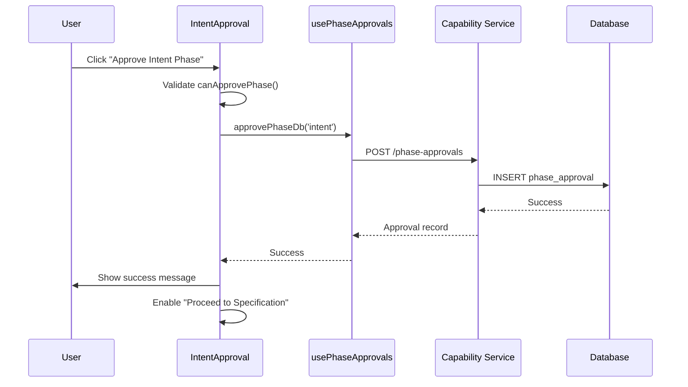

# Enabler: Execute Phase Approval Processing

## Metadata
- **ID**: ENB-100002
- **Name**: Execute Phase Approval Processing
- **Type**: Enabler
- **Parent Capability**: CAP-100001 (Intent Phase Approval Management)
- **Status**: Implemented
- **Approval**: Approved
- **Priority**: High
- **Last Updated**: 2025-12-30

## Purpose

Handle the approval and revocation of the Intent phase as a whole. This enabler manages the phase-level gate that controls progression from Intent to Specification stage in the INTENT workflow.

## Technical Context

### Implementation Location
- **File**: `web-ui/src/pages/IntentApproval.tsx`
- **Functions**: `handleApproveIntent`, `handleRevokeApproval`
- **Hook**: `usePhaseApprovals` from EntityStateContext

### Dependencies
- EntityStateContext.usePhaseApprovals hook
- Phase approval database API

## Requirements

### Functional Requirements

#### FR-1: Approve Intent Phase
**Description**: Mark the entire Intent phase as approved when all items pass review.

**Preconditions**:
- All vision items approved (count > 0)
- All ideation items approved (count > 0)
- All storyboard items approved (count > 0)
- Zero rejected items across all sections

**Input**:
```typescript
phaseName: 'intent';
workspaceId: string;
```

**Output**:
- Phase approval record created in database
- Approval timestamp recorded
- Specification phase navigation enabled

**Business Rules**:
1. Cannot approve with any rejected items
2. Cannot approve with empty sections
3. Approval is workspace-specific

#### FR-2: Revoke Phase Approval
**Description**: Remove the phase-level approval without affecting individual items.

**Input**:
```typescript
phaseName: 'intent';
```

**Output**:
- Phase approval removed from database
- Individual item approvals preserved
- Specification phase navigation locked

**Business Rules**:
1. Individual item approvals remain intact
2. User can re-approve after making changes
3. Warning message shown on revocation

#### FR-3: Check Phase Approval Status
**Description**: Determine if the Intent phase is currently approved.

**Output**:
```typescript
{
  intentApproved: boolean;
  approvalDate: string | null;
}
```

### Non-Functional Requirements

#### NFR-1: Loading States
- Show loading spinner during phase operations
- Disable action buttons while processing

#### NFR-2: Navigation Control
- Show "Proceed to Specification" only when approved
- Show revoke option only when approved

## Technical Specifications

### Phase Approval Check Logic

```typescript
const canApprovePhase = () => {
  return (
    phaseStatus.vision.total > 0 &&
    phaseStatus.ideation.total > 0 &&
    phaseStatus.storyboard.total > 0 &&
    getTotalItems() === getTotalApproved() &&
    getTotalRejected() === 0
  );
};
```

### State Derivation from Database

```typescript
// Phase approval state from database
const intentApproved = isPhaseApproved('intent');
const intentPhaseApproval = phaseApprovals.get('intent');
const approvalDate = intentPhaseApproval?.approved_at || null;
```

### API Integration

```typescript
// Approve phase
const result = await approvePhaseDb('intent');

// Revoke phase
const result = await revokePhaseDb('intent');
```

### UI State Rendering

| State | Progress Circle | Status Text | Action Button |
|-------|----------------|-------------|---------------|
| Not started | Gray 0% | "Review in Progress" | Disabled "Approve" |
| In progress | Blue X% | "Review in Progress" | Disabled "Approve" |
| Has rejections | Red X% | "Items Need Revision" | Disabled "Approve" |
| Ready | Blue 100% | "Ready for Approval" | Enabled "Approve" |
| Approved | Green 100% | "Intent Phase Approved" | "Proceed" + "Revoke" |

## Sequence Diagram



## Test Scenarios

| ID | Scenario | Expected Result |
|----|----------|-----------------|
| TS-100010 | Approve phase with all items approved | Phase approved, navigate enabled |
| TS-100011 | Approve phase with rejected items | Button disabled, cannot approve |
| TS-100012 | Approve phase with empty section | Button disabled, requirements shown |
| TS-100013 | Revoke approved phase | Phase unapproved, items unchanged |
| TS-100014 | Check approval status on load | Correct state from database |
