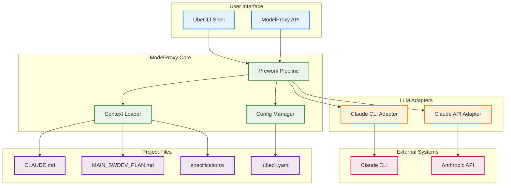
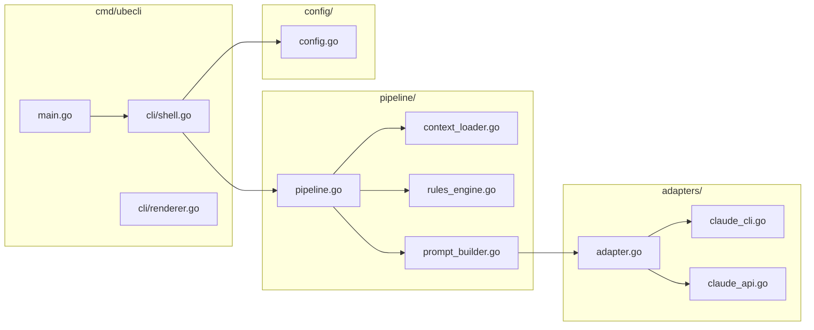
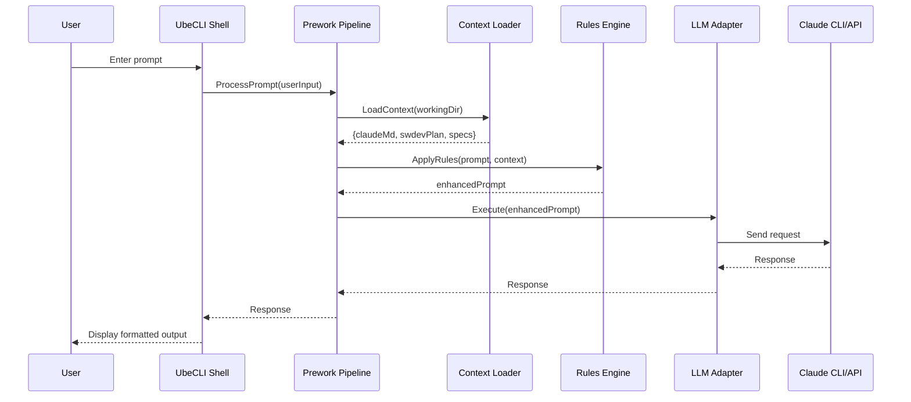

# LLM Request Interception (ModelProxy) Capability

## Metadata

| Field | Value |
|-------|-------|
| **Name** | LLM Request Interception (ModelProxy) |
| **Type** | Capability |
| **System** | IntentR |
| **Component** | ModelProxy / UbeCLI |
| **ID** | CAP-759314 |
| **Owner** | Development Team |
| **Status** | Implemented |
| **Approval** | Approved |
| **Priority** | High |
| **Implementation Location** | `cmd/ubecli/` |
| **Last Verified** | 2025-12-14 |

---

## Technical Overview

### Purpose

The LLM Request Interception capability (ModelProxy) provides a **generic, LLM-agnostic** system for intercepting, transforming, and forwarding LLM requests before they reach any target language model. This ensures that all AI interactions within the IntentR ecosystem adhere to project rules, INTENT methodology requirements, and organizational policies - regardless of which LLM backend is used.

The capability is implemented as **UbeCLI** - an interactive command-line interface that provides a familiar CLI coding assistant experience with automatic context injection and INTENT rule enforcement.

**LLM-Agnostic Design**:
The system is designed with a pluggable adapter architecture that supports multiple LLMs:
- **Claude CLI** - Local Claude Code CLI tool (`@anthropic-ai/claude-code`)
- **OpenAI Codex CLI** - Local Codex CLI tool (`@openai/codex`)
- **Mock Adapter** - For testing without actual LLM calls
- **Any future LLM** via adapter interface

**Key Implementation Features**:
- **5-Stage Prework Pipeline**: Context Load → Rule Application → Approval Validation → Prompt Build → Format
- **Automatic Context Injection**: Loads CLAUDE.md, MAIN_SWDEV_PLAN.md, and referenced specifications
- **INTENT Approval Enforcement**: Validates approval status of referenced capabilities/enablers
- **Interactive Shell**: Full REPL with multi-line input, history, and slash commands
- **Configurable via YAML**: Hierarchical configuration with defaults → global → project → env → CLI overrides
- **Context Caching**: 5-minute TTL cache with modification time checking

---

## Business Context

### Problem Statement

When developers use LLM tools like Claude CLI for code generation or assistance, they must manually ensure:
1. Project-specific rules (CLAUDE.md) are followed
2. INTENT methodology constraints are enforced
3. Approval workflows are respected
4. Context from specifications is included

This manual process is error-prone and inconsistent. Developers may forget to include critical context, leading to AI outputs that violate project standards or skip required approval gates.

### Value Proposition

ModelProxy automates the enforcement of project rules and context injection:
- **Consistency**: Every LLM interaction includes required project context
- **Compliance**: INTENT approval workflows are automatically enforced
- **Productivity**: Developers don't need to manually copy/paste context
- **Auditability**: All LLM interactions are logged for review
- **Flexibility**: Supports multiple LLM backends (Claude CLI, Claude API, future LLMs)

### Success Metrics

| Metric | Target |
|--------|--------|
| Rule Compliance Rate | 100% of requests include required context |
| Response Latency Overhead | < 100ms additional latency from prework |
| Developer Adoption | 80% of team using UbeCLI within 30 days |
| Configuration Errors | < 5% of requests fail due to config issues |

---

## User Perspective

### Primary Persona

**Developer** - A software developer working on IntentR or related projects who needs AI assistance for code generation, refactoring, or analysis while adhering to project standards.

### User Journey (Before/After)

**Before (Current State)**:
1. Developer opens Claude CLI
2. Developer manually reads CLAUDE.md to understand rules
3. Developer copies relevant context from specification files
4. Developer crafts prompt including copied context
5. Developer submits to Claude CLI
6. Developer receives response (may violate rules if context was incomplete)

**After (With ModelProxy/UbeCLI)**:
1. Developer opens UbeCLI
2. Developer types their prompt naturally
3. ModelProxy automatically loads CLAUDE.md, MAIN_SWDEV_PLAN.md, and relevant specifications
4. ModelProxy validates request against approval requirements
5. Enhanced prompt is sent to Claude CLI
6. Developer receives response that adheres to all project rules

### User Scenarios

1. **Basic Code Generation**:
   - Input: "Create a new REST endpoint for user profile updates"
   - Prework: Inject CLAUDE.md, check for capability/enabler specs, add INTENT workflow rules
   - Output: Code that follows project patterns with proper error handling

2. **Specification Compliance**:
   - Input: "Implement ENB-931848"
   - Prework: Load enabler specification, inject requirements, verify approval status
   - Output: Implementation that matches all functional requirements OR rejection if not approved

3. **Discovery Mode**:
   - Input: "Analyze the authentication module and document it"
   - Prework: Inject discovery rules (no code changes, documentation only)
   - Output: Documentation following INTENT discovery phase rules

---

## Boundaries

### In Scope

- Interactive CLI (UbeCLI) with Claude CLI-like experience
- HTTP API for programmatic access
- Prework pipeline with configurable stages
- Context loading from CLAUDE.md, MAIN_SWDEV_PLAN.md, specifications/
- LLM adapter for Claude CLI
- LLM adapter for Claude API
- Configuration file support (.ubecli.yaml)
- Request/response logging
- Basic rate limiting

### Out of Scope

- Web UI for UbeCLI (CLI only for v1)
- LLM adapters for non-Claude models (future enhancement)
- Multi-user authentication (uses system user)
- Cloud deployment (local execution only for v1)
- Fine-tuning or model training
- Cost tracking/billing

### Assumptions

- Claude CLI is installed and accessible on the host machine
- ANTHROPIC_API_KEY is available in environment for API adapter
- Project has CLAUDE.md and/or MAIN_SWDEV_PLAN.md files
- User has read/write access to project directory

### Constraints

- Must not add more than 100ms latency to requests
- Must be a single binary for easy distribution
- Must work offline (except for actual LLM calls)
- Must preserve Claude CLI user experience patterns

---

## Enablers

This capability is supported by the following enablers:

| Enabler ID | Name | Purpose | Status | Implementation |
|------------|------|---------|--------|----------------|
| ENB-759321 | UbeCLI Interactive Shell | Provides Claude CLI-like interactive experience with REPL, multi-line input, slash commands | Implemented | `cmd/ubecli/cli/shell.go` |
| ENB-759322 | Prework Pipeline | Orchestrates 5-stage prompt transformation (context, rules, approval, build, format) | Implemented | `cmd/ubecli/pipeline/pipeline.go` |
| ENB-759323 | Context Loader | Loads project files, specifications, with caching and auto-detection | Implemented | `cmd/ubecli/pipeline/context_loader.go` |
| ENB-759324 | LLM Adapter Interface | Pluggable adapter registry with interface for any LLM backend | Implemented | `cmd/ubecli/adapters/adapter.go` |
| ENB-759325 | Configuration Management | Hierarchical YAML config with env overrides | Implemented | `cmd/ubecli/config/config.go` |
| ENB-759326 | Global Installation | Makefile targets for system-wide PATH installation | Implemented | `Makefile` |
| ENB-759327 | Codex CLI Adapter | OpenAI Codex CLI integration adapter with exec mode | Implemented | `cmd/ubecli/adapters/codex_cli.go` |

---

## Dependencies

### Upstream Dependencies

| Dependency | Type | Description |
|------------|------|-------------|
| Claude CLI | External Tool | Target LLM interface for CLI adapter |
| Anthropic API | External Service | Target LLM interface for API adapter |
| Go Runtime | Language | Go 1.21+ for binary compilation |
| Existing Claude Proxy | Internal Service | Reference implementation (cmd/claude-proxy) |

### Downstream Dependencies

| Dependency | Type | Description |
|------------|------|-------------|
| CLAUDE.md | Configuration | Project rules to inject |
| MAIN_SWDEV_PLAN.md | Configuration | INTENT methodology rules |
| specifications/ | Content | Capability and enabler documents |
| .ubecli.yaml | Configuration | User configuration file |

---

## Dependency Flow



---

## Functional Requirements

| FR-ID | Name | Requirement | Status | Priority | Approval |
|-------|------|-------------|--------|----------|----------|
| FR-759001 | Interactive Shell | User can interact with LLM via command-line interface | Ready for Design | High | Approved |
| FR-759002 | Prompt Interception | System intercepts all prompts before sending to LLM | Ready for Design | High | Approved |
| FR-759003 | Context Injection | System automatically injects CLAUDE.md content | Ready for Design | High | Approved |
| FR-759004 | INTENT Enforcement | System injects MAIN_SWDEV_PLAN.md rules | Ready for Design | High | Approved |
| FR-759005 | Specification Loading | System loads relevant specification files | Ready for Design | Medium | Approved |
| FR-759006 | Claude CLI Adapter | System can execute prompts via Claude CLI | Ready for Design | High | Approved |
| FR-759007 | Claude API Adapter | System can execute prompts via Anthropic API | Ready for Design | Medium | Approved |
| FR-759011 | OpenAI Adapter | System can execute prompts via OpenAI API | Ready for Design | Medium | Approved |
| FR-759012 | Ollama Adapter | System can execute prompts via local Ollama | Ready for Design | Low | Approved |
| FR-759013 | Generic Adapter Interface | System supports adding new LLM adapters | Ready for Design | High | Approved |
| FR-759008 | Configuration File | System reads .ubecli.yaml for settings | Ready for Design | Medium | Approved |
| FR-759009 | Command History | System maintains command history like bash | Ready for Design | Low | Approved |
| FR-759010 | Slash Commands | System supports /help, /exit, /config commands | Ready for Design | Medium | Approved |

---

## Non-Functional Requirements

| NFR-ID | Name | Requirement | Type | Status | Priority |
|--------|------|-------------|------|--------|----------|
| NFR-759001 | Latency Overhead | Prework processing < 100ms | Performance | Ready for Design | High |
| NFR-759002 | Single Binary | Distributed as single executable | Deployment | Ready for Design | High |
| NFR-759003 | Cross-Platform | Works on macOS, Linux, Windows | Compatibility | Ready for Design | Medium |
| NFR-759004 | Offline Prework | Prework works without network | Reliability | Ready for Design | High |
| NFR-759005 | Graceful Degradation | Works even if config files missing | Reliability | Ready for Design | Medium |

---

## Technical Specifications

### Architecture Overview



### Implemented Directory Structure

```
cmd/ubecli/
├── main.go                    # Entry point with CLI flags (-version, -help, -init, -adapter, -p, -debug, -dry-run, -show-prework, -no-prework)
├── ubecli                     # Compiled binary
├── cli/
│   └── shell.go               # Interactive REPL with multi-line input, slash commands, history
├── pipeline/
│   ├── pipeline.go            # 5-stage prework orchestrator
│   └── context_loader.go      # Context file loading with caching (5-min TTL)
├── adapters/
│   ├── adapter.go             # LLMAdapter interface, Registry, AdapterCapabilities
│   ├── claude_cli.go          # Claude CLI adapter (exec-based)
│   ├── codex_cli.go           # OpenAI Codex CLI adapter (exec-based)
│   └── mock.go                # Mock adapter for testing
└── config/
    └── config.go              # Hierarchical YAML configuration management
```

### Prework Pipeline Stages



### Configuration File Format (.ubecli.yaml)

The actual implemented configuration structure:

```yaml
# LLM Configuration
llm:
  default: claude-cli  # Options: claude-cli, codex-cli, mock
  adapters:
    claude-cli:
      timeout: 5m0s
      skip_permissions: true
      print_mode: true
    codex-cli:
      timeout: 5m0s
      skip_approvals: true
      model: ""  # Use codex default

# Prework Pipeline Configuration
prework:
  enabled: true
  inject_context: true
  context_files:
    - CLAUDE.md
    - CODE_RULES/MAIN_SWDEV_PLAN.md
  stages:
    context_load:
      enabled: true
    rule_application:
      enabled: true
    approval_validation:
      enabled: true
    prompt_build:
      enabled: true
    format:
      enabled: true
  custom_rules:
    - name: sawai-enforcement
      always_inject: true
      template: |
        You MUST follow the MAIN_SWDEV_PLAN.md for ALL development activities.
        Check approval status before proceeding with implementation.
        Never modify approval status yourself.

# Shell Configuration
shell:
  prompt: 'ube> '
  history_file: ~/.ubecli_history
  max_history: 1000

# Logging
logging:
  enabled: true
  file: ~/.ubecli/logs/audit.log
  level: info
  include_prompts: false

# Debug settings
debug:
  enabled: false
  show_prework: false
  dry_run: false
```

**Configuration Hierarchy** (later overrides earlier):
1. Hard-coded defaults
2. Global config: `~/.ubecli.yaml`
3. Project config: `./.ubecli.yaml`
4. Environment variables: `UBECLI_*`, `ANTHROPIC_API_KEY`, `OPENAI_API_KEY`
5. Command-line flags: `-adapter`, `-debug`, etc.

---

## Success Criteria

1. **Functional Completeness**
   - UbeCLI provides interactive shell experience
   - All prompts are intercepted and enhanced
   - Context files are automatically loaded
   - Both Claude CLI and API adapters work

2. **Performance**
   - Prework adds < 100ms latency
   - Shell feels responsive and snappy

3. **User Experience**
   - Familiar to Claude CLI users
   - Clear error messages
   - Easy configuration

4. **Maintainability**
   - Clean separation of concerns
   - Pluggable adapter architecture
   - Well-documented code

---

## Implementation Notes

### Relationship to Existing Claude Proxy

The existing `cmd/claude-proxy` service is a Docker-to-Host bridge that:
- Listens on HTTP port 9085
- Executes Claude CLI commands via `exec.Command`
- Returns results over HTTP

ModelProxy/UbeCLI will:
- Reuse the Claude CLI execution pattern from claude-proxy
- Add interactive shell layer on top
- Add prework pipeline before execution
- Be a standalone CLI tool (not a service)

### File Locations (Proposed)

- **CLI Binary**: `cmd/ubecli/`
- **Configuration**: `~/.ubecli.yaml` or `./.ubecli.yaml`
- **History**: `~/.ubecli_history`
- **Logs**: `~/.ubecli/logs/`

---

## Related Documents

- [ENB-759321 UbeCLI Interactive Shell](ENB-759321.md)
- [ENB-759322 Prework Pipeline](ENB-759322.md)
- [ENB-759323 Context Loader](ENB-759323.md)
- [ENB-759324 LLM Adapter Interface](ENB-759324.md)
- [ENB-759325 Configuration Management](ENB-759325.md)
- [ENB-759326 Global Installation](ENB-759326.md)
- [ENB-759327 Codex CLI Adapter](ENB-759327.md)
- [Existing Claude Proxy](../cmd/claude-proxy/main.go)
- [CLAUDE.md](../CLAUDE.md)
- [MAIN_SWDEV_PLAN.md](../CODE_RULES/MAIN_SWDEV_PLAN.md)

---

## Approval History

| Date | Stage | Decision | By | Feedback |
|------|-------|----------|-----|----------|
| 2025-12-14 | Discovery | Approved | Development Team | Auto-approved during discovery |

---

**Document Version**: 1.0
**Created**: 2025-12-14
**Last Updated**: 2025-12-14
**Author**: Development Team
