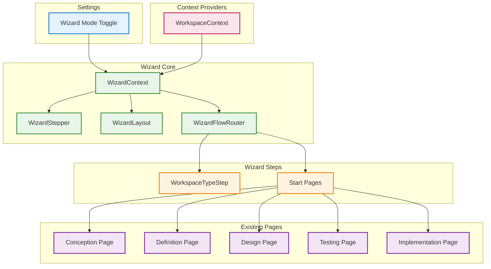

# Wizard Navigation Capability

## Metadata

| Field | Value |
|-------|-------|
| **Name** | Wizard Navigation |
| **Type** | Capability |
| **System** | IntentR |
| **Component** | Web UI / Navigation |
| **ID** | CAP-821456 |
| **Owner** | Development Team |
| **Status** | Ready for Design |
| **Approval** | Approved |
| **Priority** | High |
| **Implementation Location** | `web-ui/src/` |
| **Last Verified** | 2025-12-21 |

---

## Technical Overview

### Purpose

The Wizard Navigation capability provides an alternative step-by-step guided navigation experience for IntentR users. While IntentR offers traditional sidebar navigation for ad-hoc access to any section, the Wizard Navigation guides users through a structured workflow based on their project type.

**Navigation Modes**:
- **Sidebar Navigation** (existing): Ad-hoc access to any page via left sidebar
- **Wizard Navigation** (new): Step-by-step guided workflow with card-based progress indicator

**Wizard Flow Types**:
1. **New Application**: Workspace → Conception → Definition → Design → Testing → Implementation
2. **Refactor IntentR Application**: Workspace → Definition → Testing → Implementation
3. **Reverse Engineer Non-IntentR Application**: Workspace → Implementation (Discovery) → Definition → Design → Testing → Implementation

**Key Features**:
- Card-based step indicator at the top of the page (Style Option B)
- Start page for each section with explanatory content and illustrations
- Clickable steps for forward/backward navigation
- Conditional flow based on workspace type selection
- Toggle setting in Settings page to enable/disable Wizard Mode

---

## Business Context

### Problem Statement

New users of IntentR may feel overwhelmed by the flexibility of sidebar navigation. They may not understand the optimal order for completing development phases (Conception → Definition → Design → Testing → Implementation) or may skip critical steps.

Additionally, different project types require different workflows:
- New applications need all phases
- Refactoring existing IntentR apps can skip Conception (already defined)
- Reverse engineering non-IntentR apps needs a Discovery phase first

### Value Proposition

Wizard Navigation provides:
- **Guided Experience**: Clear step-by-step progression for users
- **Reduced Confusion**: Users always know where they are and what comes next
- **Workflow Optimization**: Different paths for different project types
- **Educational Value**: Start pages explain each section's purpose
- **Flexibility**: Users can still skip ahead or go back via clickable steps

### Success Metrics

| Metric | Target |
|--------|--------|
| User Completion Rate | 80% of wizard users complete full workflow |
| Time to First Capability | 30% reduction vs sidebar navigation |
| User Satisfaction | 4.5/5 rating for guided experience |
| Adoption Rate | 50% of new users choose Wizard Mode |

---

## User Perspective

### Primary Persona

**New IntentR User** - A developer or product manager new to IntentR who wants guidance on the INTENT methodology and the correct order of development phases.

### User Journey (Before/After)

**Before (Sidebar Only)**:
1. User opens IntentR
2. User sees sidebar with many options
3. User guesses which page to start with
4. User may skip critical phases
5. User feels lost about progress

**After (With Wizard Navigation)**:
1. User opens IntentR
2. User enables Wizard Mode in Settings
3. User sees card-based step indicator showing current phase
4. User reads Start page explaining the purpose of current section
5. User completes each step knowing exactly what comes next
6. User can click any step to navigate forward/backward

### User Scenarios

1. **New Application Workflow**:
   - User selects "New Application" in Workspace step
   - Wizard shows: Workspace ✓ → Conception ● → Definition → Design → Testing → Implementation
   - User progresses through each phase with guidance

2. **Refactoring Existing App**:
   - User selects "Refactor IntentR Application"
   - Wizard shows: Workspace ✓ → Definition ● → Testing → Implementation
   - Conception is skipped (already exists in the workspace)

3. **Reverse Engineering**:
   - User selects "Reverse Engineer Non-IntentR Application"
   - Wizard shows: Workspace ✓ → Implementation (Discovery) ● → Definition → Design → Testing → Implementation
   - Special Discovery prompt is used for initial Implementation phase

---

## Boundaries

### In Scope

- Wizard Mode toggle in Settings page
- Card-based step indicator component (WizardStepper)
- Wizard layout wrapper (no sidebar when wizard active)
- WorkspaceTypeStep for initial flow selection
- Start pages for each section (Conception, Definition, Design, Testing, Implementation)
- Three conditional flow paths based on workspace type
- Navigation between steps via step cards
- Integration with existing page components

### Out of Scope

- Replacing sidebar navigation (Wizard is an alternative, not replacement)
- Mobile-specific wizard layouts (v1 desktop only)
- Saving wizard progress across sessions (uses existing page state)
- Wizard for settings/configuration pages
- Multi-user wizard synchronization

### Assumptions

- User has an active workspace selected
- Settings are persisted via localStorage
- Existing page components work within wizard layout
- WorkspaceContext is available for flow decisions

### Constraints

- Must not break existing sidebar navigation
- Must use existing UI components (Card, Button, etc.)
- Must follow existing Tailwind CSS patterns
- Start pages must be concise (not overwhelming)

---

## Enablers

This capability is supported by the following enablers:

| Enabler ID | Name | Purpose | Status | Implementation |
|------------|------|---------|--------|----------------|
| ENB-821461 | WizardContext | React context for wizard state, flow type, and current step | Ready for Design | `web-ui/src/context/WizardContext.tsx` |
| ENB-821462 | WizardStepper | Card-based step indicator component with clickable navigation | Ready for Design | `web-ui/src/components/wizard/WizardStepper.tsx` |
| ENB-821463 | WizardLayout | Layout wrapper that replaces sidebar with wizard header | Ready for Design | `web-ui/src/components/wizard/WizardLayout.tsx` |
| ENB-821464 | WorkspaceTypeStep | Initial step for selecting New/Refactor/Reverse Engineer | Ready for Design | `web-ui/src/components/wizard/WorkspaceTypeStep.tsx` |
| ENB-821465 | Section Start Pages | Introductory pages for each section with purpose and illustrations | Ready for Design | `web-ui/src/components/wizard/StartPages/` |
| ENB-821466 | Wizard Flow Router | Conditional routing logic based on selected workspace type | Ready for Design | `web-ui/src/components/wizard/WizardFlowRouter.tsx` |

---

## Dependencies

### Upstream Dependencies

| Dependency | Type | Description |
|------------|------|-------------|
| WorkspaceContext | Internal | Access to current workspace and type |
| Settings (localStorage) | Internal | Wizard Mode toggle persistence |
| Existing Page Components | Internal | Conception, Definition, Design, Testing, Implementation pages |
| React Router | Library | Navigation between wizard steps |

### Downstream Dependencies

| Dependency | Type | Description |
|------------|------|-------------|
| App.tsx | Internal | Route configuration for wizard mode |
| Layout components | Internal | Conditional layout based on wizard mode |
| Settings page | Internal | Toggle for enabling wizard mode |

---

## Dependency Flow



---

## Functional Requirements

| FR-ID | Name | Requirement | Status | Priority | Approval |
|-------|------|-------------|--------|----------|----------|
| FR-821001 | Wizard Mode Toggle | User can enable/disable Wizard Mode in Settings page | Ready for Design | High | Approved |
| FR-821002 | Step Indicator | Card-based step indicator displays current progress | Ready for Design | High | Approved |
| FR-821003 | Clickable Steps | User can click any step to navigate forward or backward | Ready for Design | High | Approved |
| FR-821004 | Workspace Type Selection | First step allows selecting New/Refactor/Reverse Engineer | Ready for Design | High | Approved |
| FR-821005 | Conditional Flow | Wizard path changes based on workspace type selection | Ready for Design | High | Approved |
| FR-821006 | Start Pages | Each section has an introductory Start page | Ready for Design | Medium | Approved |
| FR-821007 | No Sidebar in Wizard | Wizard mode hides sidebar, uses full-width layout | Ready for Design | Medium | Approved |
| FR-821008 | Previous/Next Navigation | Bottom navigation buttons for step progression | Ready for Design | Medium | Approved |
| FR-821009 | Step Status Indicators | Steps show Done/Active/Upcoming status | Ready for Design | Medium | Approved |
| FR-821010 | Exit Wizard Option | User can exit wizard and return to sidebar navigation | Ready for Design | Low | Approved |

---

## Non-Functional Requirements

| NFR-ID | Name | Requirement | Type | Status | Priority |
|--------|------|-------------|------|--------|----------|
| NFR-821001 | Responsive Layout | Wizard adapts to different screen widths | UX | Ready for Design | Medium |
| NFR-821002 | Fast Navigation | Step transitions complete in < 200ms | Performance | Ready for Design | Medium |
| NFR-821003 | Accessibility | Keyboard navigation and screen reader support | Accessibility | Ready for Design | Medium |
| NFR-821004 | Visual Consistency | Use existing Card, Button components | UX | Ready for Design | High |

---

## Technical Specifications (Template)

### Wizard Step Indicator Design (Style B - Card-Based)

```
┌──────────┐   ┌──────────┐   ┌──────────┐   ┌──────────┐   ┌──────────┐
│    1     │ → │    2     │ → │    3     │ → │    4     │ → │    5     │
│Workspace │   │Conception│   │Definition│   │ Design   │   │  Test    │
│ ✓ Done   │   │ ● Active │   │ Upcoming │   │ Upcoming │   │ Upcoming │
└──────────┘   └──────────┘   └──────────┘   └──────────┘   └──────────┘
```

### Flow Definitions

**New Application Flow:**
```
Steps: [Workspace, Conception, Definition, Design, Testing, Implementation]
Index:     0           1           2          3        4           5
```

**Refactor IntentR App Flow:**
```
Steps: [Workspace, Definition, Testing, Implementation]
Index:     0           1          2           3
```

**Reverse Engineer Flow:**
```
Steps: [Workspace, Implementation*, Definition, Design, Testing, Implementation]
Index:     0             1              2         3        4           5
* Uses Discovery Mode prompt
```

---

## Success Criteria

1. **Functional Completeness**
   - Wizard Mode toggle works in Settings
   - All three flow types navigate correctly
   - Start pages display for each section
   - Step indicator reflects current position

2. **User Experience**
   - Clear visual indication of progress
   - Intuitive navigation between steps
   - Start pages are informative but not overwhelming

3. **Integration**
   - Works seamlessly with existing pages
   - Does not break sidebar navigation
   - Persists wizard mode preference

---

## Related Documents

- [ENB-821461 WizardContext](ENB-821461.md)
- [ENB-821462 WizardStepper](ENB-821462.md)
- [ENB-821463 WizardLayout](ENB-821463.md)
- [ENB-821464 WorkspaceTypeStep](ENB-821464.md)
- [ENB-821465 Section Start Pages](ENB-821465.md)
- [ENB-821466 Wizard Flow Router](ENB-821466.md)
- [Settings Page](../web-ui/src/pages/Settings.tsx)
- [WorkspaceContext](../web-ui/src/context/WorkspaceContext.tsx)

---

## Approval History

| Date | Stage | Decision | By | Feedback |
|------|-------|----------|-----|----------|
| 2025-12-21 | Specification | Approved | Development Team | Initial capability specification |

---

**Document Version**: 1.0
**Created**: 2025-12-21
**Last Updated**: 2025-12-21
**Author**: Development Team
