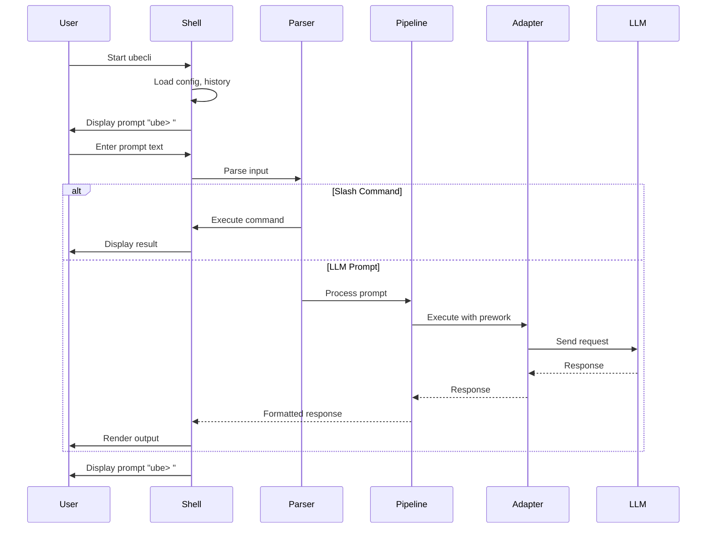
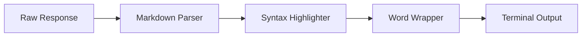

# UbeCLI Interactive Shell Enabler

## Metadata

| Field | Value |
|-------|-------|
| **Name** | UbeCLI Interactive Shell |
| **Type** | Enabler |
| **ID** | ENB-759321 |
| **Capability ID** | CAP-759314 |
| **Owner** | Development Team |
| **Status** | Implemented |
| **Approval** | Approved |
| **Priority** | High |
| **Analysis Review** | Not Required |
| **Code Review** | Not Required |
| **Implementation** | `cmd/ubecli/cli/shell.go` |
| **Last Verified** | 2025-12-14 |

---

## Technical Context

### Purpose

The UbeCLI Interactive Shell enabler provides a command-line interface that offers a familiar coding assistant experience similar to Claude CLI, but with automatic prework processing. It serves as the primary user-facing interface for the ModelProxy capability.

**Implemented Features**:
1. **REPL Interface**: Read-Eval-Print-Loop for interactive sessions with welcome message and adapter info
2. **Multi-line Input**: Triple-quote (`"""` or `'''`) delimiters and backslash (`\`) continuation
3. **Slash Commands**: Extensive built-in commands (`/help`, `/exit`, `/config`, `/model`, `/prework`, `/history`, `/debug`, `/adapters`)
4. **Signal Handling**: Graceful Ctrl+C exit with goodbye message
5. **Timing Display**: Shows response time for each LLM call
6. **Configuration Integration**: Real-time config changes via `/config set`

### Architecture Fit

This enabler is the entry point for the ModelProxy system:
- Receives user input via terminal
- Delegates to Prework Pipeline (ENB-759322) for processing
- Receives responses from LLM Adapter (ENB-759324)
- Renders output to terminal

### Existing Patterns to Follow

- Terminal interaction patterns from Go's `bufio` and `readline`
- Existing startup patterns from `cmd/integration-service/main.go`
- Color/formatting patterns from popular Go CLI tools (cobra, lipgloss)

---

## Functional Requirements

| ID | Name | Requirement | Status | Priority | Approval |
|----|------|-------------|--------|----------|----------|
| FR-759101 | REPL Loop | Shell provides interactive read-eval-print loop | Implemented | High | Approved |
| FR-759102 | Multi-line Input | User can enter multi-line prompts | Implemented | High | Approved |
| FR-759103 | Command History | Shell maintains and persists command history | Implemented | Medium | Approved |
| FR-759104 | History Navigation | User can navigate history with arrow keys | Implemented | Medium | Approved |
| FR-759105 | Slash Commands | Shell supports /help, /exit, /clear, /config | Implemented | Medium | Approved |
| FR-759106 | Graceful Exit | Ctrl+C and /exit cleanly terminate session | Implemented | High | Approved |
| FR-759107 | Prompt Customization | User can customize shell prompt in config | Implemented | Low | Approved |
| FR-759108 | Output Formatting | Responses are formatted with markdown rendering | Implemented | Medium | Approved |
| FR-759109 | Progress Indication | Show spinner/progress during LLM calls | Implemented | Medium | Approved |
| FR-759110 | Error Display | Clear error messages for failures | Implemented | High | Approved |

---

## Non-Functional Requirements

| ID | Name | Requirement | Type | Status | Priority | Approval |
|----|------|-------------|------|--------|----------|----------|
| NFR-759101 | Startup Time | Shell starts in < 500ms | Performance | Implemented | High | Approved |
| NFR-759102 | Memory Usage | Idle memory < 50MB | Performance | Implemented | Medium | Approved |
| NFR-759103 | Cross-Platform | Works on macOS, Linux, Windows | Compatibility | Implemented | High | Approved |
| NFR-759104 | Terminal Support | Works in standard terminals (iTerm, Terminal.app, Windows Terminal) | Compatibility | Implemented | High | Approved |

---

## Technical Specifications

### Shell Architecture

```mermaid
flowchart TD
    subgraph Shell["cli/shell.go"]
        INIT[Initialize]
        READ[Read Input]
        PARSE[Parse Command]
        EXEC[Execute]
        RENDER[Render Output]
    end

    subgraph Commands["cli/commands.go"]
        HELP[/help]
        EXIT[/exit]
        CLEAR[/clear]
        CONFIG[/config]
    end

    subgraph External
        PIPE[Prework Pipeline]
        HIST[History File]
        CFG[Config Manager]
    end

    INIT --> CFG
    INIT --> HIST
    INIT --> READ
    READ --> PARSE
    PARSE -->|Slash Command| Commands
    PARSE -->|Prompt| PIPE
    Commands --> RENDER
    PIPE --> RENDER
    RENDER --> READ

    classDef shell fill:#e3f2fd,stroke:#1976d2,stroke-width:2px
    classDef cmd fill:#e8f5e9,stroke:#388e3c,stroke-width:2px
    classDef ext fill:#fff3e0,stroke:#f57c00,stroke-width:2px

    class INIT,READ,PARSE,EXEC,RENDER shell
    class HELP,EXIT,CLEAR,CONFIG cmd
    class PIPE,HIST,CFG ext
```

### Shell Interface (Go)

```go
// Shell represents the interactive CLI shell
type Shell struct {
    config     *config.Config
    pipeline   *pipeline.Pipeline
    history    *History
    reader     *readline.Instance
    running    bool
}

// NewShell creates a new interactive shell
func NewShell(cfg *config.Config, pipe *pipeline.Pipeline) (*Shell, error)

// Run starts the interactive REPL loop
func (s *Shell) Run() error

// ProcessInput handles a single input line
func (s *Shell) ProcessInput(input string) error

// Shutdown gracefully terminates the shell
func (s *Shell) Shutdown()
```

### Implemented Slash Commands

| Command | Aliases | Description | Example |
|---------|---------|-------------|---------|
| `/help` | `/h`, `/?` | Display help information | `/help` |
| `/exit` | `/quit`, `/q` | Exit the shell | `/exit` |
| `/clear` | `/cls` | Clear screen | `/clear` |
| `/config` | - | Show current configuration (masked secrets) | `/config` |
| `/config init` | - | Create `.ubecli.yaml` in current directory | `/config init` |
| `/config get <key>` | - | Get config value by dot-notation key | `/config get llm.default` |
| `/config set <key> <value>` | - | Update configuration value | `/config set llm.default codex-cli` |
| `/config save` | - | Save current config to file | `/config save` |
| `/model` | - | Show current LLM adapter | `/model` |
| `/model <name>` | - | Switch LLM adapter | `/model codex-cli` |
| `/adapters` | - | List all registered adapters | `/adapters` |
| `/history` | - | Show command history | `/history` |
| `/debug` | - | Toggle debug mode | `/debug` |
| `/prework` | - | Show prework pipeline status | `/prework` |
| `/prework on` | - | Enable prework pipeline | `/prework on` |
| `/prework off` | - | Disable prework pipeline | `/prework off` |
| `/prework show [prompt]` | - | Show prework output for test prompt | `/prework show "test prompt"` |

### Multi-line Input Mode

```
ube> """
... This is a multi-line
... prompt that continues
... until the closing quotes
... """
```

Or using backslash continuation:
```
ube> Create a function that \
...> handles user authentication \
...> with JWT tokens
```

### Sequence Diagram: User Interaction



### Output Rendering

The shell renders LLM responses with:
- **Markdown formatting**: Headers, lists, code blocks
- **Syntax highlighting**: Code blocks with language detection
- **Word wrapping**: Proper wrapping for terminal width
- **Color theming**: Configurable color schemes



---

## Edge Cases and Error Handling

| Scenario | Expected Behavior | Test Case |
|----------|-------------------|-----------|
| Empty input | Ignore, show new prompt | `test_empty_input()` |
| Very long input | Accept up to 100KB | `test_long_input()` |
| Binary input | Reject with error | `test_binary_input()` |
| Ctrl+C during input | Cancel current input | `test_ctrl_c_input()` |
| Ctrl+C during LLM call | Cancel request gracefully | `test_ctrl_c_llm()` |
| Terminal resize | Adjust output width | `test_terminal_resize()` |
| No TTY (piped input) | Process non-interactively | `test_piped_input()` |

---

## External Dependencies

| Dependency | Purpose | Version |
|------------|---------|---------|
| `github.com/chzyer/readline` | Line editing, history | v1.5+ |
| `github.com/charmbracelet/glamour` | Markdown rendering | v0.6+ |
| `github.com/fatih/color` | Terminal colors | v1.15+ |
| `github.com/briandowns/spinner` | Progress indicator | v1.23+ |

---

## Acceptance Scenarios (Gherkin)

### Test Suite: TST-759321 - UbeCLI Interactive Shell Tests

```gherkin
@TST-759321
Feature: UbeCLI Interactive Shell
  As a developer
  I want an interactive CLI for LLM interactions
  So that I can get AI assistance with project context automatically applied

  Background:
    Given UbeCLI is installed
    And a valid configuration exists

  @TS-759101 @FR-759101 @critical
  Scenario: Start interactive shell
    When I run "ubecli" without arguments
    Then I should see the shell prompt "ube> "
    And the shell should be waiting for input

  @TS-759102 @FR-759102
  Scenario: Enter multi-line prompt
    Given the shell is running
    When I type '"""'
    And I enter "This is line 1"
    And I enter "This is line 2"
    And I type '"""'
    Then the full multi-line prompt should be sent to the LLM

  @TS-759103 @FR-759103 @FR-759104
  Scenario: Navigate command history
    Given the shell is running
    And I have previously entered "Hello world"
    When I press the up arrow key
    Then "Hello world" should appear at the prompt

  @TS-759104 @FR-759105
  Scenario: Execute slash command
    Given the shell is running
    When I type "/help"
    Then I should see the help information
    And the LLM should not be called

  @TS-759105 @FR-759106 @critical
  Scenario: Graceful exit with Ctrl+C
    Given the shell is running
    When I press Ctrl+C
    Then the shell should display "Goodbye!"
    And the shell should exit with code 0

  @TS-759106 @FR-759108
  Scenario: Formatted output rendering
    Given the shell is running
    When the LLM returns markdown with code blocks
    Then the code blocks should be syntax highlighted
    And headers should be formatted correctly

  @TS-759107 @FR-759109
  Scenario: Progress indication during LLM call
    Given the shell is running
    When I submit a prompt
    Then a spinner should appear while waiting
    And the spinner should disappear when response arrives
```

### Test Scenario Summary

| Scenario ID | Name | Requirement | Priority | Status | Automation |
|-------------|------|-------------|----------|--------|------------|
| TS-759101 | Start interactive shell | FR-759101 | Critical | Implemented | Pending |
| TS-759102 | Enter multi-line prompt | FR-759102 | High | Implemented | Pending |
| TS-759103 | Navigate command history | FR-759103, FR-759104 | Medium | Implemented | Pending |
| TS-759104 | Execute slash command | FR-759105 | Medium | Implemented | Pending |
| TS-759105 | Graceful exit with Ctrl+C | FR-759106 | Critical | Implemented | Pending |
| TS-759106 | Formatted output rendering | FR-759108 | Medium | Implemented | Pending |
| TS-759107 | Progress indication | FR-759109 | Medium | Implemented | Pending |

---

## Test Architecture

- **Framework**: Go testing package
- **Coverage Target**: 80%+
- **Test Types**: Unit, Integration
- **Mock LLM**: Mock adapter for testing without real LLM calls

---

## Implementation Hints

### Suggested Approach

1. Start with basic REPL loop using `bufio.Scanner`
2. Add readline for history and line editing
3. Implement slash command parser
4. Integrate with Pipeline (ENB-759322)
5. Add output rendering with glamour
6. Add progress spinner

### Known Gotchas

- Windows terminal ANSI color support varies
- Readline library may conflict with some terminal emulators
- Multi-line detection needs careful quote matching
- History file permissions on shared systems

### Reference Implementations

- Claude CLI for UX patterns
- `cobra` for command structure
- `bubbletea` for TUI components (if needed)

---

## Approval History

| Date | Stage | Decision | By | Feedback |
|------|-------|----------|-----|----------|
| 2025-12-14 | Discovery | Approved | Development Team | Auto-approved during discovery |

---

**Document Version**: 1.0
**Created**: 2025-12-14
**Last Updated**: 2025-12-14
**Author**: Development Team
