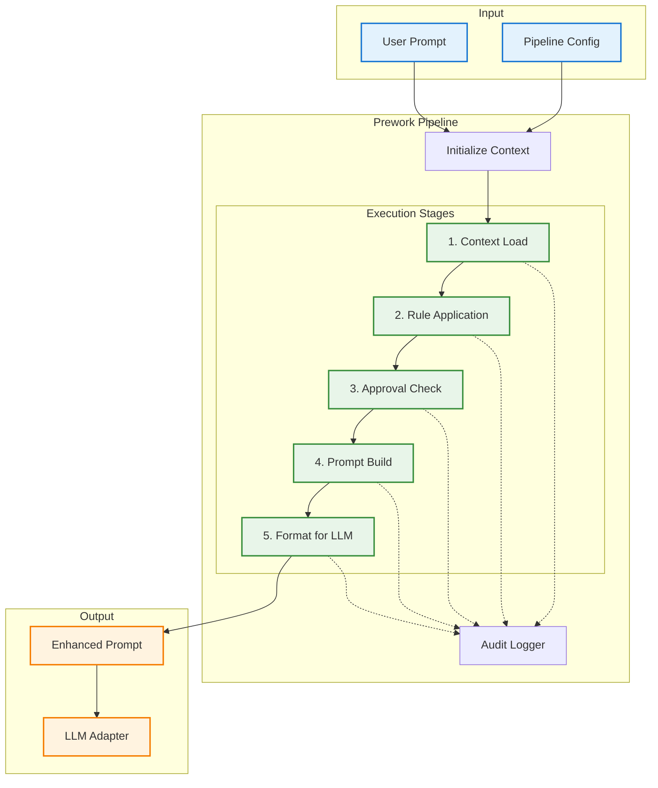
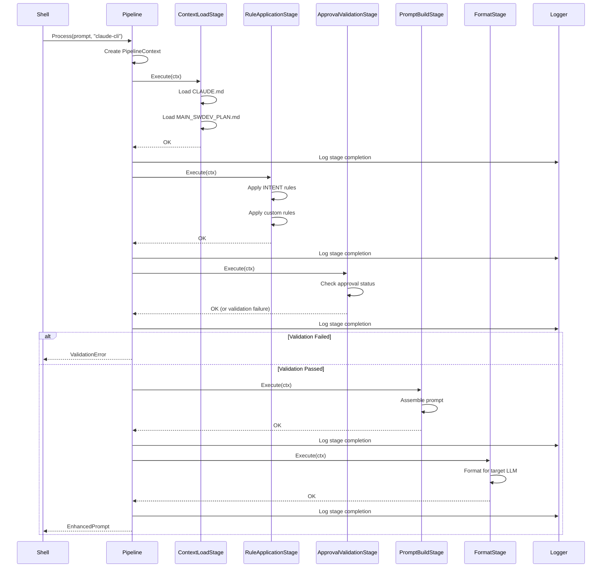

# Prework Pipeline Enabler

## Metadata

| Field | Value |
|-------|-------|
| **Name** | Prework Pipeline |
| **Type** | Enabler |
| **ID** | ENB-759322 |
| **Capability ID** | CAP-759314 |
| **Owner** | Development Team |
| **Status** | Implemented |
| **Approval** | Approved |
| **Priority** | High |
| **Analysis Review** | Not Required |
| **Code Review** | Not Required |

---

## Technical Context

### Purpose

The Prework Pipeline enabler orchestrates the transformation of user prompts before they are sent to any LLM. It implements a configurable, multi-stage pipeline that:

1. **Loads Context**: Injects project files (CLAUDE.md, MAIN_SWDEV_PLAN.md)
2. **Applies Rules**: Enforces project-specific rules and constraints
3. **Validates**: Checks for approval requirements and blockers
4. **Formats**: Prepares the final prompt for the target LLM
5. **Logs**: Records the transformation for audit purposes

The pipeline is **LLM-agnostic** - it produces a standardized intermediate format that adapters then convert to LLM-specific formats.

### Architecture Fit

The Prework Pipeline sits between the user interface (UbeCLI Shell) and the LLM Adapters:

```
UbeCLI Shell → Prework Pipeline → LLM Adapter → Any LLM
```

It depends on:
- Context Loader (ENB-759323) for file loading
- Configuration Manager (ENB-759325) for pipeline settings
- LLM Adapter Interface (ENB-759324) for execution

### Existing Patterns to Follow

- Middleware patterns from `pkg/middleware/auth.go`
- Pipeline patterns from existing Go applications
- The existing `additionalPrompt` injection in `cmd/claude-proxy/main.go`

---

## Functional Requirements

| ID | Name | Requirement | Status | Priority | Approval |
|----|------|-------------|--------|----------|----------|
| FR-759201 | Stage Orchestration | Pipeline executes stages in configured order | Implemented | High | Approved |
| FR-759202 | Context Injection | Pipeline injects loaded context into prompt | Implemented | High | Approved |
| FR-759203 | Rule Application | Pipeline applies custom rules from config | Implemented | High | Approved |
| FR-759204 | Approval Validation | Pipeline checks INTENT approval status | Implemented | High | Approved |
| FR-759205 | Prompt Formatting | Pipeline formats prompt for target LLM | Implemented | High | Approved |
| FR-759206 | Stage Skip | Individual stages can be skipped via config | Implemented | Medium | Approved |
| FR-759207 | Error Handling | Pipeline continues on non-fatal errors | Implemented | High | Approved |
| FR-759208 | Audit Logging | Pipeline logs all transformations | Implemented | Medium | Approved |
| FR-759209 | Stage Metrics | Pipeline tracks stage execution time | Implemented | Low | Approved |
| FR-759210 | Custom Stages | Users can add custom stages via config | Implemented | Low | Approved |

---

## Non-Functional Requirements

| ID | Name | Requirement | Type | Status | Priority | Approval |
|----|------|-------------|------|--------|----------|----------|
| NFR-759201 | Total Latency | Full pipeline < 100ms | Performance | Implemented | High | Approved |
| NFR-759202 | Memory Efficiency | Pipeline does not load entire files into memory | Performance | Implemented | Medium | Approved |
| NFR-759203 | Extensibility | New stages addable without code changes | Maintainability | Implemented | High | Approved |
| NFR-759204 | Testability | Each stage independently testable | Quality | Implemented | High | Approved |

---

## Technical Specifications

### Pipeline Architecture



### Pipeline Interfaces (Go)

```go
// Stage represents a single transformation stage
type Stage interface {
    Name() string
    Execute(ctx *PipelineContext) error
    CanSkip() bool
}

// PipelineContext carries data through stages
type PipelineContext struct {
    OriginalPrompt string
    EnhancedPrompt string
    LoadedContext  map[string]string  // filename -> content
    AppliedRules   []string
    ValidationResult *ValidationResult
    TargetAdapter  string
    Metadata       map[string]interface{}
}

// Pipeline orchestrates stage execution
type Pipeline struct {
    stages    []Stage
    config    *config.PipelineConfig
    logger    *AuditLogger
}

// NewPipeline creates a configured pipeline
func NewPipeline(cfg *config.PipelineConfig) *Pipeline

// Process runs all stages on a prompt
func (p *Pipeline) Process(prompt string, adapterName string) (*PipelineContext, error)

// AddStage adds a custom stage to the pipeline
func (p *Pipeline) AddStage(stage Stage)
```

### Pipeline Stages

#### Stage 1: Context Load

Loads project context files using the Context Loader (ENB-759323).

```go
type ContextLoadStage struct {
    loader *ContextLoader
}

func (s *ContextLoadStage) Execute(ctx *PipelineContext) error {
    // Load CLAUDE.md
    claudeMd, err := s.loader.LoadFile("CLAUDE.md")
    if err == nil {
        ctx.LoadedContext["CLAUDE.md"] = claudeMd
    }

    // Load MAIN_SWDEV_PLAN.md
    swdevPlan, err := s.loader.LoadFile("CODE_RULES/MAIN_SWDEV_PLAN.md")
    if err == nil {
        ctx.LoadedContext["MAIN_SWDEV_PLAN.md"] = swdevPlan
    }

    return nil
}
```

#### Stage 2: Rule Application

Applies configured rules to enhance the prompt.

```go
type RuleApplicationStage struct {
    rules []Rule
}

type Rule struct {
    Name         string
    Template     string
    AlwaysInject bool
    Condition    func(*PipelineContext) bool
}

func (s *RuleApplicationStage) Execute(ctx *PipelineContext) error {
    for _, rule := range s.rules {
        if rule.AlwaysInject || (rule.Condition != nil && rule.Condition(ctx)) {
            ctx.AppliedRules = append(ctx.AppliedRules, rule.Name)
            // Inject rule template
        }
    }
    return nil
}
```

#### Stage 3: Approval Validation

Checks INTENT approval requirements.

```go
type ApprovalValidationStage struct{}

func (s *ApprovalValidationStage) Execute(ctx *PipelineContext) error {
    // Check if prompt references an enabler or capability
    refs := extractReferences(ctx.OriginalPrompt)

    for _, ref := range refs {
        spec, err := loadSpecification(ref)
        if err != nil {
            continue
        }

        if spec.Approval != "Approved" {
            ctx.ValidationResult = &ValidationResult{
                Valid: false,
                Message: fmt.Sprintf("%s is not approved (status: %s)", ref, spec.Approval),
            }
            return nil
        }
    }

    ctx.ValidationResult = &ValidationResult{Valid: true}
    return nil
}
```

#### Stage 4: Prompt Build

Assembles the final enhanced prompt.

```go
type PromptBuildStage struct{}

func (s *PromptBuildStage) Execute(ctx *PipelineContext) error {
    var builder strings.Builder

    // Add system context
    builder.WriteString("# Project Context\n\n")
    for filename, content := range ctx.LoadedContext {
        builder.WriteString(fmt.Sprintf("## %s\n\n%s\n\n", filename, content))
    }

    // Add applied rules
    if len(ctx.AppliedRules) > 0 {
        builder.WriteString("# Applied Rules\n\n")
        for _, rule := range ctx.AppliedRules {
            builder.WriteString(fmt.Sprintf("- %s\n", rule))
        }
        builder.WriteString("\n")
    }

    // Add user prompt
    builder.WriteString("# User Request\n\n")
    builder.WriteString(ctx.OriginalPrompt)

    ctx.EnhancedPrompt = builder.String()
    return nil
}
```

#### Stage 5: Format for LLM

Formats the prompt for the specific LLM adapter.

```go
type FormatStage struct {
    formatters map[string]Formatter
}

type Formatter interface {
    Format(prompt string) string
}

func (s *FormatStage) Execute(ctx *PipelineContext) error {
    formatter, ok := s.formatters[ctx.TargetAdapter]
    if ok {
        ctx.EnhancedPrompt = formatter.Format(ctx.EnhancedPrompt)
    }
    return nil
}
```

### Sequence Diagram: Pipeline Execution



### Configuration Schema

```yaml
pipeline:
  # Enable/disable entire pipeline
  enabled: true

  # Stage configuration
  stages:
    context_load:
      enabled: true
      files:
        - CLAUDE.md
        - CODE_RULES/MAIN_SWDEV_PLAN.md
      max_file_size: 1MB

    rule_application:
      enabled: true
      rules:
        - name: sawai-enforcement
          always_inject: true
          template: |
            Follow MAIN_SWDEV_PLAN.md strictly.
            Check approval status before implementation.

        - name: discovery-mode
          condition: "prompt contains 'discovery'"
          template: |
            This is DISCOVERY mode.
            Create documentation ONLY, no code changes.

    approval_validation:
      enabled: true
      strict: false  # If true, block on unapproved items

    prompt_build:
      enabled: true
      format: markdown

    format:
      enabled: true

  # Audit logging
  logging:
    enabled: true
    include_prompts: false  # Privacy: don't log full prompts
    include_context: false
    log_file: ~/.ubecli/audit.log
```

---

## Edge Cases and Error Handling

| Scenario | Expected Behavior | Test Case |
|----------|-------------------|-----------|
| CLAUDE.md not found | Continue without it, warn user | `test_missing_claude_md()` |
| Circular rule references | Detect and error | `test_circular_rules()` |
| Very large context files | Truncate with warning | `test_large_context()` |
| Stage timeout | Skip stage, log warning | `test_stage_timeout()` |
| Invalid rule syntax | Skip rule, log error | `test_invalid_rule()` |
| All stages disabled | Pass through original prompt | `test_passthrough()` |

---

## External Dependencies

| Dependency | Purpose | Version |
|------------|---------|---------|
| `gopkg.in/yaml.v3` | Configuration parsing | v3.0+ |
| `github.com/sirupsen/logrus` | Structured logging | v1.9+ |

---

## Acceptance Scenarios (Gherkin)

### Test Suite: TST-759322 - Prework Pipeline Tests

```gherkin
@TST-759322
Feature: Prework Pipeline
  As a developer using UbeCLI
  I want my prompts automatically enhanced with project context
  So that LLM responses follow project rules

  Background:
    Given the prework pipeline is configured
    And CLAUDE.md exists in the project

  @TS-759201 @FR-759201 @critical
  Scenario: Execute all stages in order
    Given all pipeline stages are enabled
    When I process a prompt "Create a new API endpoint"
    Then the context load stage should execute first
    And the rule application stage should execute second
    And the approval validation stage should execute third
    And the prompt build stage should execute fourth
    And the format stage should execute last

  @TS-759202 @FR-759202 @critical
  Scenario: Inject CLAUDE.md content
    Given CLAUDE.md contains "Always use gofmt"
    When I process a prompt "Write a Go function"
    Then the enhanced prompt should contain "Always use gofmt"

  @TS-759203 @FR-759203
  Scenario: Apply INTENT rules
    Given INTENT enforcement rule is enabled
    When I process a prompt "Implement ENB-123456"
    Then the enhanced prompt should contain "Follow MAIN_SWDEV_PLAN.md"

  @TS-759204 @FR-759204 @critical
  Scenario: Block unapproved enabler implementation
    Given strict approval validation is enabled
    And ENB-123456 has Approval = "Pending"
    When I process a prompt "Implement ENB-123456"
    Then the pipeline should return a validation error
    And the error should say "ENB-123456 is not approved"

  @TS-759205 @FR-759206
  Scenario: Skip disabled stages
    Given the rule application stage is disabled
    When I process a prompt "Create a new API endpoint"
    Then the rule application stage should not execute
    And other stages should still execute

  @TS-759206 @FR-759207
  Scenario: Continue on non-fatal error
    Given CLAUDE.md is corrupted
    When I process a prompt "Create a new API endpoint"
    Then the pipeline should continue
    And a warning should be logged
    And the prompt should still be processed
```

### Test Scenario Summary

| Scenario ID | Name | Requirement | Priority | Status | Automation |
|-------------|------|-------------|----------|--------|------------|
| TS-759201 | Execute all stages in order | FR-759201 | Critical | Implemented | Pending |
| TS-759202 | Inject CLAUDE.md content | FR-759202 | Critical | Implemented | Pending |
| TS-759203 | Apply INTENT rules | FR-759203 | High | Implemented | Pending |
| TS-759204 | Block unapproved enabler | FR-759204 | Critical | Implemented | Pending |
| TS-759205 | Skip disabled stages | FR-759206 | Medium | Implemented | Pending |
| TS-759206 | Continue on non-fatal error | FR-759207 | High | Implemented | Pending |

---

## Test Architecture

- **Framework**: Go testing package
- **Coverage Target**: 90%+ (core pipeline logic)
- **Test Types**: Unit tests for each stage, integration tests for full pipeline

---

## Implementation Hints

### Suggested Approach

1. Define Stage interface
2. Implement PipelineContext struct
3. Create Pipeline orchestrator
4. Implement each stage individually
5. Add configuration loading
6. Add audit logging
7. Integration test full pipeline

### Known Gotchas

- Context files may be very large - implement streaming/chunking
- Rule conditions need safe evaluation (no arbitrary code execution)
- Stage order matters - document dependencies
- Logging should not include sensitive prompt content

### Reference Implementations

- `cmd/claude-proxy/main.go` for basic prompt enhancement
- Middleware chains in web frameworks for pipeline pattern

---

## Approval History

| Date | Stage | Decision | By | Feedback |
|------|-------|----------|-----|----------|
| 2025-12-14 | Discovery | Approved | Development Team | Auto-approved during discovery |

---

**Document Version**: 1.0
**Created**: 2025-12-14
**Last Updated**: 2025-12-14
**Author**: Development Team
