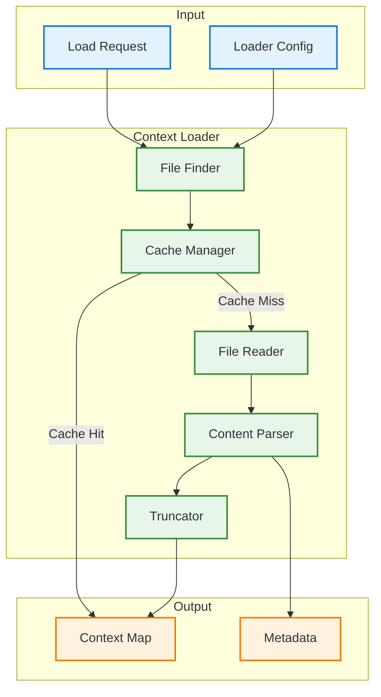
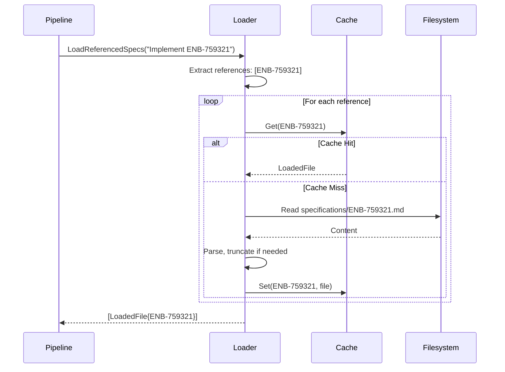

# Context Loader Enabler

## Metadata

| Field | Value |
|-------|-------|
| **Name** | Context Loader |
| **Type** | Enabler |
| **ID** | ENB-759323 |
| **Capability ID** | CAP-759314 |
| **Owner** | Development Team |
| **Status** | Implemented |
| **Approval** | Approved |
| **Priority** | High |
| **Analysis Review** | Not Required |
| **Code Review** | Not Required |

---

## Technical Context

### Purpose

The Context Loader enabler is responsible for discovering, reading, and parsing project context files that should be injected into LLM prompts. It handles:

1. **File Discovery**: Locating context files (CLAUDE.md, MAIN_SWDEV_PLAN.md, specifications)
2. **Content Loading**: Reading file contents with proper encoding
3. **Size Management**: Truncating or summarizing large files
4. **Caching**: Avoiding repeated file reads during a session
5. **Smart Loading**: Loading relevant specifications based on prompt content

### Architecture Fit

The Context Loader is used by the Prework Pipeline (ENB-759322) to load project files:

```
Prework Pipeline → Context Loader → Filesystem
                                  → specifications/
                                  → CLAUDE.md
```

### Existing Patterns to Follow

- File reading patterns from `internal/integration/handler.go`
- Specification parsing from existing specification handling code
- Caching patterns from Go standard library

---

## Functional Requirements

| ID | Name | Requirement | Status | Priority | Approval |
|----|------|-------------|--------|----------|----------|
| FR-759301 | CLAUDE.md Loading | Loader finds and reads CLAUDE.md | Implemented | High | Approved |
| FR-759302 | SWDEV Plan Loading | Loader finds and reads MAIN_SWDEV_PLAN.md | Implemented | High | Approved |
| FR-759303 | Specification Loading | Loader reads specification files from specs/ | Implemented | High | Approved |
| FR-759304 | Smart Spec Loading | Loader loads specs referenced in prompt | Implemented | Medium | Approved |
| FR-759305 | Size Limiting | Loader truncates files exceeding max size | Implemented | High | Approved |
| FR-759306 | Content Caching | Loader caches files within a session | Implemented | Medium | Approved |
| FR-759307 | Encoding Handling | Loader handles UTF-8 and common encodings | Implemented | Medium | Approved |
| FR-759308 | Directory Walking | Loader can walk nested directories | Implemented | Medium | Approved |
| FR-759309 | File Filtering | Loader respects include/exclude patterns | Implemented | Medium | Approved |
| FR-759310 | Metadata Extraction | Loader extracts frontmatter from specs | Implemented | Low | Approved |

---

## Non-Functional Requirements

| ID | Name | Requirement | Type | Status | Priority | Approval |
|----|------|-------------|------|--------|----------|----------|
| NFR-759301 | Load Time | Single file load < 10ms | Performance | Implemented | High | Approved |
| NFR-759302 | Max Total Size | Combined context < 100KB by default | Performance | Implemented | High | Approved |
| NFR-759303 | Cache Invalidation | Cache refreshes if file mtime changes | Reliability | Implemented | Medium | Approved |

---

## Technical Specifications

### Context Loader Architecture



### Loader Interface (Go)

```go
// ContextLoader handles loading project context files
type ContextLoader struct {
    workingDir string
    cache      *FileCache
    config     *LoaderConfig
}

// LoaderConfig configures the context loader
type LoaderConfig struct {
    MaxFileSize      int64    // Max size per file (default 50KB)
    MaxTotalSize     int64    // Max total context (default 100KB)
    CacheEnabled     bool
    CacheTTL         time.Duration
    IncludePatterns  []string
    ExcludePatterns  []string
}

// LoadedFile represents a loaded context file
type LoadedFile struct {
    Path      string
    Content   string
    Truncated bool
    Metadata  map[string]interface{}
    LoadedAt  time.Time
}

// NewContextLoader creates a new loader
func NewContextLoader(workingDir string, cfg *LoaderConfig) *ContextLoader

// LoadFile loads a single file by path
func (l *ContextLoader) LoadFile(path string) (*LoadedFile, error)

// LoadClaudeMD loads CLAUDE.md from project root
func (l *ContextLoader) LoadClaudeMD() (*LoadedFile, error)

// LoadSWDevPlan loads MAIN_SWDEV_PLAN.md
func (l *ContextLoader) LoadSWDevPlan() (*LoadedFile, error)

// LoadSpecification loads a specification by ID
func (l *ContextLoader) LoadSpecification(id string) (*LoadedFile, error)

// LoadReferencedSpecs loads specs mentioned in text
func (l *ContextLoader) LoadReferencedSpecs(text string) ([]*LoadedFile, error)

// LoadAll loads all configured context files
func (l *ContextLoader) LoadAll() (map[string]*LoadedFile, error)
```

### File Discovery

```go
// FindContextFiles discovers context files in the project
func (l *ContextLoader) FindContextFiles() ([]string, error) {
    var files []string

    // 1. Look for CLAUDE.md in current dir and parent dirs
    claudeMd := l.findUpward("CLAUDE.md")
    if claudeMd != "" {
        files = append(files, claudeMd)
    }

    // 2. Look for MAIN_SWDEV_PLAN.md
    swdevPaths := []string{
        "MAIN_SWDEV_PLAN.md",
        "CODE_RULES/MAIN_SWDEV_PLAN.md",
        "docs/MAIN_SWDEV_PLAN.md",
    }
    for _, path := range swdevPaths {
        if l.fileExists(path) {
            files = append(files, path)
            break
        }
    }

    // 3. Scan specifications directory
    specDir := l.findSpecsDir()
    if specDir != "" {
        specFiles, _ := l.scanDir(specDir, "*.md")
        files = append(files, specFiles...)
    }

    return files, nil
}

// findUpward searches for a file in current and parent directories
func (l *ContextLoader) findUpward(filename string) string {
    dir := l.workingDir
    for {
        path := filepath.Join(dir, filename)
        if l.fileExists(path) {
            return path
        }
        parent := filepath.Dir(dir)
        if parent == dir {
            break
        }
        dir = parent
    }
    return ""
}
```

### Smart Specification Loading

```go
// LoadReferencedSpecs finds and loads specs mentioned in text
func (l *ContextLoader) LoadReferencedSpecs(text string) ([]*LoadedFile, error) {
    // Pattern matches: CAP-XXXXXX, ENB-XXXXXX, FR-XXXXXX, NFR-XXXXXX
    pattern := regexp.MustCompile(`(CAP|ENB|FR|NFR)-\d{6}`)
    matches := pattern.FindAllString(text, -1)

    var loaded []*LoadedFile
    seen := make(map[string]bool)

    for _, match := range matches {
        if seen[match] {
            continue
        }
        seen[match] = true

        spec, err := l.LoadSpecification(match)
        if err == nil {
            loaded = append(loaded, spec)
        }
    }

    return loaded, nil
}

// LoadSpecification loads a spec file by ID
func (l *ContextLoader) LoadSpecification(id string) (*LoadedFile, error) {
    // Extract numeric part for filename
    parts := strings.Split(id, "-")
    if len(parts) != 2 {
        return nil, fmt.Errorf("invalid spec ID: %s", id)
    }

    // Try different naming patterns
    patterns := []string{
        fmt.Sprintf("specifications/%s.md", id),           // CAP-123456.md
        fmt.Sprintf("specifications/%s-capability.md", parts[1]), // 123456-capability.md
        fmt.Sprintf("specifications/%s-enabler.md", parts[1]),    // 123456-enabler.md
    }

    for _, pattern := range patterns {
        if l.fileExists(pattern) {
            return l.LoadFile(pattern)
        }
    }

    return nil, fmt.Errorf("specification not found: %s", id)
}
```

### Content Truncation

```go
// TruncateContent truncates content to max size
func (l *ContextLoader) TruncateContent(content string, maxSize int64) (string, bool) {
    if int64(len(content)) <= maxSize {
        return content, false
    }

    // Find a good breaking point
    truncated := content[:maxSize]

    // Try to break at paragraph or sentence
    if idx := strings.LastIndex(truncated, "\n\n"); idx > int(maxSize/2) {
        truncated = truncated[:idx]
    } else if idx := strings.LastIndex(truncated, ". "); idx > int(maxSize/2) {
        truncated = truncated[:idx+1]
    }

    truncated += "\n\n[... content truncated due to size limit ...]"
    return truncated, true
}
```

### Caching

```go
// FileCache caches loaded files
type FileCache struct {
    entries map[string]*cacheEntry
    mutex   sync.RWMutex
}

type cacheEntry struct {
    file      *LoadedFile
    mtime     time.Time
    expiresAt time.Time
}

// Get retrieves a cached file if valid
func (c *FileCache) Get(path string) (*LoadedFile, bool) {
    c.mutex.RLock()
    defer c.mutex.RUnlock()

    entry, ok := c.entries[path]
    if !ok {
        return nil, false
    }

    // Check expiration
    if time.Now().After(entry.expiresAt) {
        return nil, false
    }

    // Check if file modified
    info, err := os.Stat(path)
    if err != nil || info.ModTime().After(entry.mtime) {
        return nil, false
    }

    return entry.file, true
}
```

### Sequence Diagram: Load Referenced Specs



### Configuration Schema

```yaml
context_loader:
  # Maximum size per file
  max_file_size: 50KB

  # Maximum total context size
  max_total_size: 100KB

  # Cache settings
  cache:
    enabled: true
    ttl: 5m

  # Files to always load
  always_load:
    - CLAUDE.md
    - CODE_RULES/MAIN_SWDEV_PLAN.md

  # Patterns for specification files
  spec_patterns:
    - "specifications/*.md"
    - "specs/*.md"

  # Files/patterns to exclude
  exclude:
    - "**/node_modules/**"
    - "**/.git/**"
    - "**/vendor/**"
```

---

## Edge Cases and Error Handling

| Scenario | Expected Behavior | Test Case |
|----------|-------------------|-----------|
| File not found | Return nil, log warning | `test_file_not_found()` |
| Permission denied | Return error | `test_permission_denied()` |
| Binary file | Skip with warning | `test_binary_file()` |
| Circular includes | Detect and prevent | `test_circular_includes()` |
| Very large file | Truncate to limit | `test_large_file()` |
| Empty file | Return empty content | `test_empty_file()` |
| Invalid UTF-8 | Replace invalid chars | `test_invalid_utf8()` |
| Symlink | Follow or skip based on config | `test_symlink()` |

---

## External Dependencies

| Dependency | Purpose | Version |
|------------|---------|---------|
| Standard library only | File operations, caching | Go 1.21+ |

---

## Acceptance Scenarios (Gherkin)

### Test Suite: TST-759323 - Context Loader Tests

```gherkin
@TST-759323
Feature: Context Loader
  As the prework pipeline
  I want to load project context files
  So that prompts include relevant project information

  Background:
    Given a project directory exists
    And the context loader is configured

  @TS-759301 @FR-759301 @critical
  Scenario: Load CLAUDE.md from project root
    Given CLAUDE.md exists in the project root
    When I call LoadClaudeMD()
    Then the file content should be returned
    And the path should be recorded

  @TS-759302 @FR-759302
  Scenario: Load MAIN_SWDEV_PLAN.md from CODE_RULES
    Given MAIN_SWDEV_PLAN.md exists in CODE_RULES/
    When I call LoadSWDevPlan()
    Then the file content should be returned

  @TS-759303 @FR-759304 @critical
  Scenario: Load specifications referenced in prompt
    Given ENB-759321.md exists in specifications/
    When I call LoadReferencedSpecs("Please implement ENB-759321")
    Then ENB-759321.md should be loaded
    And the content should be in the result

  @TS-759304 @FR-759305
  Scenario: Truncate large file
    Given CLAUDE.md contains 100KB of content
    And max_file_size is 50KB
    When I call LoadClaudeMD()
    Then the content should be truncated to 50KB
    And a truncation notice should be appended

  @TS-759305 @FR-759306
  Scenario: Cache file content
    Given CLAUDE.md exists and is loaded
    When I call LoadClaudeMD() again
    Then the cached content should be returned
    And the file should not be read from disk

  @TS-759306 @FR-759306
  Scenario: Invalidate cache on file change
    Given CLAUDE.md is cached
    When CLAUDE.md is modified
    And I call LoadClaudeMD()
    Then the file should be re-read from disk
    And the new content should be returned

  @TS-759307 @FR-759301
  Scenario: Find CLAUDE.md in parent directory
    Given I am in a subdirectory
    And CLAUDE.md exists in the parent directory
    When I call LoadClaudeMD()
    Then the parent's CLAUDE.md should be found and loaded
```

### Test Scenario Summary

| Scenario ID | Name | Requirement | Priority | Status | Automation |
|-------------|------|-------------|----------|--------|------------|
| TS-759301 | Load CLAUDE.md from project root | FR-759301 | Critical | Implemented | Pending |
| TS-759302 | Load MAIN_SWDEV_PLAN.md | FR-759302 | High | Implemented | Pending |
| TS-759303 | Load referenced specifications | FR-759304 | Critical | Implemented | Pending |
| TS-759304 | Truncate large file | FR-759305 | High | Implemented | Pending |
| TS-759305 | Cache file content | FR-759306 | Medium | Implemented | Pending |
| TS-759306 | Invalidate cache on change | FR-759306 | Medium | Implemented | Pending |
| TS-759307 | Find CLAUDE.md in parent | FR-759301 | Medium | Implemented | Pending |

---

## Test Architecture

- **Framework**: Go testing package
- **Coverage Target**: 85%+
- **Test Types**: Unit tests with temporary directories

---

## Implementation Hints

### Suggested Approach

1. Start with simple file reading
2. Add upward directory search for CLAUDE.md
3. Implement specification ID pattern matching
4. Add truncation logic
5. Implement caching with mtime validation
6. Add configuration loading

### Known Gotchas

- Windows path separators differ from Unix
- Large binary files in specs folder should be skipped
- UTF-8 BOM should be stripped
- Symlink loops should be detected

### Reference Implementations

- `internal/integration/handler.go` for file reading patterns
- Go's `filepath.Walk` for directory traversal

---

## Approval History

| Date | Stage | Decision | By | Feedback |
|------|-------|----------|-----|----------|
| 2025-12-14 | Discovery | Approved | Development Team | Auto-approved during discovery |

---

**Document Version**: 1.0
**Created**: 2025-12-14
**Last Updated**: 2025-12-14
**Author**: Development Team
