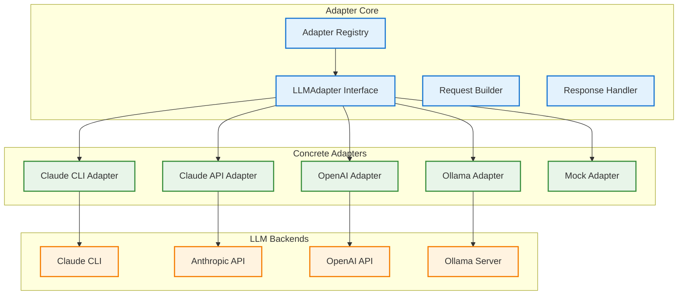
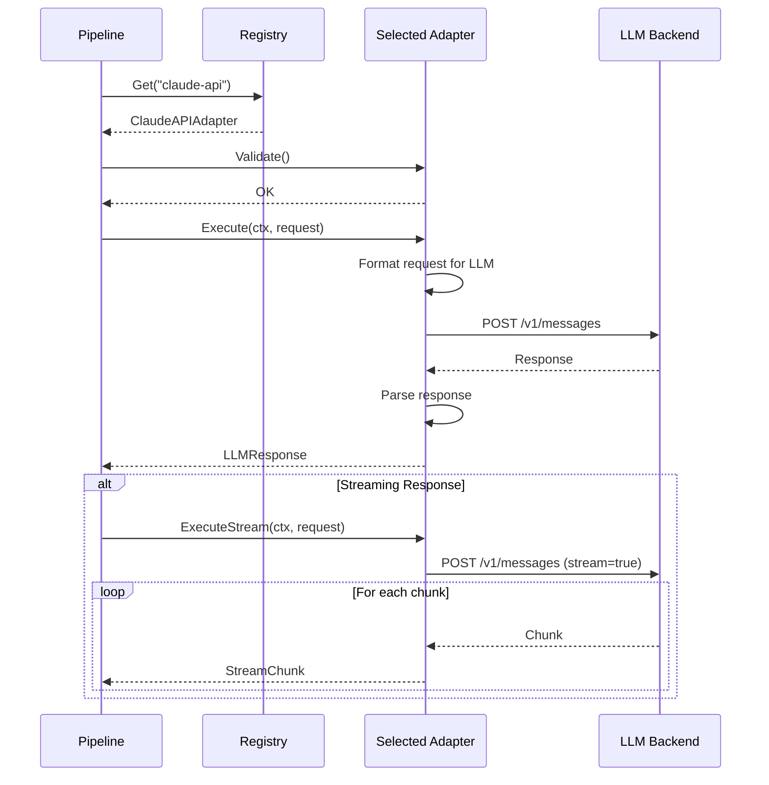

# LLM Adapter Interface Enabler

## Metadata

| Field | Value |
|-------|-------|
| **Name** | LLM Adapter Interface |
| **Type** | Enabler |
| **ID** | ENB-759324 |
| **Capability ID** | CAP-759314 |
| **Owner** | Development Team |
| **Status** | Implemented |
| **Approval** | Approved |
| **Priority** | High |
| **Analysis Review** | Not Required |
| **Code Review** | Not Required |

---

## Technical Context

### Purpose

The LLM Adapter Interface enabler defines a **generic, pluggable interface** for executing prompts against any Large Language Model. This enables ModelProxy/UbeCLI to work with multiple LLM backends without code changes.

**Supported Adapters**:
1. **Claude CLI Adapter**: Executes via local Claude CLI installation
2. **Claude API Adapter**: Calls Anthropic API directly
3. **OpenAI Adapter**: Calls OpenAI GPT API
4. **Ollama Adapter**: Executes against local Ollama models
5. **Custom Adapters**: User-defined adapters via configuration

**Key Design Principles**:
- **Interface-based**: All adapters implement a common interface
- **Self-registering**: Adapters register themselves at init time
- **Configurable**: Adapter selection and settings via config file
- **Testable**: Mock adapters for testing without real LLM calls

### Architecture Fit

The Adapter Interface is the final stage before LLM execution:

```
Prework Pipeline → LLM Adapter Interface → Specific Adapter → LLM Backend
```

### Existing Patterns to Follow

- Existing Claude CLI execution in `cmd/claude-proxy/main.go`
- HTTP client patterns from `internal/integration/ai_chat.go`
- Interface patterns from Go standard library (io.Reader, etc.)

---

## Functional Requirements

| ID | Name | Requirement | Status | Priority | Approval |
|----|------|-------------|--------|----------|----------|
| FR-759401 | Common Interface | All adapters implement LLMAdapter interface | Implemented | High | Approved |
| FR-759402 | Adapter Registry | System maintains registry of available adapters | Implemented | High | Approved |
| FR-759403 | Claude CLI Adapter | Adapter executes via Claude CLI | Implemented | High | Approved |
| FR-759404 | Claude API Adapter | Adapter calls Anthropic API | Implemented | High | Approved |
| FR-759405 | OpenAI Adapter | Adapter calls OpenAI API | Implemented | Medium | Approved |
| FR-759406 | Ollama Adapter | Adapter calls local Ollama | Implemented | Medium | Approved |
| FR-759407 | Streaming Support | Adapters support streaming responses | Implemented | Medium | Approved |
| FR-759408 | Timeout Handling | Adapters respect timeout configuration | Implemented | High | Approved |
| FR-759409 | Error Normalization | All adapters return standardized errors | Implemented | High | Approved |
| FR-759410 | Conversation Context | Adapters maintain conversation history | Implemented | Medium | Approved |
| FR-759411 | Token Counting | Adapters report token usage | Implemented | Low | Approved |
| FR-759412 | Mock Adapter | Mock adapter for testing | Implemented | High | Approved |

---

## Non-Functional Requirements

| ID | Name | Requirement | Type | Status | Priority | Approval |
|----|------|-------------|------|--------|----------|----------|
| NFR-759401 | Adapter Loading | Adapter initialization < 100ms | Performance | Implemented | High | Approved |
| NFR-759402 | Connection Reuse | HTTP adapters reuse connections | Performance | Implemented | Medium | Approved |
| NFR-759403 | Graceful Timeout | Clean cancellation on timeout | Reliability | Implemented | High | Approved |
| NFR-759404 | Extensibility | New adapters addable without core changes | Maintainability | Implemented | High | Approved |

---

## Technical Specifications

### Adapter Architecture



### Core Interfaces (Go)

```go
// LLMAdapter is the interface all adapters must implement
type LLMAdapter interface {
    // Name returns the adapter identifier (e.g., "claude-cli", "openai")
    Name() string

    // Execute sends a prompt and returns the response
    Execute(ctx context.Context, req *LLMRequest) (*LLMResponse, error)

    // ExecuteStream sends a prompt and streams the response
    ExecuteStream(ctx context.Context, req *LLMRequest) (<-chan StreamChunk, error)

    // Validate checks if the adapter is properly configured
    Validate() error

    // Capabilities returns what features this adapter supports
    Capabilities() AdapterCapabilities
}

// LLMRequest represents a prompt request
type LLMRequest struct {
    Prompt           string
    SystemPrompt     string
    ConversationID   string
    Messages         []Message        // For conversation context
    MaxTokens        int
    Temperature      float64
    StopSequences    []string
    Metadata         map[string]interface{}
}

// LLMResponse represents a response from the LLM
type LLMResponse struct {
    Content          string
    FinishReason     string           // "complete", "max_tokens", "stop_sequence"
    TokensUsed       TokenUsage
    Model            string
    AdapterName      string
    Metadata         map[string]interface{}
}

// TokenUsage tracks token consumption
type TokenUsage struct {
    PromptTokens     int
    CompletionTokens int
    TotalTokens      int
}

// StreamChunk represents a streaming response chunk
type StreamChunk struct {
    Content    string
    Done       bool
    Error      error
}

// AdapterCapabilities describes adapter features
type AdapterCapabilities struct {
    SupportsStreaming    bool
    SupportsConversation bool
    SupportsSystemPrompt bool
    MaxContextLength     int
    SupportedModels      []string
}

// Message represents a conversation message
type Message struct {
    Role    string  // "user", "assistant", "system"
    Content string
}
```

### Adapter Registry

```go
// Registry manages available adapters
type Registry struct {
    adapters map[string]LLMAdapter
    default_ string
    mutex    sync.RWMutex
}

// Global registry instance
var DefaultRegistry = &Registry{
    adapters: make(map[string]LLMAdapter),
}

// Register adds an adapter to the registry
func (r *Registry) Register(adapter LLMAdapter) {
    r.mutex.Lock()
    defer r.mutex.Unlock()
    r.adapters[adapter.Name()] = adapter
}

// Get retrieves an adapter by name
func (r *Registry) Get(name string) (LLMAdapter, error) {
    r.mutex.RLock()
    defer r.mutex.RUnlock()

    adapter, ok := r.adapters[name]
    if !ok {
        return nil, fmt.Errorf("adapter not found: %s", name)
    }
    return adapter, nil
}

// GetDefault returns the default adapter
func (r *Registry) GetDefault() (LLMAdapter, error) {
    return r.Get(r.default_)
}

// ListAdapters returns all registered adapter names
func (r *Registry) ListAdapters() []string {
    r.mutex.RLock()
    defer r.mutex.RUnlock()

    names := make([]string, 0, len(r.adapters))
    for name := range r.adapters {
        names = append(names, name)
    }
    return names
}
```

### Claude CLI Adapter

```go
// ClaudeCLIAdapter executes prompts via Claude CLI
type ClaudeCLIAdapter struct {
    config     *ClaudeCLIConfig
    claudePath string
}

type ClaudeCLIConfig struct {
    WorkingDir   string
    Timeout      time.Duration
    SkipPerms    bool  // --dangerously-skip-permissions
    PrintMode    bool  // -p flag
}

func NewClaudeCLIAdapter(cfg *ClaudeCLIConfig) (*ClaudeCLIAdapter, error) {
    claudePath, err := findClaudeCLI()
    if err != nil {
        return nil, err
    }
    return &ClaudeCLIAdapter{
        config:     cfg,
        claudePath: claudePath,
    }, nil
}

func (a *ClaudeCLIAdapter) Name() string {
    return "claude-cli"
}

func (a *ClaudeCLIAdapter) Execute(ctx context.Context, req *LLMRequest) (*LLMResponse, error) {
    args := []string{}

    if a.config.PrintMode {
        args = append(args, "-p")
    }
    if a.config.SkipPerms {
        args = append(args, "--dangerously-skip-permissions")
    }

    // Build the full prompt
    fullPrompt := req.Prompt
    if req.SystemPrompt != "" {
        fullPrompt = req.SystemPrompt + "\n\n" + req.Prompt
    }
    args = append(args, fullPrompt)

    cmd := exec.CommandContext(ctx, a.claudePath, args...)
    cmd.Dir = a.config.WorkingDir

    var stdout, stderr bytes.Buffer
    cmd.Stdout = &stdout
    cmd.Stderr = &stderr

    err := cmd.Run()
    if err != nil {
        return nil, &AdapterError{
            Adapter: a.Name(),
            Message: fmt.Sprintf("Claude CLI error: %s", stderr.String()),
            Cause:   err,
        }
    }

    return &LLMResponse{
        Content:      stdout.String(),
        FinishReason: "complete",
        AdapterName:  a.Name(),
    }, nil
}

func (a *ClaudeCLIAdapter) Capabilities() AdapterCapabilities {
    return AdapterCapabilities{
        SupportsStreaming:    false,  // CLI doesn't support streaming
        SupportsConversation: false,  // Each call is independent
        SupportsSystemPrompt: true,
        MaxContextLength:     200000,
        SupportedModels:      []string{"claude-sonnet-4-20250514"},
    }
}
```

### Claude API Adapter

```go
// ClaudeAPIAdapter calls Anthropic API directly
type ClaudeAPIAdapter struct {
    config *ClaudeAPIConfig
    client *http.Client
}

type ClaudeAPIConfig struct {
    APIKey      string
    Model       string
    MaxTokens   int
    APIEndpoint string
    Timeout     time.Duration
}

func NewClaudeAPIAdapter(cfg *ClaudeAPIConfig) *ClaudeAPIAdapter {
    return &ClaudeAPIAdapter{
        config: cfg,
        client: &http.Client{Timeout: cfg.Timeout},
    }
}

func (a *ClaudeAPIAdapter) Name() string {
    return "claude-api"
}

func (a *ClaudeAPIAdapter) Execute(ctx context.Context, req *LLMRequest) (*LLMResponse, error) {
    messages := make([]map[string]string, 0)

    // Add conversation history
    for _, msg := range req.Messages {
        messages = append(messages, map[string]string{
            "role":    msg.Role,
            "content": msg.Content,
        })
    }

    // Add current prompt
    messages = append(messages, map[string]string{
        "role":    "user",
        "content": req.Prompt,
    })

    payload := map[string]interface{}{
        "model":      a.config.Model,
        "max_tokens": a.config.MaxTokens,
        "messages":   messages,
    }

    if req.SystemPrompt != "" {
        payload["system"] = req.SystemPrompt
    }

    body, _ := json.Marshal(payload)
    httpReq, _ := http.NewRequestWithContext(ctx, "POST", a.config.APIEndpoint, bytes.NewBuffer(body))
    httpReq.Header.Set("Content-Type", "application/json")
    httpReq.Header.Set("x-api-key", a.config.APIKey)
    httpReq.Header.Set("anthropic-version", "2023-06-01")

    resp, err := a.client.Do(httpReq)
    if err != nil {
        return nil, &AdapterError{Adapter: a.Name(), Message: "API request failed", Cause: err}
    }
    defer resp.Body.Close()

    // Parse response...
    var result struct {
        Content []struct {
            Text string `json:"text"`
        } `json:"content"`
        Usage struct {
            InputTokens  int `json:"input_tokens"`
            OutputTokens int `json:"output_tokens"`
        } `json:"usage"`
    }
    json.NewDecoder(resp.Body).Decode(&result)

    return &LLMResponse{
        Content:      result.Content[0].Text,
        FinishReason: "complete",
        TokensUsed: TokenUsage{
            PromptTokens:     result.Usage.InputTokens,
            CompletionTokens: result.Usage.OutputTokens,
            TotalTokens:      result.Usage.InputTokens + result.Usage.OutputTokens,
        },
        Model:       a.config.Model,
        AdapterName: a.Name(),
    }, nil
}

func (a *ClaudeAPIAdapter) Capabilities() AdapterCapabilities {
    return AdapterCapabilities{
        SupportsStreaming:    true,
        SupportsConversation: true,
        SupportsSystemPrompt: true,
        MaxContextLength:     200000,
        SupportedModels:      []string{"claude-sonnet-4-20250514", "claude-opus-4-20250514"},
    }
}
```

### OpenAI Adapter

```go
// OpenAIAdapter calls OpenAI API
type OpenAIAdapter struct {
    config *OpenAIConfig
    client *http.Client
}

type OpenAIConfig struct {
    APIKey      string
    Model       string
    MaxTokens   int
    APIEndpoint string
    Timeout     time.Duration
}

func (a *OpenAIAdapter) Name() string {
    return "openai"
}

func (a *OpenAIAdapter) Execute(ctx context.Context, req *LLMRequest) (*LLMResponse, error) {
    messages := make([]map[string]string, 0)

    // Add system prompt if present
    if req.SystemPrompt != "" {
        messages = append(messages, map[string]string{
            "role":    "system",
            "content": req.SystemPrompt,
        })
    }

    // Add conversation history and current prompt
    for _, msg := range req.Messages {
        messages = append(messages, map[string]string{
            "role":    msg.Role,
            "content": msg.Content,
        })
    }
    messages = append(messages, map[string]string{
        "role":    "user",
        "content": req.Prompt,
    })

    payload := map[string]interface{}{
        "model":      a.config.Model,
        "max_tokens": a.config.MaxTokens,
        "messages":   messages,
    }

    // Make request to OpenAI API...
    // (Similar pattern to Claude API adapter)

    return &LLMResponse{
        Content:      "...",
        AdapterName:  a.Name(),
        Model:        a.config.Model,
    }, nil
}

func (a *OpenAIAdapter) Capabilities() AdapterCapabilities {
    return AdapterCapabilities{
        SupportsStreaming:    true,
        SupportsConversation: true,
        SupportsSystemPrompt: true,
        MaxContextLength:     128000,  // GPT-4 Turbo
        SupportedModels:      []string{"gpt-4-turbo", "gpt-4o", "gpt-3.5-turbo"},
    }
}
```

### Ollama Adapter

```go
// OllamaAdapter calls local Ollama server
type OllamaAdapter struct {
    config *OllamaConfig
    client *http.Client
}

type OllamaConfig struct {
    Host    string  // e.g., "http://localhost:11434"
    Model   string  // e.g., "llama3", "codellama"
    Timeout time.Duration
}

func (a *OllamaAdapter) Name() string {
    return "ollama"
}

func (a *OllamaAdapter) Execute(ctx context.Context, req *LLMRequest) (*LLMResponse, error) {
    payload := map[string]interface{}{
        "model":  a.config.Model,
        "prompt": req.Prompt,
        "stream": false,
    }

    if req.SystemPrompt != "" {
        payload["system"] = req.SystemPrompt
    }

    body, _ := json.Marshal(payload)
    httpReq, _ := http.NewRequestWithContext(ctx, "POST", a.config.Host+"/api/generate", bytes.NewBuffer(body))
    httpReq.Header.Set("Content-Type", "application/json")

    resp, err := a.client.Do(httpReq)
    if err != nil {
        return nil, &AdapterError{Adapter: a.Name(), Message: "Ollama request failed", Cause: err}
    }
    defer resp.Body.Close()

    var result struct {
        Response string `json:"response"`
    }
    json.NewDecoder(resp.Body).Decode(&result)

    return &LLMResponse{
        Content:     result.Response,
        AdapterName: a.Name(),
        Model:       a.config.Model,
    }, nil
}

func (a *OllamaAdapter) Capabilities() AdapterCapabilities {
    return AdapterCapabilities{
        SupportsStreaming:    true,
        SupportsConversation: true,
        SupportsSystemPrompt: true,
        MaxContextLength:     8192,  // Varies by model
        SupportedModels:      []string{"llama3", "codellama", "mistral", "phi3"},
    }
}
```

### Mock Adapter (for Testing)

```go
// MockAdapter provides a test adapter
type MockAdapter struct {
    responses   []string
    callCount   int
    lastRequest *LLMRequest
    shouldError bool
}

func NewMockAdapter() *MockAdapter {
    return &MockAdapter{
        responses: []string{"Mock response"},
    }
}

func (a *MockAdapter) Name() string {
    return "mock"
}

func (a *MockAdapter) Execute(ctx context.Context, req *LLMRequest) (*LLMResponse, error) {
    a.lastRequest = req
    a.callCount++

    if a.shouldError {
        return nil, &AdapterError{Adapter: a.Name(), Message: "Mock error"}
    }

    idx := (a.callCount - 1) % len(a.responses)
    return &LLMResponse{
        Content:     a.responses[idx],
        AdapterName: a.Name(),
    }, nil
}

// Test helpers
func (a *MockAdapter) SetResponses(responses ...string) {
    a.responses = responses
}

func (a *MockAdapter) GetCallCount() int {
    return a.callCount
}

func (a *MockAdapter) GetLastRequest() *LLMRequest {
    return a.lastRequest
}
```

### Sequence Diagram: Adapter Selection and Execution



### Configuration Schema

```yaml
llm:
  # Default adapter to use
  default: claude-cli

  # Adapter-specific configuration
  adapters:
    claude-cli:
      working_dir: .
      timeout: 5m
      skip_permissions: true
      print_mode: true

    claude-api:
      api_key: ${ANTHROPIC_API_KEY}
      model: claude-sonnet-4-20250514
      max_tokens: 16384
      endpoint: https://api.anthropic.com/v1/messages
      timeout: 2m

    openai:
      api_key: ${OPENAI_API_KEY}
      model: gpt-4-turbo
      max_tokens: 4096
      endpoint: https://api.openai.com/v1/chat/completions
      timeout: 2m

    ollama:
      host: http://localhost:11434
      model: llama3
      timeout: 5m
```

---

## Edge Cases and Error Handling

| Scenario | Expected Behavior | Test Case |
|----------|-------------------|-----------|
| Adapter not found | Return descriptive error | `test_adapter_not_found()` |
| API key missing | Fail validation | `test_missing_api_key()` |
| Claude CLI not installed | Return installation instructions | `test_cli_not_installed()` |
| Network timeout | Cancel request, return error | `test_network_timeout()` |
| Rate limited | Return rate limit error with retry-after | `test_rate_limited()` |
| Invalid response | Parse what possible, log warning | `test_invalid_response()` |
| Context cancelled | Clean cancellation | `test_context_cancelled()` |

---

## External Dependencies

| Dependency | Purpose | Version |
|------------|---------|---------|
| Standard library | HTTP client, JSON, exec | Go 1.21+ |
| Claude CLI | CLI execution | Latest |

---

## Acceptance Scenarios (Gherkin)

### Test Suite: TST-759324 - LLM Adapter Interface Tests

```gherkin
@TST-759324
Feature: LLM Adapter Interface
  As a developer
  I want to use different LLM backends
  So that I can choose the best LLM for my needs

  Background:
    Given the adapter registry is initialized

  @TS-759401 @FR-759402 @critical
  Scenario: Register and retrieve adapter
    Given ClaudeCLIAdapter is registered
    When I request adapter "claude-cli"
    Then the ClaudeCLIAdapter should be returned

  @TS-759402 @FR-759403 @critical
  Scenario: Execute with Claude CLI adapter
    Given Claude CLI is installed
    And ClaudeCLIAdapter is configured
    When I execute a prompt "Hello world"
    Then Claude CLI should be invoked
    And a response should be returned

  @TS-759403 @FR-759404
  Scenario: Execute with Claude API adapter
    Given ANTHROPIC_API_KEY is set
    And ClaudeAPIAdapter is configured
    When I execute a prompt "Hello world"
    Then the Anthropic API should be called
    And a response should be returned

  @TS-759404 @FR-759405
  Scenario: Execute with OpenAI adapter
    Given OPENAI_API_KEY is set
    And OpenAIAdapter is configured
    When I execute a prompt "Hello world"
    Then the OpenAI API should be called
    And a response should be returned

  @TS-759405 @FR-759406
  Scenario: Execute with Ollama adapter
    Given Ollama server is running
    And OllamaAdapter is configured for model "llama3"
    When I execute a prompt "Hello world"
    Then Ollama should be called
    And a response should be returned

  @TS-759406 @FR-759408 @critical
  Scenario: Timeout handling
    Given an adapter with 1 second timeout
    When execution takes longer than 1 second
    Then the request should be cancelled
    And a timeout error should be returned

  @TS-759407 @FR-759412
  Scenario: Use mock adapter for testing
    Given MockAdapter is registered
    And mock responses are configured
    When I execute a prompt
    Then the mock response should be returned
    And no real LLM should be called
```

### Test Scenario Summary

| Scenario ID | Name | Requirement | Priority | Status | Automation |
|-------------|------|-------------|----------|--------|------------|
| TS-759401 | Register and retrieve adapter | FR-759402 | Critical | Implemented | Pending |
| TS-759402 | Execute with Claude CLI | FR-759403 | Critical | Implemented | Pending |
| TS-759403 | Execute with Claude API | FR-759404 | High | Implemented | Pending |
| TS-759404 | Execute with OpenAI | FR-759405 | Medium | Implemented | Pending |
| TS-759405 | Execute with Ollama | FR-759406 | Medium | Implemented | Pending |
| TS-759406 | Timeout handling | FR-759408 | Critical | Implemented | Pending |
| TS-759407 | Mock adapter for testing | FR-759412 | High | Implemented | Pending |

---

## Test Architecture

- **Framework**: Go testing package
- **Coverage Target**: 85%+
- **Test Types**: Unit tests with mock HTTP servers and mock adapters

---

## Implementation Hints

### Suggested Approach

1. Define LLMAdapter interface
2. Implement Registry
3. Implement ClaudeCLIAdapter (copy from claude-proxy)
4. Implement ClaudeAPIAdapter
5. Implement MockAdapter for testing
6. Add OpenAI and Ollama adapters
7. Add streaming support

### Known Gotchas

- Different LLMs have different prompt formats
- Rate limiting varies by provider
- Streaming implementations differ significantly
- Claude CLI doesn't support streaming
- Token counting is approximate without model-specific tokenizers

### Reference Implementations

- `cmd/claude-proxy/main.go` for Claude CLI execution
- `internal/integration/ai_chat.go` for Claude API calls

---

## Approval History

| Date | Stage | Decision | By | Feedback |
|------|-------|----------|-----|----------|
| 2025-12-14 | Discovery | Approved | Development Team | Auto-approved during discovery |

---

**Document Version**: 1.0
**Created**: 2025-12-14
**Last Updated**: 2025-12-14
**Author**: Development Team
