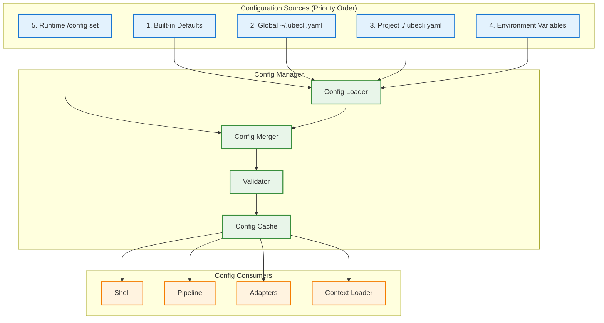

# Configuration Management Enabler

## Metadata

| Field | Value |
|-------|-------|
| **Name** | Configuration Management |
| **Type** | Enabler |
| **ID** | ENB-759325 |
| **Capability ID** | CAP-759314 |
| **Owner** | Development Team |
| **Status** | Implemented |
| **Approval** | Approved |
| **Priority** | Medium |
| **Analysis Review** | Not Required |
| **Code Review** | Not Required |

---

## Technical Context

### Purpose

The Configuration Management enabler handles loading, parsing, validating, and providing access to UbeCLI/ModelProxy configuration. It supports:

1. **Multi-source Configuration**: Defaults → Global → Project → Environment
2. **File Format**: YAML configuration files (.ubecli.yaml)
3. **Environment Variables**: Override any config value via env vars
4. **Runtime Updates**: Modify config via slash commands
5. **Validation**: Type checking and constraint validation

### Architecture Fit

Configuration is used by all other enablers:

```
Config Manager → Shell, Pipeline, Context Loader, Adapters
```

### Existing Patterns to Follow

- Configuration patterns from `envconfig` library
- YAML parsing from existing Go applications
- Environment variable handling from `os.Getenv`

---

## Functional Requirements

| ID | Name | Requirement | Status | Priority | Approval |
|----|------|-------------|--------|----------|----------|
| FR-759501 | YAML Loading | Config loads from .ubecli.yaml files | Implemented | High | Approved |
| FR-759502 | Config Hierarchy | Configs merge: defaults → global → project | Implemented | High | Approved |
| FR-759503 | Env Override | Environment variables override config values | Implemented | High | Approved |
| FR-759504 | Config Validation | Invalid configs are rejected with clear errors | Implemented | High | Approved |
| FR-759505 | Default Values | Sensible defaults for all optional settings | Implemented | High | Approved |
| FR-759506 | Config Init | `/config init` creates default config file | Implemented | Medium | Approved |
| FR-759507 | Runtime Get | `/config get <key>` shows current value | Implemented | Medium | Approved |
| FR-759508 | Runtime Set | `/config set <key> <value>` updates config | Implemented | Medium | Approved |
| FR-759509 | Config Save | Config changes can be persisted to file | Implemented | Medium | Approved |
| FR-759510 | Secret Handling | API keys are not logged or displayed | Implemented | High | Approved |

---

## Non-Functional Requirements

| ID | Name | Requirement | Type | Status | Priority | Approval |
|----|------|-------------|------|--------|----------|----------|
| NFR-759501 | Load Time | Config loading < 50ms | Performance | Implemented | High | Approved |
| NFR-759502 | File Watching | Optional auto-reload on file change | Reliability | Implemented | Low | Approved |
| NFR-759503 | Type Safety | Strongly typed config struct in Go | Quality | Implemented | High | Approved |

---

## Technical Specifications

### Configuration Architecture



### Configuration Struct (Go)

```go
// Config is the root configuration structure
type Config struct {
    LLM        LLMConfig        `yaml:"llm"`
    Prework    PreworkConfig    `yaml:"prework"`
    Shell      ShellConfig      `yaml:"shell"`
    Logging    LoggingConfig    `yaml:"logging"`
    Debug      DebugConfig      `yaml:"debug"`
}

// LLMConfig configures LLM adapters
type LLMConfig struct {
    Default   string                    `yaml:"default" env:"UBECLI_LLM_DEFAULT"`
    Adapters  map[string]AdapterConfig  `yaml:"adapters"`
}

type AdapterConfig struct {
    APIKey    string        `yaml:"api_key" env:"prefix"`  // Will check ${ADAPTER}_API_KEY
    Model     string        `yaml:"model"`
    MaxTokens int           `yaml:"max_tokens"`
    Timeout   time.Duration `yaml:"timeout"`
    Endpoint  string        `yaml:"endpoint"`

    // Claude CLI specific
    WorkingDir      string `yaml:"working_dir"`
    SkipPermissions bool   `yaml:"skip_permissions"`
    PrintMode       bool   `yaml:"print_mode"`

    // Ollama specific
    Host string `yaml:"host"`
}

// PreworkConfig configures the prework pipeline
type PreworkConfig struct {
    Enabled       bool                `yaml:"enabled"`
    InjectContext bool                `yaml:"inject_context"`
    ContextFiles  []string            `yaml:"context_files"`
    Stages        StagesConfig        `yaml:"stages"`
    CustomRules   []RuleConfig        `yaml:"custom_rules"`
}

type StagesConfig struct {
    ContextLoad        StageConfig `yaml:"context_load"`
    RuleApplication    StageConfig `yaml:"rule_application"`
    ApprovalValidation StageConfig `yaml:"approval_validation"`
    PromptBuild        StageConfig `yaml:"prompt_build"`
    Format             StageConfig `yaml:"format"`
}

type StageConfig struct {
    Enabled bool `yaml:"enabled"`
}

type RuleConfig struct {
    Name         string `yaml:"name"`
    AlwaysInject bool   `yaml:"always_inject"`
    Condition    string `yaml:"condition"`
    Template     string `yaml:"template"`
    Command      string `yaml:"command"`
    InjectAs     string `yaml:"inject_as"`
}

// ShellConfig configures the interactive shell
type ShellConfig struct {
    Prompt      string `yaml:"prompt" env:"UBECLI_PROMPT"`
    HistoryFile string `yaml:"history_file"`
    MaxHistory  int    `yaml:"max_history"`
}

// LoggingConfig configures logging
type LoggingConfig struct {
    Enabled        bool   `yaml:"enabled"`
    File           string `yaml:"file"`
    Level          string `yaml:"level"`
    IncludePrompts bool   `yaml:"include_prompts"`
}

// DebugConfig configures debug options
type DebugConfig struct {
    Enabled    bool `yaml:"enabled" env:"UBECLI_DEBUG"`
    ShowPrwork bool `yaml:"show_prework"`
    DryRun     bool `yaml:"dry_run"`
}
```

### Config Manager Interface

```go
// ConfigManager handles configuration loading and access
type ConfigManager struct {
    config      *Config
    configPath  string
    projectPath string
    mutex       sync.RWMutex
    watchers    []func(*Config)
}

// NewConfigManager creates a new config manager
func NewConfigManager() *ConfigManager

// Load loads configuration from all sources
func (m *ConfigManager) Load() error

// Get returns the current configuration (read-only)
func (m *ConfigManager) Get() *Config

// Set updates a configuration value
func (m *ConfigManager) Set(key string, value interface{}) error

// Save persists current config to project file
func (m *ConfigManager) Save() error

// OnChange registers a callback for config changes
func (m *ConfigManager) OnChange(fn func(*Config))

// GetString returns a string config value by dot-notation key
func (m *ConfigManager) GetString(key string) string

// GetInt returns an int config value
func (m *ConfigManager) GetInt(key string) int

// GetBool returns a bool config value
func (m *ConfigManager) GetBool(key string) bool
```

### Configuration Loading Logic

```go
// Load loads and merges configuration from all sources
func (m *ConfigManager) Load() error {
    // 1. Start with defaults
    config := DefaultConfig()

    // 2. Load global config (~/.ubecli.yaml)
    globalPath := filepath.Join(os.Getenv("HOME"), ".ubecli.yaml")
    if globalConfig, err := loadYAML(globalPath); err == nil {
        config = mergeConfig(config, globalConfig)
    }

    // 3. Load project config (./.ubecli.yaml)
    projectPath := ".ubecli.yaml"
    if projectConfig, err := loadYAML(projectPath); err == nil {
        config = mergeConfig(config, projectConfig)
        m.configPath = projectPath
    }

    // 4. Apply environment variable overrides
    config = applyEnvOverrides(config)

    // 5. Validate final configuration
    if err := validateConfig(config); err != nil {
        return fmt.Errorf("invalid configuration: %w", err)
    }

    m.mutex.Lock()
    m.config = config
    m.mutex.Unlock()

    // Notify watchers
    for _, watcher := range m.watchers {
        watcher(config)
    }

    return nil
}

// applyEnvOverrides applies environment variable overrides
func applyEnvOverrides(config *Config) *Config {
    // UBECLI_LLM_DEFAULT
    if v := os.Getenv("UBECLI_LLM_DEFAULT"); v != "" {
        config.LLM.Default = v
    }

    // ANTHROPIC_API_KEY for claude adapters
    if v := os.Getenv("ANTHROPIC_API_KEY"); v != "" {
        if adapter, ok := config.LLM.Adapters["claude-api"]; ok {
            adapter.APIKey = v
            config.LLM.Adapters["claude-api"] = adapter
        }
    }

    // OPENAI_API_KEY for openai adapter
    if v := os.Getenv("OPENAI_API_KEY"); v != "" {
        if adapter, ok := config.LLM.Adapters["openai"]; ok {
            adapter.APIKey = v
            config.LLM.Adapters["openai"] = adapter
        }
    }

    // UBECLI_DEBUG
    if v := os.Getenv("UBECLI_DEBUG"); v == "true" || v == "1" {
        config.Debug.Enabled = true
    }

    return config
}
```

### Default Configuration

```go
// DefaultConfig returns the default configuration
func DefaultConfig() *Config {
    return &Config{
        LLM: LLMConfig{
            Default: "claude-cli",
            Adapters: map[string]AdapterConfig{
                "claude-cli": {
                    Timeout:         5 * time.Minute,
                    SkipPermissions: true,
                    PrintMode:       true,
                },
                "claude-api": {
                    Model:     "claude-sonnet-4-20250514",
                    MaxTokens: 16384,
                    Endpoint:  "https://api.anthropic.com/v1/messages",
                    Timeout:   2 * time.Minute,
                },
                "openai": {
                    Model:     "gpt-4-turbo",
                    MaxTokens: 4096,
                    Endpoint:  "https://api.openai.com/v1/chat/completions",
                    Timeout:   2 * time.Minute,
                },
                "ollama": {
                    Host:    "http://localhost:11434",
                    Model:   "llama3",
                    Timeout: 5 * time.Minute,
                },
            },
        },
        Prework: PreworkConfig{
            Enabled:       true,
            InjectContext: true,
            ContextFiles: []string{
                "CLAUDE.md",
                "CODE_RULES/MAIN_SWDEV_PLAN.md",
            },
            Stages: StagesConfig{
                ContextLoad:        StageConfig{Enabled: true},
                RuleApplication:    StageConfig{Enabled: true},
                ApprovalValidation: StageConfig{Enabled: true},
                PromptBuild:        StageConfig{Enabled: true},
                Format:             StageConfig{Enabled: true},
            },
        },
        Shell: ShellConfig{
            Prompt:      "ube> ",
            HistoryFile: "~/.ubecli_history",
            MaxHistory:  1000,
        },
        Logging: LoggingConfig{
            Enabled: true,
            File:    "~/.ubecli/logs/audit.log",
            Level:   "info",
        },
        Debug: DebugConfig{
            Enabled: false,
        },
    }
}
```

### Configuration Validation

```go
// validateConfig validates the configuration
func validateConfig(config *Config) error {
    var errors []string

    // Validate LLM config
    if config.LLM.Default == "" {
        errors = append(errors, "llm.default is required")
    }
    if _, ok := config.LLM.Adapters[config.LLM.Default]; !ok {
        errors = append(errors, fmt.Sprintf("default adapter '%s' not configured", config.LLM.Default))
    }

    // Validate adapter configs
    for name, adapter := range config.LLM.Adapters {
        if name == "claude-api" || name == "openai" {
            if adapter.APIKey == "" {
                // Just warn, env var might be set at runtime
                log.Printf("Warning: %s adapter has no API key configured", name)
            }
        }
        if adapter.Timeout <= 0 {
            errors = append(errors, fmt.Sprintf("adapter '%s' has invalid timeout", name))
        }
    }

    // Validate prework config
    if config.Prework.Enabled && len(config.Prework.ContextFiles) == 0 {
        log.Printf("Warning: prework enabled but no context files configured")
    }

    if len(errors) > 0 {
        return fmt.Errorf("configuration errors:\n  - %s", strings.Join(errors, "\n  - "))
    }
    return nil
}
```

### Slash Commands Implementation

```go
// HandleConfigCommand handles /config commands
func HandleConfigCommand(args []string, mgr *ConfigManager) (string, error) {
    if len(args) == 0 {
        return showCurrentConfig(mgr)
    }

    switch args[0] {
    case "init":
        return initConfig(mgr)
    case "get":
        if len(args) < 2 {
            return "", fmt.Errorf("usage: /config get <key>")
        }
        return getConfigValue(mgr, args[1])
    case "set":
        if len(args) < 3 {
            return "", fmt.Errorf("usage: /config set <key> <value>")
        }
        return setConfigValue(mgr, args[1], args[2])
    case "save":
        return saveConfig(mgr)
    default:
        return "", fmt.Errorf("unknown config command: %s", args[0])
    }
}

func showCurrentConfig(mgr *ConfigManager) (string, error) {
    config := mgr.Get()
    // Mask secrets
    masked := maskSecrets(config)
    output, _ := yaml.Marshal(masked)
    return string(output), nil
}

func maskSecrets(config *Config) *Config {
    masked := *config
    for name, adapter := range masked.LLM.Adapters {
        if adapter.APIKey != "" {
            adapter.APIKey = "***REDACTED***"
            masked.LLM.Adapters[name] = adapter
        }
    }
    return &masked
}
```

### Complete YAML Configuration Example

```yaml
# ~/.ubecli.yaml or ./.ubecli.yaml

# LLM Configuration
llm:
  # Default adapter (can be overridden by UBECLI_LLM_DEFAULT env var)
  default: claude-cli

  adapters:
    claude-cli:
      working_dir: .
      timeout: 5m
      skip_permissions: true
      print_mode: true

    claude-api:
      api_key: ${ANTHROPIC_API_KEY}  # Or set via environment
      model: claude-sonnet-4-20250514
      max_tokens: 16384
      endpoint: https://api.anthropic.com/v1/messages
      timeout: 2m

    openai:
      api_key: ${OPENAI_API_KEY}
      model: gpt-4-turbo
      max_tokens: 4096
      endpoint: https://api.openai.com/v1/chat/completions
      timeout: 2m

    ollama:
      host: http://localhost:11434
      model: llama3
      timeout: 5m

# Prework Pipeline Configuration
prework:
  enabled: true
  inject_context: true

  context_files:
    - CLAUDE.md
    - CODE_RULES/MAIN_SWDEV_PLAN.md

  stages:
    context_load:
      enabled: true
    rule_application:
      enabled: true
    approval_validation:
      enabled: true
    prompt_build:
      enabled: true
    format:
      enabled: true

  custom_rules:
    - name: sawai-enforcement
      always_inject: true
      template: |
        You MUST follow the MAIN_SWDEV_PLAN.md for ALL development activities.
        Check approval status before proceeding with implementation.
        Never modify approval status yourself.

    - name: git-status-injection
      command: git status --short
      inject_as: "Current git status"

    - name: discovery-mode
      condition: "prompt contains 'discovery'"
      template: |
        This is DISCOVERY mode.
        Create documentation ONLY.
        DO NOT modify any application code.

# Shell Configuration
shell:
  prompt: "ube> "
  history_file: ~/.ubecli_history
  max_history: 1000

# Logging Configuration
logging:
  enabled: true
  file: ~/.ubecli/logs/audit.log
  level: info
  include_prompts: false  # Privacy: don't log full prompts

# Debug Configuration
debug:
  enabled: false
  show_prework: false  # Show prework output before sending
  dry_run: false       # Don't actually call LLM
```

---

## Edge Cases and Error Handling

| Scenario | Expected Behavior | Test Case |
|----------|-------------------|-----------|
| Config file not found | Use defaults, warn user | `test_missing_config()` |
| Invalid YAML syntax | Error with line number | `test_invalid_yaml()` |
| Unknown config key | Ignore with warning | `test_unknown_key()` |
| Type mismatch | Error with expected type | `test_type_mismatch()` |
| Missing API key | Warn but continue | `test_missing_api_key()` |
| Circular env var | Detect and error | `test_circular_env()` |
| Permission denied on save | Error with instructions | `test_save_permission()` |

---

## External Dependencies

| Dependency | Purpose | Version |
|------------|---------|---------|
| `gopkg.in/yaml.v3` | YAML parsing | v3.0+ |
| Standard library | File operations, env vars | Go 1.21+ |

---

## Acceptance Scenarios (Gherkin)

### Test Suite: TST-759325 - Configuration Management Tests

```gherkin
@TST-759325
Feature: Configuration Management
  As a UbeCLI user
  I want flexible configuration options
  So that I can customize UbeCLI for my needs

  Background:
    Given the config manager is initialized

  @TS-759501 @FR-759501 @critical
  Scenario: Load YAML configuration
    Given .ubecli.yaml exists with valid content
    When the config manager loads configuration
    Then the configuration should be parsed correctly

  @TS-759502 @FR-759502
  Scenario: Merge configuration hierarchy
    Given ~/.ubecli.yaml sets llm.default to "claude-api"
    And ./.ubecli.yaml sets llm.default to "ollama"
    When the config manager loads configuration
    Then llm.default should be "ollama"

  @TS-759503 @FR-759503 @critical
  Scenario: Environment variable override
    Given .ubecli.yaml sets llm.default to "claude-cli"
    And UBECLI_LLM_DEFAULT is set to "openai"
    When the config manager loads configuration
    Then llm.default should be "openai"

  @TS-759504 @FR-759504
  Scenario: Reject invalid configuration
    Given .ubecli.yaml has invalid timeout value
    When the config manager loads configuration
    Then an error should be returned
    And the error should describe the invalid field

  @TS-759505 @FR-759505
  Scenario: Apply default values
    Given no configuration files exist
    When the config manager loads configuration
    Then llm.default should be "claude-cli"
    And shell.prompt should be "ube> "

  @TS-759506 @FR-759506
  Scenario: Initialize default config file
    Given no .ubecli.yaml exists
    When I run "/config init"
    Then .ubecli.yaml should be created
    And it should contain default values

  @TS-759507 @FR-759507
  Scenario: Get config value at runtime
    Given the config is loaded
    When I run "/config get llm.default"
    Then the current value should be displayed

  @TS-759508 @FR-759508
  Scenario: Set config value at runtime
    Given the config is loaded
    When I run "/config set llm.default openai"
    Then llm.default should be updated to "openai"

  @TS-759509 @FR-759510 @critical
  Scenario: API keys are not displayed
    Given claude-api adapter has an API key configured
    When I run "/config"
    Then the API key should show as "***REDACTED***"
```

### Test Scenario Summary

| Scenario ID | Name | Requirement | Priority | Status | Automation |
|-------------|------|-------------|----------|--------|------------|
| TS-759501 | Load YAML configuration | FR-759501 | Critical | Implemented | Pending |
| TS-759502 | Merge configuration hierarchy | FR-759502 | High | Implemented | Pending |
| TS-759503 | Environment variable override | FR-759503 | Critical | Implemented | Pending |
| TS-759504 | Reject invalid configuration | FR-759504 | High | Implemented | Pending |
| TS-759505 | Apply default values | FR-759505 | High | Implemented | Pending |
| TS-759506 | Initialize default config | FR-759506 | Medium | Implemented | Pending |
| TS-759507 | Get config value | FR-759507 | Medium | Implemented | Pending |
| TS-759508 | Set config value | FR-759508 | Medium | Implemented | Pending |
| TS-759509 | API keys not displayed | FR-759510 | Critical | Implemented | Pending |

---

## Test Architecture

- **Framework**: Go testing package
- **Coverage Target**: 85%+
- **Test Types**: Unit tests with temp files

---

## Implementation Hints

### Suggested Approach

1. Define Config structs with YAML tags
2. Implement default config factory
3. Implement YAML loading
4. Implement config merging
5. Add environment variable handling
6. Implement validation
7. Add slash command handlers

### Known Gotchas

- YAML parsing is case-sensitive
- Environment variable expansion needs careful handling
- Time durations need parsing ("5m", "2h")
- Config file paths need ~ expansion
- Secret masking must be thorough

### Reference Implementations

- `viper` library for inspiration (but we use simpler approach)
- `envconfig` for env var patterns

---

## Approval History

| Date | Stage | Decision | By | Feedback |
|------|-------|----------|-----|----------|
| 2025-12-14 | Discovery | Approved | Development Team | Auto-approved during discovery |

---

**Document Version**: 1.0
**Created**: 2025-12-14
**Last Updated**: 2025-12-14
**Author**: Development Team
