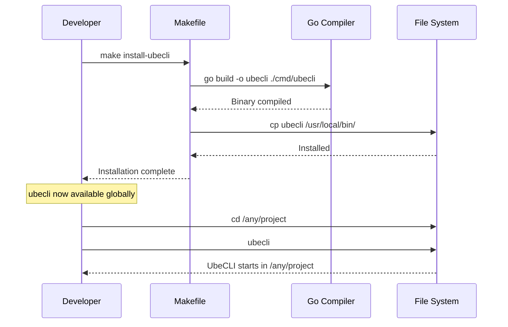

# Global Installation and PATH Integration

## Metadata

| Field | Value |
|-------|-------|
| **Name** | Global Installation and PATH Integration |
| **Type** | Enabler |
| **ID** | ENB-759326 |
| **Capability ID** | CAP-759314 |
| **Owner** | Development Team |
| **Status** | Implemented |
| **Approval** | Approved |
| **Priority** | High |
| **Analysis Review** | Required |
| **Code Review** | Not Required |

---

## Technical Context

### Purpose

Enable the `ubecli` command to be executed from any directory on the system by providing installation mechanisms that add the binary to the system PATH. When invoked, ubecli operates on the current working directory and its subdirectories, loading project-specific configuration files (.ubecli.yaml, CLAUDE.md, etc.) from the working directory.

### Architecture Fit

This enabler extends the existing UbeCLI binary distribution by adding:
- Makefile targets for building and installing to system-wide locations
- Shell profile integration for PATH modification
- Version management and upgrade capabilities

### Existing Patterns to Follow

- Follow Makefile patterns from existing build targets (e.g., `make build`, `make docker-build`)
- Use standard Go cross-compilation patterns for multi-platform support
- Follow Unix conventions for binary installation (/usr/local/bin)

---

## Functional Requirements

| ID | Name | Requirement | Status | Priority | Approval |
|----|------|-------------|--------|----------|----------|
| FR-759101 | Build Target | Makefile target `make ubecli` compiles the ubecli binary for the current platform | Ready for Design | High | Pending |
| FR-759102 | Install Target | Makefile target `make install-ubecli` copies binary to /usr/local/bin | Ready for Design | High | Pending |
| FR-759103 | Uninstall Target | Makefile target `make uninstall-ubecli` removes binary from /usr/local/bin | Ready for Design | Medium | Pending |
| FR-759104 | Cross-Platform Build | Support building for macOS (arm64, amd64), Linux (amd64), and Windows (amd64) | Ready for Design | Medium | Pending |
| FR-759105 | Version Embedding | Binary includes version, build date, and git commit information | Ready for Design | Medium | Pending |
| FR-759106 | Working Directory Context | ubecli operates on current working directory when invoked from any location | Ready for Design | High | Pending |

---

## Non-Functional Requirements

| ID | Name | Requirement | Type | Status | Priority | Approval |
|----|------|-------------|------|--------|----------|----------|
| NFR-759101 | Single Binary | Installation produces a single, self-contained executable | Deployment | Ready for Design | High | Pending |
| NFR-759102 | No Dependencies | Installed binary has no runtime dependencies beyond OS | Deployment | Ready for Design | High | Pending |
| NFR-759103 | Permission Handling | Install target handles permission requirements gracefully | Usability | Ready for Design | Medium | Pending |

---

## Technical Specifications (Template)

### Enabler Dependency Flow Diagram

```mermaid
flowchart TD
    ENB_759326["ENB-759326<br/>Global Installation<br/>📦"]

    MAKE["Makefile<br/>Build System<br/>⚙️"]
    GO["Go Compiler<br/>Build Tool<br/>🔧"]
    BIN["ubecli Binary<br/>Executable<br/>💾"]
    PATH["/usr/local/bin<br/>System PATH<br/>🌐"]

    ENB_759326 --> MAKE
    MAKE --> GO
    GO --> BIN
    BIN --> PATH

    classDef enabler fill:#e3f2fd,stroke:#1976d2,stroke-width:2px
    classDef tool fill:#e8f5e9,stroke:#388e3c,stroke-width:2px
    classDef output fill:#fff3e0,stroke:#f57c00,stroke-width:2px

    class ENB_759326 enabler
    class MAKE,GO tool
    class BIN,PATH output
```



### API Technical Specifications (if applicable)

Not applicable - this enabler provides build/install tooling, not API endpoints.

### Data Models

Not applicable.

### Class Diagrams

Not applicable.

### Sequence Diagrams



### Dataflow Diagrams

Not applicable.

### State Diagrams

Not applicable.

---

## Edge Cases and Error Handling

| Scenario | Expected Behavior | Test Case |
|----------|-------------------|-----------|
| No sudo access | Display clear error message with manual instructions | `test_no_sudo_install()` |
| Binary exists | Prompt for overwrite or use -f flag | `test_overwrite_existing()` |
| Invalid GOPATH | Fall back to module-aware build | `test_no_gopath()` |
| Cross-compile failure | Display platform-specific error and available targets | `test_cross_compile_error()` |

---

## External Dependencies

| Dependency | Type | Purpose |
|------------|------|---------|
| Go 1.21+ | Build Tool | Compile Go source code |
| Make | Build Tool | Build orchestration |
| /usr/local/bin | System Path | Standard binary installation location |

---

## Acceptance Scenarios (Gherkin)

### Test Suite: TST-759326 - Global Installation Tests

```gherkin
@TST-759326
Feature: UbeCLI Global Installation
  As a developer
  I want to install ubecli globally
  So that I can use it from any directory

  Background:
    Given Go 1.21+ is installed
    And the IntentR repository is cloned

  @TS-759401 @FR-759101 @critical
  Scenario: Build ubecli binary
    Given I am in the IntentR repository root
    When I run "make ubecli"
    Then a ubecli binary should be created in cmd/ubecli/
    And the binary should be executable
    And running "./cmd/ubecli/ubecli -version" should display version info

  @TS-759402 @FR-759102 @critical
  Scenario: Install ubecli to system PATH
    Given ubecli binary has been built
    When I run "sudo make install-ubecli"
    Then ubecli should exist in /usr/local/bin/
    And running "which ubecli" should return "/usr/local/bin/ubecli"
    And running "ubecli -version" should work from any directory

  @TS-759403 @FR-759103
  Scenario: Uninstall ubecli from system PATH
    Given ubecli is installed in /usr/local/bin/
    When I run "sudo make uninstall-ubecli"
    Then ubecli should not exist in /usr/local/bin/
    And running "which ubecli" should return empty

  @TS-759404 @FR-759106 @critical
  Scenario: UbeCLI operates on current working directory
    Given ubecli is installed globally
    And a project exists at "/tmp/test-project" with .ubecli.yaml
    When I run "cd /tmp/test-project && ubecli -p 'test'"
    Then ubecli should load configuration from /tmp/test-project/.ubecli.yaml
    And context files should be loaded relative to /tmp/test-project

  @TS-759405 @FR-759105
  Scenario: Version information includes build details
    Given ubecli is built with version embedding
    When I run "ubecli -version"
    Then the output should include the version number
    And the output should include the build date
    And the output should include the git commit hash
```

### Test Scenario Summary

| Scenario ID | Name | Requirement | Priority | Status | Automation |
|-------------|------|-------------|----------|--------|------------|
| TS-759401 | Build ubecli binary | FR-759101 | Critical | Draft | Pending |
| TS-759402 | Install to system PATH | FR-759102 | Critical | Draft | Pending |
| TS-759403 | Uninstall from system PATH | FR-759103 | Medium | Draft | Pending |
| TS-759404 | Operates on working directory | FR-759106 | Critical | Draft | Pending |
| TS-759405 | Version includes build details | FR-759105 | Medium | Draft | Pending |

---

## Test Architecture

- **Framework**: Go testing + shell scripts for integration
- **Coverage Target**: 80%+
- **Test Types**: Unit (Go), Integration (shell scripts)
- **Step Definition Location**: `cmd/ubecli/install_test.go`
- **Feature File Location**: `test/features/installation.feature`

---

## Testing Strategy

### Unit Testing

- Test version string formatting
- Test build flag parsing

### Integration Testing

- Test full build → install → verify → uninstall cycle
- Test cross-directory execution
- Test configuration loading from various directories

### End-to-End Testing

- Install on clean system and verify functionality
- Test upgrade from previous version

---

## Implementation Hints

### Suggested Approach

1. Add Makefile targets for `ubecli`, `install-ubecli`, `uninstall-ubecli`
2. Use Go ldflags to embed version/build information
3. Create `scripts/install.sh` for advanced installation options
4. Update main.go to use embedded version info

### Known Gotchas

- macOS may require `sudo` or user to add /usr/local/bin to PATH manually
- Windows requires different installation approach (no /usr/local/bin)
- Go modules mode requires specific build flags

### Reference Implementations

- Existing Makefile patterns in project root
- Similar tools: `gh` (GitHub CLI), `kubectl` installation patterns

---

## Approval History

| Date | Stage | Decision | By | Feedback |
|------|-------|----------|-----|----------|
| 2025-12-14 | Created | Pending | Development Team | Awaiting approval |
| 2025-12-14 | Analysis | Approved | User | Approved for implementation |
| 2025-12-14 | Implementation | Completed | Claude | Makefile targets and version embedding added |

---

**Document Version**: 1.0
**Created**: 2025-12-14
**Last Updated**: 2025-12-14
**Author**: Development Team
