# OpenAI Codex CLI Adapter

## Metadata

| Field | Value |
|-------|-------|
| **Name** | OpenAI Codex CLI Adapter |
| **Type** | Enabler |
| **ID** | ENB-759327 |
| **Capability ID** | CAP-759314 |
| **Owner** | Development Team |
| **Status** | Implemented |
| **Approval** | Approved |
| **Priority** | High |
| **Analysis Review** | Required |
| **Code Review** | Not Required |

---

## Technical Context

### Purpose

Provide an LLM adapter that integrates with the OpenAI Codex CLI (`@openai/codex`), enabling ubecli users to route prompts through OpenAI's Codex agent. This adapter follows the same patterns as the existing Claude CLI adapter, executing prompts via the local Codex CLI installation and capturing responses.

### Architecture Fit

This enabler extends the existing LLM adapter system (ENB-759324) by adding a new adapter implementation. It follows the established adapter interface pattern and integrates with:
- Adapter Registry for automatic registration
- Configuration system for adapter-specific settings
- Pipeline for prompt enhancement before execution

### Existing Patterns to Follow

- Follow adapter implementation pattern from `adapters/claude_cli.go`
- Use `exec.Command` for CLI execution with context timeout
- Implement `LLMAdapter` interface (Name, Execute, Validate, Capabilities)
- Register adapter in `init()` function
- Follow configuration pattern from `config/config.go`

---

## Functional Requirements

| ID | Name | Requirement | Status | Priority | Approval |
|----|------|-------------|--------|----------|----------|
| FR-759201 | Adapter Interface | Implement LLMAdapter interface for Codex CLI | Ready for Design | High | Pending |
| FR-759202 | CLI Discovery | Locate codex executable in PATH and common locations | Ready for Design | High | Pending |
| FR-759203 | Exec Mode | Use `codex exec` for non-interactive prompt execution | Ready for Design | High | Pending |
| FR-759204 | Working Directory | Support working directory configuration via `-C` flag | Ready for Design | High | Pending |
| FR-759205 | Skip Approvals | Support `--dangerously-bypass-approvals-and-sandbox` flag | Ready for Design | Medium | Pending |
| FR-759206 | Model Selection | Support model selection via `-m` flag | Ready for Design | Medium | Pending |
| FR-759207 | Timeout Handling | Support configurable timeout for long-running operations | Ready for Design | High | Pending |
| FR-759208 | Auto Registration | Auto-register with adapter registry on init | Ready for Design | High | Pending |
| FR-759209 | Configuration | Add codex-cli section to default config | Ready for Design | Medium | Pending |

---

## Non-Functional Requirements

| ID | Name | Requirement | Type | Status | Priority | Approval |
|----|------|-------------|------|--------|----------|----------|
| NFR-759201 | Graceful Fallback | If codex not found, skip registration without error | Reliability | Ready for Design | High | Pending |
| NFR-759202 | Timeout Default | Default timeout of 5 minutes for exec operations | Performance | Ready for Design | Medium | Pending |
| NFR-759203 | Error Messages | Clear error messages including stderr output from codex | Usability | Ready for Design | Medium | Pending |

---

## Technical Specifications (Template)

### Enabler Dependency Flow Diagram

```mermaid
flowchart TD
    ENB_759327["ENB-759327<br/>Codex CLI Adapter<br/>📡"]

    ADAPT["adapters/adapter.go<br/>LLMAdapter Interface<br/>📋"]
    REG["Adapter Registry<br/>Registration<br/>📦"]
    CODEX["codex exec<br/>CLI Execution<br/>🔧"]
    CFG["config/config.go<br/>Configuration<br/>⚙️"]

    ENB_759327 --> ADAPT
    ENB_759327 --> REG
    ENB_759327 --> CODEX
    ENB_759327 --> CFG

    classDef enabler fill:#e3f2fd,stroke:#1976d2,stroke-width:2px
    classDef interface fill:#e8f5e9,stroke:#388e3c,stroke-width:2px
    classDef external fill:#fff3e0,stroke:#f57c00,stroke-width:2px

    class ENB_759327 enabler
    class ADAPT,REG,CFG interface
    class CODEX external
```



### API Technical Specifications (if applicable)

Not applicable - this is a CLI adapter, not an API.

### Data Models

**CodexCLIConfig Structure:**
```go
type CodexCLIConfig struct {
    WorkingDir       string        // -C flag
    Timeout          time.Duration // Command timeout
    SkipApprovals    bool          // --dangerously-bypass-approvals-and-sandbox
    Model            string        // -m flag (e.g., "o3", "gpt-4")
    SandboxMode      string        // -s flag (read-only, workspace-write, danger-full-access)
}
```

### Class Diagrams


### Sequence Diagrams


### Dataflow Diagrams


### State Diagrams

Not applicable.

---

## Edge Cases and Error Handling

| Scenario | Expected Behavior | Test Case |
|----------|-------------------|-----------|
| Codex not installed | Skip registration, log warning | `test_codex_not_found()` |
| Codex timeout | Return timeout error with context | `test_codex_timeout()` |
| Codex returns error | Include stderr in error message | `test_codex_error()` |
| Empty response | Return descriptive message | `test_empty_response()` |
| Invalid model | Pass through to codex, let it handle | `test_invalid_model()` |
| Context cancelled | Return cancellation error | `test_context_cancelled()` |

---

## External Dependencies

| Dependency | Type | Purpose |
|------------|------|---------|
| @openai/codex | NPM Package | OpenAI Codex CLI tool |
| exec.Command | Go stdlib | CLI execution |
| context | Go stdlib | Timeout and cancellation |

---

## Acceptance Scenarios (Gherkin)

### Test Suite: TST-759327 - Codex CLI Adapter Tests

```gherkin
@TST-759327
Feature: Codex CLI Adapter
  As a developer
  I want to use OpenAI Codex through ubecli
  So that I can leverage Codex for AI-assisted development

  Background:
    Given codex CLI is installed
    And ubecli is configured with codex-cli adapter

  @TS-759501 @FR-759201 @critical
  Scenario: Execute prompt via Codex CLI
    Given the adapter is properly configured
    When I execute a prompt "Explain this code"
    Then the prompt should be sent to codex exec
    And the response should be returned

  @TS-759502 @FR-759202 @critical
  Scenario: Codex CLI discovery
    Given codex is installed in PATH
    When the adapter initializes
    Then the codex executable should be found
    And the adapter should register successfully

  @TS-759503 @FR-759202
  Scenario: Codex CLI not installed
    Given codex is not installed
    When the adapter initializes
    Then the adapter should not register
    And no error should be thrown

  @TS-759504 @FR-759204
  Scenario: Working directory support
    Given a project directory "/tmp/test-project"
    When I execute a prompt with working directory set
    Then codex should receive "-C /tmp/test-project"

  @TS-759505 @FR-759207
  Scenario: Timeout handling
    Given a timeout of 30 seconds is configured
    When a codex operation takes longer than 30 seconds
    Then the operation should be cancelled
    And a timeout error should be returned

  @TS-759506 @FR-759206
  Scenario: Model selection
    Given model "o3" is configured
    When I execute a prompt
    Then codex should receive "-m o3"
```

### Test Scenario Summary

| Scenario ID | Name | Requirement | Priority | Status | Automation |
|-------------|------|-------------|----------|--------|------------|
| TS-759501 | Execute prompt via Codex | FR-759201 | Critical | Draft | Pending |
| TS-759502 | Codex CLI discovery | FR-759202 | Critical | Draft | Pending |
| TS-759503 | Codex not installed | FR-759202 | Medium | Draft | Pending |
| TS-759504 | Working directory | FR-759204 | Medium | Draft | Pending |
| TS-759505 | Timeout handling | FR-759207 | Medium | Draft | Pending |
| TS-759506 | Model selection | FR-759206 | Medium | Draft | Pending |

---

## Test Architecture

- **Framework**: Go testing package
- **Coverage Target**: 80%+
- **Test Types**: Unit tests with mocked exec.Command
- **Step Definition Location**: `cmd/ubecli/adapters/codex_cli_test.go`
- **Feature File Location**: `test/features/codex_adapter.feature`

---

## Testing Strategy

### Unit Testing

- Test CLI argument building
- Test error handling
- Mock exec.Command for isolated testing

### Integration Testing

- Test actual codex execution (requires codex installed)
- Test timeout behavior
- Test working directory handling

### End-to-End Testing

- Full ubecli flow with codex adapter
- Configuration loading and usage

---

## Implementation Hints

### Suggested Approach

1. Create `adapters/codex_cli.go` following `claude_cli.go` pattern
2. Implement `CodexCLIAdapter` struct with config
3. Use `codex exec` command with prompt as argument
4. Add `-C` flag for working directory
5. Add `--dangerously-bypass-approvals-and-sandbox` for skip approvals
6. Register in `init()` only if codex is found
7. Update `config/config.go` to include codex-cli defaults

### Codex CLI Command Pattern

```bash
# Basic execution
codex exec "Your prompt here"

# With working directory
codex exec -C /path/to/project "Your prompt here"

# With model selection
codex exec -m o3 "Your prompt here"

# With skip approvals (dangerous mode)
codex exec --dangerously-bypass-approvals-and-sandbox "Your prompt here"

# Combined
codex exec -C /path -m o3 --dangerously-bypass-approvals-and-sandbox "prompt"
```

### Known Gotchas

- Codex CLI is installed via npm, path may be in nvm/node locations
- Codex uses TOML config at `~/.codex/config.toml`, not YAML
- `codex exec` is the non-interactive mode, not `codex -p`
- May need OPENAI_API_KEY environment variable

### Reference Implementations

- `adapters/claude_cli.go` - Primary reference for adapter pattern
- `adapters/adapter.go` - Interface definitions

---

## Approval History

| Date | Stage | Decision | By | Feedback |
|------|-------|----------|-----|----------|
| 2025-12-14 | Created | Pending | Development Team | Awaiting approval |
| 2025-12-14 | Analysis | Approved | User | Approved for implementation |
| 2025-12-14 | Implementation | Completed | Claude | Adapter and config added |

---

**Document Version**: 1.0
**Created**: 2025-12-14
**Last Updated**: 2025-12-14
**Author**: Development Team
