# Storyboard Index: HelloWorldWeather

## Metadata
- **Workspace**: HelloWorldWeather
- **Generated**: 12/23/2025, 11:19:04 AM
- **Total Cards**: 193
- **Total Connections**: 11

## Complete Flow Diagram

```mermaid
flowchart TD
    card1765937081415["✓ start app"]
    card1765937126217["✓ pull weather data"]
    card1765937186735["✓ display weather data on screen"]
    card1765937281984["✓ read default location"]
    card1765937186735["✓ display weather data on screen"]
    card1765937126217["✓ pull weather data"]
    card1765937281984["✓ read default location"]
    card1765937081415["✓ start app"]
    card1765937186735["✓ display weather data on screen"]
    card1765937824816["✓ Environment"]
    card1765937126217["✓ pull weather data"]
    card1765937281984["✓ read default location"]
    card1765937081415["✓ start app"]
    card1765937186735["✓ display weather data on screen"]
    card1765937824816["✓ Environment"]
    card1765937126217["✓ pull weather data"]
    card1765937281984["✓ read default location"]
    card1765937081415["✓ start app"]
    card1765937186735["✓ display weather data on screen"]
    card1765937824816["✓ Environment"]
    card1765940802459["✓ Provide Prompt field"]
    card1765937126217["✓ pull weather data"]
    card1765937281984["✓ read default location"]
    card1765937081415["✓ start app"]
    card1765943031022["✓ display prompt results"]
    card1765937186735["✓ display weather data on screen"]
    card1765937824816["✓ Environment"]
    card1765940802459["✓ Provide Prompt field"]
    card1765937126217["✓ pull weather data"]
    card1765937281984["✓ read default location"]
    card1765942941837["✓ send prompt data to openweather API"]
    card1765937081415["✓ start app"]
    card1765943031022["✓ display prompt results"]
    card1765937186735["✓ display weather data on screen"]
    card1765937824816["✓ Environment"]
    card1765940802459["✓ Provide Prompt field"]
    card1765937126217["✓ pull weather data"]
    card1765937281984["✓ read default location"]
    card1765942941837["✓ send prompt data to openweather API"]
    card1765937081415["✓ start app"]
    card1765943031022["✓ display prompt results"]
    card1765937186735["✓ display weather data on screen"]
    card1765937824816["✓ Environment"]
    card1765940802459["✓ Provide Prompt field"]
    card1765937126217["✓ pull weather data"]
    card1765937281984["✓ read default location"]
    card1765942941837["✓ send prompt data to openweather API"]
    card1765937081415["✓ start app"]
    card1765943031022["✓ display prompt results"]
    card1765937186735["✓ display weather data on screen"]
    card1765937824816["✓ Environment"]
    card1765940802459["✓ Provide Prompt field"]
    card1765937126217["✓ pull weather data"]
    card1765937281984["✓ read default location"]
    card1765942941837["✓ send prompt data to openweather API"]
    card1765937081415["✓ start app"]
    card1765943031022["✓ display prompt results"]
    card1765937186735["✓ display weather data on screen"]
    card1765937824816["✓ Environment"]
    card1765940802459["✓ Provide Prompt field"]
    card1765937126217["✓ pull weather data"]
    card1765937281984["✓ read default location"]
    card1765942941837["✓ send prompt data to openweather API"]
    card1765937081415["✓ start app"]
    card1765943031022["✓ display prompt results"]
    card1765937186735["✓ display weather data on screen"]
    card1765937824816["✓ Environment"]
    card1765940802459["✓ Provide Prompt field"]
    card1765937126217["✓ pull weather data"]
    card1765937281984["✓ read default location"]
    card1765942941837["✓ send prompt data to openweather API"]
    card1765937081415["✓ start app"]
    card1765943031022["✓ display prompt results"]
    card1765937186735["✓ display weather data on screen"]
    card1765937824816["✓ Environment"]
    card1765940802459["✓ Provide Prompt field"]
    card1765937126217["✓ pull weather data"]
    card1765937281984["✓ read default location"]
    card1765942941837["✓ send prompt data to openweather API"]
    card1765937081415["✓ start app"]
    card1766171921085["⟳ Enter City"]
    card1765943031022["✓ display prompt results"]
    card1765937186735["✓ display weather data on screen"]
    card1766171921085["⟳ Enter City"]
    card1765937824816["✓ Environment"]
    card1765940802459["✓ Provide Prompt field"]
    card1765937126217["✓ pull weather data"]
    card1765937281984["✓ read default location"]
    card1765942941837["✓ send prompt data to openweather API"]
    card1765937081415["✓ start app"]
    card1765943031022["✓ display prompt results"]
    card1765937186735["✓ display weather data on screen"]
    card1766171921085["⟳ Enter City"]
    card1765937824816["✓ Environment"]
    card1765940802459["✓ Provide Prompt field"]
    card1765937126217["✓ pull weather data"]
    card1765937281984["✓ read default location"]
    card1765942941837["✓ send prompt data to openweather API"]
    card1765937081415["✓ start app"]
    card1765943031022["✓ display prompt results"]
    card1765937186735["✓ display weather data on screen"]
    card1766171921085["⟳ Enter City"]
    card1765937824816["✓ Environment"]
    card1765940802459["✓ Provide Prompt field"]
    card1765937126217["✓ pull weather data"]
    card1765937281984["✓ read default location"]
    card1765942941837["✓ send prompt data to openweather API"]
    card1765937081415["✓ start app"]
    card1765943031022["✓ display prompt results"]
    card1765937186735["✓ display weather data on screen"]
    card1766171921085["⟳ Enter City"]
    card1765937824816["✓ Environment"]
    card1765940802459["✓ Provide Prompt field"]
    card1765937126217["✓ pull weather data"]
    card1765937281984["✓ read default location"]
    card1765942941837["✓ send prompt data to openweather API"]
    card1765937081415["✓ start app"]
    card1765943031022["✓ display prompt results"]
    card1765937186735["✓ display weather data on screen"]
    card1766171921085["⟳ Enter City"]
    card1765937824816["✓ Environment"]
    card1765940802459["✓ Provide Prompt field"]
    card1765937126217["✓ pull weather data"]
    card1765937281984["✓ read default location"]
    card1765942941837["✓ send prompt data to openweather API"]
    card1765937081415["✓ start app"]
    card1765943031022["✓ display prompt results"]
    card1765937186735["✓ display weather data on screen"]
    card1766171921085["⟳ Enter City"]
    card1765937824816["✓ Environment"]
    card1765940802459["✓ Provide Prompt field"]
    card1765937126217["✓ pull weather data"]
    card1765937281984["✓ read default location"]
    card1765942941837["✓ send prompt data to openweather API"]
    card1765937081415["✓ start app"]
    card1765943031022["✓ display prompt results"]
    card1765937186735["✓ display weather data on screen"]
    card1766171921085["⟳ Enter City"]
    card1765937824816["✓ Environment"]
    card1765940802459["✓ Provide Prompt field"]
    card1765937126217["✓ pull weather data"]
    card1765937281984["✓ read default location"]
    card1765942941837["✓ send prompt data to openweather API"]
    card1765937081415["✓ start app"]
    card1765943031022["✓ display prompt results"]
    card1765937186735["✓ display weather data on screen"]
    card1766171921085["⟳ Enter City"]
    card1765937824816["✓ Environment"]
    card1765940802459["✓ Provide Prompt field"]
    card1765937126217["✓ pull weather data"]
    card1765937281984["✓ read default location"]
    card1765942941837["✓ send prompt data to openweather API"]
    card1765937081415["✓ start app"]
    card1765943031022["✓ display prompt results"]
    card1765937186735["✓ display weather data on screen"]
    card1766171921085["⟳ Enter City"]
    card1765937824816["✓ Environment"]
    card1766171779671["⟳ Navigation"]
    card1765940802459["✓ Provide Prompt field"]
    card1765937126217["✓ pull weather data"]
    card1765937281984["✓ read default location"]
    card1765942941837["✓ send prompt data to openweather API"]
    card1765937081415["✓ start app"]
    card1765943031022["✓ display prompt results"]
    card1765937186735["✓ display weather data on screen"]
    card1766171921085["⟳ Enter City"]
    card1765937824816["✓ Environment"]
    card1766171779671["⟳ Navigation"]
    card1765940802459["✓ Provide Prompt field"]
    card1765937126217["✓ pull weather data"]
    card1765937281984["✓ read default location"]
    card1765942941837["✓ send prompt data to openweather API"]
    card1765937081415["✓ start app"]
    card1765943031022["✓ display prompt results"]
    card1765937186735["✓ display weather data on screen"]
    card1766171921085["⟳ Enter City"]
    card1765937824816["✓ Environment"]
    card1766171779671["⟳ Navigation"]
    card1765940802459["✓ Provide Prompt field"]
    card1765937126217["✓ pull weather data"]
    card1765937281984["✓ read default location"]
    card1765942941837["✓ send prompt data to openweather API"]
    card1765937081415["✓ start app"]
    card1765943031022["✓ display prompt results"]
    card1765937186735["✓ display weather data on screen"]
    card1766171921085["⟳ Enter City"]
    card1765937824816["✓ Environment"]
    card1766171779671["⟳ Navigation"]
    card1765940802459["✓ Provide Prompt field"]
    card1765937126217["✓ pull weather data"]
    card1765937281984["✓ read default location"]
    card1765942941837["✓ send prompt data to openweather API"]
    card1765937081415["✓ start app"]
    card1765937081415 --> card1765937281984
    card1765937126217 --> card1765937186735
    card1765937824816 --> card1765937081415
    card1765942941837 --> card1765940802459
    card1765940802459 --> card1765942941837
    card1765942941837 --> card1765943031022
    card1766171921085 --> card1765937126217
    card1765937281984 --> card1765937126217
    card1765937281984 --> card1766171779671
    card1766171779671 --> card1765940802459
    card1765940802459 --> card1766171921085
```

## Story Cards

| # | Title | Status | X | Y | File | Dependencies |
|---|-------|--------|---|---|------|-------------|
| 1 | [start app](./STORY-START-APP.md) | Completed | 128 | 305 | STORY-START-APP.md | 2 |
| 2 | [pull weather data](./STORY-PULL-WEATHER-DATA.md) | Completed | 573 | 789 | STORY-PULL-WEATHER-DATA.md | 3 |
| 3 | [display weather data on screen](./STORY-DISPLAY-WEATHER-DATA-ON-SCREEN.md) | Completed | 1032 | 1096 | STORY-DISPLAY-WEATHER-DATA-ON-SCREEN.md | 1 |
| 4 | [read default location](./STORY-READ-DEFAULT-LOCATION.md) | Completed | 128 | 552 | STORY-READ-DEFAULT-LOCATION.md | 3 |
| 5 | [display weather data on screen](./STORY-DISPLAY-WEATHER-DATA-ON-SCREEN.md) | Completed | 1032 | 1096 | STORY-DISPLAY-WEATHER-DATA-ON-SCREEN.md | 1 |
| 6 | [pull weather data](./STORY-PULL-WEATHER-DATA.md) | Completed | 573 | 789 | STORY-PULL-WEATHER-DATA.md | 3 |
| 7 | [read default location](./STORY-READ-DEFAULT-LOCATION.md) | Completed | 128 | 552 | STORY-READ-DEFAULT-LOCATION.md | 3 |
| 8 | [start app](./STORY-START-APP.md) | Completed | 128 | 305 | STORY-START-APP.md | 2 |
| 9 | [display weather data on screen](./STORY-DISPLAY-WEATHER-DATA-ON-SCREEN.md) | Completed | 1032 | 1096 | STORY-DISPLAY-WEATHER-DATA-ON-SCREEN.md | 1 |
| 10 | [Environment](./STORY-ENVIRONMENT.md) | Completed | 127 | 58 | STORY-ENVIRONMENT.md | 1 |
| 11 | [pull weather data](./STORY-PULL-WEATHER-DATA.md) | Completed | 573 | 789 | STORY-PULL-WEATHER-DATA.md | 3 |
| 12 | [read default location](./STORY-READ-DEFAULT-LOCATION.md) | Completed | 128 | 552 | STORY-READ-DEFAULT-LOCATION.md | 3 |
| 13 | [start app](./STORY-START-APP.md) | Completed | 128 | 305 | STORY-START-APP.md | 2 |
| 14 | [display weather data on screen](./STORY-DISPLAY-WEATHER-DATA-ON-SCREEN.md) | Completed | 1032 | 1096 | STORY-DISPLAY-WEATHER-DATA-ON-SCREEN.md | 1 |
| 15 | [Environment](./STORY-ENVIRONMENT.md) | Completed | 127 | 58 | STORY-ENVIRONMENT.md | 1 |
| 16 | [pull weather data](./STORY-PULL-WEATHER-DATA.md) | Completed | 573 | 789 | STORY-PULL-WEATHER-DATA.md | 3 |
| 17 | [read default location](./STORY-READ-DEFAULT-LOCATION.md) | Completed | 128 | 552 | STORY-READ-DEFAULT-LOCATION.md | 3 |
| 18 | [start app](./STORY-START-APP.md) | Completed | 128 | 305 | STORY-START-APP.md | 2 |
| 19 | [display weather data on screen](./STORY-DISPLAY-WEATHER-DATA-ON-SCREEN.md) | Completed | 1032 | 1096 | STORY-DISPLAY-WEATHER-DATA-ON-SCREEN.md | 1 |
| 20 | [Environment](./STORY-ENVIRONMENT.md) | Completed | 127 | 58 | STORY-ENVIRONMENT.md | 1 |
| 21 | [Provide Prompt field](./STORY-PROVIDE-PROMPT-FIELD.md) | Completed | 127 | 1265 | STORY-PROVIDE-PROMPT-FIELD.md | 4 |
| 22 | [pull weather data](./STORY-PULL-WEATHER-DATA.md) | Completed | 573 | 789 | STORY-PULL-WEATHER-DATA.md | 3 |
| 23 | [read default location](./STORY-READ-DEFAULT-LOCATION.md) | Completed | 128 | 552 | STORY-READ-DEFAULT-LOCATION.md | 3 |
| 24 | [start app](./STORY-START-APP.md) | Completed | 128 | 305 | STORY-START-APP.md | 2 |
| 25 | [display prompt results](./STORY-DISPLAY-PROMPT-RESULTS.md) | Completed | 127 | 1773 | STORY-DISPLAY-PROMPT-RESULTS.md | 1 |
| 26 | [display weather data on screen](./STORY-DISPLAY-WEATHER-DATA-ON-SCREEN.md) | Completed | 1032 | 1096 | STORY-DISPLAY-WEATHER-DATA-ON-SCREEN.md | 1 |
| 27 | [Environment](./STORY-ENVIRONMENT.md) | Completed | 127 | 58 | STORY-ENVIRONMENT.md | 1 |
| 28 | [Provide Prompt field](./STORY-PROVIDE-PROMPT-FIELD.md) | Completed | 127 | 1265 | STORY-PROVIDE-PROMPT-FIELD.md | 4 |
| 29 | [pull weather data](./STORY-PULL-WEATHER-DATA.md) | Completed | 573 | 789 | STORY-PULL-WEATHER-DATA.md | 3 |
| 30 | [read default location](./STORY-READ-DEFAULT-LOCATION.md) | Completed | 128 | 552 | STORY-READ-DEFAULT-LOCATION.md | 3 |
| 31 | [send prompt data to openweather API](./STORY-SEND-PROMPT-DATA-TO-OPENWEATHER-API.md) | Completed | 127 | 1520 | STORY-SEND-PROMPT-DATA-TO-OPENWEATHER-API.md | 3 |
| 32 | [start app](./STORY-START-APP.md) | Completed | 128 | 305 | STORY-START-APP.md | 2 |
| 33 | [display prompt results](./STORY-DISPLAY-PROMPT-RESULTS.md) | Completed | 127 | 1773 | STORY-DISPLAY-PROMPT-RESULTS.md | 1 |
| 34 | [display weather data on screen](./STORY-DISPLAY-WEATHER-DATA-ON-SCREEN.md) | Completed | 1032 | 1096 | STORY-DISPLAY-WEATHER-DATA-ON-SCREEN.md | 1 |
| 35 | [Environment](./STORY-ENVIRONMENT.md) | Completed | 127 | 58 | STORY-ENVIRONMENT.md | 1 |
| 36 | [Provide Prompt field](./STORY-PROVIDE-PROMPT-FIELD.md) | Completed | 127 | 1265 | STORY-PROVIDE-PROMPT-FIELD.md | 4 |
| 37 | [pull weather data](./STORY-PULL-WEATHER-DATA.md) | Completed | 573 | 789 | STORY-PULL-WEATHER-DATA.md | 3 |
| 38 | [read default location](./STORY-READ-DEFAULT-LOCATION.md) | Completed | 128 | 552 | STORY-READ-DEFAULT-LOCATION.md | 3 |
| 39 | [send prompt data to openweather API](./STORY-SEND-PROMPT-DATA-TO-OPENWEATHER-API.md) | Completed | 127 | 1520 | STORY-SEND-PROMPT-DATA-TO-OPENWEATHER-API.md | 3 |
| 40 | [start app](./STORY-START-APP.md) | Completed | 128 | 305 | STORY-START-APP.md | 2 |
| 41 | [display prompt results](./STORY-DISPLAY-PROMPT-RESULTS.md) | Completed | 127 | 1773 | STORY-DISPLAY-PROMPT-RESULTS.md | 1 |
| 42 | [display weather data on screen](./STORY-DISPLAY-WEATHER-DATA-ON-SCREEN.md) | Completed | 1032 | 1096 | STORY-DISPLAY-WEATHER-DATA-ON-SCREEN.md | 1 |
| 43 | [Environment](./STORY-ENVIRONMENT.md) | Completed | 127 | 58 | STORY-ENVIRONMENT.md | 1 |
| 44 | [Provide Prompt field](./STORY-PROVIDE-PROMPT-FIELD.md) | Completed | 127 | 1265 | STORY-PROVIDE-PROMPT-FIELD.md | 4 |
| 45 | [pull weather data](./STORY-PULL-WEATHER-DATA.md) | Completed | 573 | 789 | STORY-PULL-WEATHER-DATA.md | 3 |
| 46 | [read default location](./STORY-READ-DEFAULT-LOCATION.md) | Completed | 128 | 552 | STORY-READ-DEFAULT-LOCATION.md | 3 |
| 47 | [send prompt data to openweather API](./STORY-SEND-PROMPT-DATA-TO-OPENWEATHER-API.md) | Completed | 127 | 1520 | STORY-SEND-PROMPT-DATA-TO-OPENWEATHER-API.md | 3 |
| 48 | [start app](./STORY-START-APP.md) | Completed | 128 | 305 | STORY-START-APP.md | 2 |
| 49 | [display prompt results](./STORY-DISPLAY-PROMPT-RESULTS.md) | Completed | 127 | 1773 | STORY-DISPLAY-PROMPT-RESULTS.md | 1 |
| 50 | [display weather data on screen](./STORY-DISPLAY-WEATHER-DATA-ON-SCREEN.md) | Completed | 1032 | 1096 | STORY-DISPLAY-WEATHER-DATA-ON-SCREEN.md | 1 |
| 51 | [Environment](./STORY-ENVIRONMENT.md) | Completed | 127 | 58 | STORY-ENVIRONMENT.md | 1 |
| 52 | [Provide Prompt field](./STORY-PROVIDE-PROMPT-FIELD.md) | Completed | 127 | 1265 | STORY-PROVIDE-PROMPT-FIELD.md | 4 |
| 53 | [pull weather data](./STORY-PULL-WEATHER-DATA.md) | Completed | 573 | 789 | STORY-PULL-WEATHER-DATA.md | 3 |
| 54 | [read default location](./STORY-READ-DEFAULT-LOCATION.md) | Completed | 128 | 552 | STORY-READ-DEFAULT-LOCATION.md | 3 |
| 55 | [send prompt data to openweather API](./STORY-SEND-PROMPT-DATA-TO-OPENWEATHER-API.md) | Completed | 127 | 1520 | STORY-SEND-PROMPT-DATA-TO-OPENWEATHER-API.md | 3 |
| 56 | [start app](./STORY-START-APP.md) | Completed | 128 | 305 | STORY-START-APP.md | 2 |
| 57 | [display prompt results](./STORY-DISPLAY-PROMPT-RESULTS.md) | Completed | 127 | 1773 | STORY-DISPLAY-PROMPT-RESULTS.md | 1 |
| 58 | [display weather data on screen](./STORY-DISPLAY-WEATHER-DATA-ON-SCREEN.md) | Completed | 1032 | 1096 | STORY-DISPLAY-WEATHER-DATA-ON-SCREEN.md | 1 |
| 59 | [Environment](./STORY-ENVIRONMENT.md) | Completed | 127 | 58 | STORY-ENVIRONMENT.md | 1 |
| 60 | [Provide Prompt field](./STORY-PROVIDE-PROMPT-FIELD.md) | Completed | 127 | 1265 | STORY-PROVIDE-PROMPT-FIELD.md | 4 |
| 61 | [pull weather data](./STORY-PULL-WEATHER-DATA.md) | Completed | 573 | 789 | STORY-PULL-WEATHER-DATA.md | 3 |
| 62 | [read default location](./STORY-READ-DEFAULT-LOCATION.md) | Completed | 128 | 552 | STORY-READ-DEFAULT-LOCATION.md | 3 |
| 63 | [send prompt data to openweather API](./STORY-SEND-PROMPT-DATA-TO-OPENWEATHER-API.md) | Completed | 127 | 1520 | STORY-SEND-PROMPT-DATA-TO-OPENWEATHER-API.md | 3 |
| 64 | [start app](./STORY-START-APP.md) | Completed | 128 | 305 | STORY-START-APP.md | 2 |
| 65 | [display prompt results](./STORY-DISPLAY-PROMPT-RESULTS.md) | Completed | 127 | 1773 | STORY-DISPLAY-PROMPT-RESULTS.md | 1 |
| 66 | [display weather data on screen](./STORY-DISPLAY-WEATHER-DATA-ON-SCREEN.md) | Completed | 1032 | 1096 | STORY-DISPLAY-WEATHER-DATA-ON-SCREEN.md | 1 |
| 67 | [Environment](./STORY-ENVIRONMENT.md) | Completed | 127 | 58 | STORY-ENVIRONMENT.md | 1 |
| 68 | [Provide Prompt field](./STORY-PROVIDE-PROMPT-FIELD.md) | Completed | 127 | 1265 | STORY-PROVIDE-PROMPT-FIELD.md | 4 |
| 69 | [pull weather data](./STORY-PULL-WEATHER-DATA.md) | Completed | 573 | 789 | STORY-PULL-WEATHER-DATA.md | 3 |
| 70 | [read default location](./STORY-READ-DEFAULT-LOCATION.md) | Completed | 128 | 552 | STORY-READ-DEFAULT-LOCATION.md | 3 |
| 71 | [send prompt data to openweather API](./STORY-SEND-PROMPT-DATA-TO-OPENWEATHER-API.md) | Completed | 127 | 1520 | STORY-SEND-PROMPT-DATA-TO-OPENWEATHER-API.md | 3 |
| 72 | [start app](./STORY-START-APP.md) | Completed | 128 | 305 | STORY-START-APP.md | 2 |
| 73 | [display prompt results](./STORY-DISPLAY-PROMPT-RESULTS.md) | Completed | 127 | 1773 | STORY-DISPLAY-PROMPT-RESULTS.md | 1 |
| 74 | [display weather data on screen](./STORY-DISPLAY-WEATHER-DATA-ON-SCREEN.md) | Completed | 1032 | 1096 | STORY-DISPLAY-WEATHER-DATA-ON-SCREEN.md | 1 |
| 75 | [Environment](./STORY-ENVIRONMENT.md) | Completed | 127 | 58 | STORY-ENVIRONMENT.md | 1 |
| 76 | [Provide Prompt field](./STORY-PROVIDE-PROMPT-FIELD.md) | Completed | 127 | 1265 | STORY-PROVIDE-PROMPT-FIELD.md | 4 |
| 77 | [pull weather data](./STORY-PULL-WEATHER-DATA.md) | Completed | 573 | 789 | STORY-PULL-WEATHER-DATA.md | 3 |
| 78 | [read default location](./STORY-READ-DEFAULT-LOCATION.md) | Completed | 128 | 552 | STORY-READ-DEFAULT-LOCATION.md | 3 |
| 79 | [send prompt data to openweather API](./STORY-SEND-PROMPT-DATA-TO-OPENWEATHER-API.md) | Completed | 127 | 1520 | STORY-SEND-PROMPT-DATA-TO-OPENWEATHER-API.md | 3 |
| 80 | [start app](./STORY-START-APP.md) | Completed | 128 | 305 | STORY-START-APP.md | 2 |
| 81 | [Enter City](./STORY-ENTER-CITY.md) | In Progress | 570 | 1194 | STORY-ENTER-CITY.md | 2 |
| 82 | [display prompt results](./STORY-DISPLAY-PROMPT-RESULTS.md) | Completed | 127 | 1773 | STORY-DISPLAY-PROMPT-RESULTS.md | 1 |
| 83 | [display weather data on screen](./STORY-DISPLAY-WEATHER-DATA-ON-SCREEN.md) | Completed | 1032 | 1096 | STORY-DISPLAY-WEATHER-DATA-ON-SCREEN.md | 1 |
| 84 | [Enter City](./STORY-ENTER-CITY.md) | In Progress | 570 | 1194 | STORY-ENTER-CITY.md | 2 |
| 85 | [Environment](./STORY-ENVIRONMENT.md) | Completed | 127 | 58 | STORY-ENVIRONMENT.md | 1 |
| 86 | [Provide Prompt field](./STORY-PROVIDE-PROMPT-FIELD.md) | Completed | 127 | 1265 | STORY-PROVIDE-PROMPT-FIELD.md | 4 |
| 87 | [pull weather data](./STORY-PULL-WEATHER-DATA.md) | Completed | 573 | 789 | STORY-PULL-WEATHER-DATA.md | 3 |
| 88 | [read default location](./STORY-READ-DEFAULT-LOCATION.md) | Completed | 128 | 552 | STORY-READ-DEFAULT-LOCATION.md | 3 |
| 89 | [send prompt data to openweather API](./STORY-SEND-PROMPT-DATA-TO-OPENWEATHER-API.md) | Completed | 127 | 1520 | STORY-SEND-PROMPT-DATA-TO-OPENWEATHER-API.md | 3 |
| 90 | [start app](./STORY-START-APP.md) | Completed | 128 | 305 | STORY-START-APP.md | 2 |
| 91 | [display prompt results](./STORY-DISPLAY-PROMPT-RESULTS.md) | Completed | 127 | 1773 | STORY-DISPLAY-PROMPT-RESULTS.md | 1 |
| 92 | [display weather data on screen](./STORY-DISPLAY-WEATHER-DATA-ON-SCREEN.md) | Completed | 1032 | 1096 | STORY-DISPLAY-WEATHER-DATA-ON-SCREEN.md | 1 |
| 93 | [Enter City](./STORY-ENTER-CITY.md) | In Progress | 570 | 1194 | STORY-ENTER-CITY.md | 2 |
| 94 | [Environment](./STORY-ENVIRONMENT.md) | Completed | 127 | 58 | STORY-ENVIRONMENT.md | 1 |
| 95 | [Provide Prompt field](./STORY-PROVIDE-PROMPT-FIELD.md) | Completed | 127 | 1265 | STORY-PROVIDE-PROMPT-FIELD.md | 4 |
| 96 | [pull weather data](./STORY-PULL-WEATHER-DATA.md) | Completed | 573 | 789 | STORY-PULL-WEATHER-DATA.md | 3 |
| 97 | [read default location](./STORY-READ-DEFAULT-LOCATION.md) | Completed | 128 | 552 | STORY-READ-DEFAULT-LOCATION.md | 3 |
| 98 | [send prompt data to openweather API](./STORY-SEND-PROMPT-DATA-TO-OPENWEATHER-API.md) | Completed | 127 | 1520 | STORY-SEND-PROMPT-DATA-TO-OPENWEATHER-API.md | 3 |
| 99 | [start app](./STORY-START-APP.md) | Completed | 128 | 305 | STORY-START-APP.md | 2 |
| 100 | [display prompt results](./STORY-DISPLAY-PROMPT-RESULTS.md) | Completed | 127 | 1773 | STORY-DISPLAY-PROMPT-RESULTS.md | 1 |
| 101 | [display weather data on screen](./STORY-DISPLAY-WEATHER-DATA-ON-SCREEN.md) | Completed | 1032 | 1096 | STORY-DISPLAY-WEATHER-DATA-ON-SCREEN.md | 1 |
| 102 | [Enter City](./STORY-ENTER-CITY.md) | In Progress | 570 | 1194 | STORY-ENTER-CITY.md | 2 |
| 103 | [Environment](./STORY-ENVIRONMENT.md) | Completed | 127 | 58 | STORY-ENVIRONMENT.md | 1 |
| 104 | [Provide Prompt field](./STORY-PROVIDE-PROMPT-FIELD.md) | Completed | 127 | 1265 | STORY-PROVIDE-PROMPT-FIELD.md | 4 |
| 105 | [pull weather data](./STORY-PULL-WEATHER-DATA.md) | Completed | 573 | 789 | STORY-PULL-WEATHER-DATA.md | 3 |
| 106 | [read default location](./STORY-READ-DEFAULT-LOCATION.md) | Completed | 128 | 552 | STORY-READ-DEFAULT-LOCATION.md | 3 |
| 107 | [send prompt data to openweather API](./STORY-SEND-PROMPT-DATA-TO-OPENWEATHER-API.md) | Completed | 127 | 1520 | STORY-SEND-PROMPT-DATA-TO-OPENWEATHER-API.md | 3 |
| 108 | [start app](./STORY-START-APP.md) | Completed | 128 | 305 | STORY-START-APP.md | 2 |
| 109 | [display prompt results](./STORY-DISPLAY-PROMPT-RESULTS.md) | Completed | 127 | 1773 | STORY-DISPLAY-PROMPT-RESULTS.md | 1 |
| 110 | [display weather data on screen](./STORY-DISPLAY-WEATHER-DATA-ON-SCREEN.md) | Completed | 1032 | 1096 | STORY-DISPLAY-WEATHER-DATA-ON-SCREEN.md | 1 |
| 111 | [Enter City](./STORY-ENTER-CITY.md) | In Progress | 570 | 1194 | STORY-ENTER-CITY.md | 2 |
| 112 | [Environment](./STORY-ENVIRONMENT.md) | Completed | 127 | 58 | STORY-ENVIRONMENT.md | 1 |
| 113 | [Provide Prompt field](./STORY-PROVIDE-PROMPT-FIELD.md) | Completed | 127 | 1265 | STORY-PROVIDE-PROMPT-FIELD.md | 4 |
| 114 | [pull weather data](./STORY-PULL-WEATHER-DATA.md) | Completed | 573 | 789 | STORY-PULL-WEATHER-DATA.md | 3 |
| 115 | [read default location](./STORY-READ-DEFAULT-LOCATION.md) | Completed | 128 | 552 | STORY-READ-DEFAULT-LOCATION.md | 3 |
| 116 | [send prompt data to openweather API](./STORY-SEND-PROMPT-DATA-TO-OPENWEATHER-API.md) | Completed | 127 | 1520 | STORY-SEND-PROMPT-DATA-TO-OPENWEATHER-API.md | 3 |
| 117 | [start app](./STORY-START-APP.md) | Completed | 128 | 305 | STORY-START-APP.md | 2 |
| 118 | [display prompt results](./STORY-DISPLAY-PROMPT-RESULTS.md) | Completed | 127 | 1773 | STORY-DISPLAY-PROMPT-RESULTS.md | 1 |
| 119 | [display weather data on screen](./STORY-DISPLAY-WEATHER-DATA-ON-SCREEN.md) | Completed | 1032 | 1096 | STORY-DISPLAY-WEATHER-DATA-ON-SCREEN.md | 1 |
| 120 | [Enter City](./STORY-ENTER-CITY.md) | In Progress | 570 | 1194 | STORY-ENTER-CITY.md | 2 |
| 121 | [Environment](./STORY-ENVIRONMENT.md) | Completed | 127 | 58 | STORY-ENVIRONMENT.md | 1 |
| 122 | [Provide Prompt field](./STORY-PROVIDE-PROMPT-FIELD.md) | Completed | 127 | 1265 | STORY-PROVIDE-PROMPT-FIELD.md | 4 |
| 123 | [pull weather data](./STORY-PULL-WEATHER-DATA.md) | Completed | 573 | 789 | STORY-PULL-WEATHER-DATA.md | 3 |
| 124 | [read default location](./STORY-READ-DEFAULT-LOCATION.md) | Completed | 128 | 552 | STORY-READ-DEFAULT-LOCATION.md | 3 |
| 125 | [send prompt data to openweather API](./STORY-SEND-PROMPT-DATA-TO-OPENWEATHER-API.md) | Completed | 127 | 1520 | STORY-SEND-PROMPT-DATA-TO-OPENWEATHER-API.md | 3 |
| 126 | [start app](./STORY-START-APP.md) | Completed | 128 | 305 | STORY-START-APP.md | 2 |
| 127 | [display prompt results](./STORY-DISPLAY-PROMPT-RESULTS.md) | Completed | 127 | 1773 | STORY-DISPLAY-PROMPT-RESULTS.md | 1 |
| 128 | [display weather data on screen](./STORY-DISPLAY-WEATHER-DATA-ON-SCREEN.md) | Completed | 1032 | 1096 | STORY-DISPLAY-WEATHER-DATA-ON-SCREEN.md | 1 |
| 129 | [Enter City](./STORY-ENTER-CITY.md) | In Progress | 570 | 1194 | STORY-ENTER-CITY.md | 2 |
| 130 | [Environment](./STORY-ENVIRONMENT.md) | Completed | 127 | 58 | STORY-ENVIRONMENT.md | 1 |
| 131 | [Provide Prompt field](./STORY-PROVIDE-PROMPT-FIELD.md) | Completed | 127 | 1265 | STORY-PROVIDE-PROMPT-FIELD.md | 4 |
| 132 | [pull weather data](./STORY-PULL-WEATHER-DATA.md) | Completed | 573 | 789 | STORY-PULL-WEATHER-DATA.md | 3 |
| 133 | [read default location](./STORY-READ-DEFAULT-LOCATION.md) | Completed | 128 | 552 | STORY-READ-DEFAULT-LOCATION.md | 3 |
| 134 | [send prompt data to openweather API](./STORY-SEND-PROMPT-DATA-TO-OPENWEATHER-API.md) | Completed | 127 | 1520 | STORY-SEND-PROMPT-DATA-TO-OPENWEATHER-API.md | 3 |
| 135 | [start app](./STORY-START-APP.md) | Completed | 128 | 305 | STORY-START-APP.md | 2 |
| 136 | [display prompt results](./STORY-DISPLAY-PROMPT-RESULTS.md) | Completed | 127 | 1773 | STORY-DISPLAY-PROMPT-RESULTS.md | 1 |
| 137 | [display weather data on screen](./STORY-DISPLAY-WEATHER-DATA-ON-SCREEN.md) | Completed | 1032 | 1096 | STORY-DISPLAY-WEATHER-DATA-ON-SCREEN.md | 1 |
| 138 | [Enter City](./STORY-ENTER-CITY.md) | In Progress | 570 | 1194 | STORY-ENTER-CITY.md | 2 |
| 139 | [Environment](./STORY-ENVIRONMENT.md) | Completed | 127 | 58 | STORY-ENVIRONMENT.md | 1 |
| 140 | [Provide Prompt field](./STORY-PROVIDE-PROMPT-FIELD.md) | Completed | 127 | 1265 | STORY-PROVIDE-PROMPT-FIELD.md | 4 |
| 141 | [pull weather data](./STORY-PULL-WEATHER-DATA.md) | Completed | 573 | 789 | STORY-PULL-WEATHER-DATA.md | 3 |
| 142 | [read default location](./STORY-READ-DEFAULT-LOCATION.md) | Completed | 128 | 552 | STORY-READ-DEFAULT-LOCATION.md | 3 |
| 143 | [send prompt data to openweather API](./STORY-SEND-PROMPT-DATA-TO-OPENWEATHER-API.md) | Completed | 127 | 1520 | STORY-SEND-PROMPT-DATA-TO-OPENWEATHER-API.md | 3 |
| 144 | [start app](./STORY-START-APP.md) | Completed | 128 | 305 | STORY-START-APP.md | 2 |
| 145 | [display prompt results](./STORY-DISPLAY-PROMPT-RESULTS.md) | Completed | 127 | 1773 | STORY-DISPLAY-PROMPT-RESULTS.md | 1 |
| 146 | [display weather data on screen](./STORY-DISPLAY-WEATHER-DATA-ON-SCREEN.md) | Completed | 1032 | 1096 | STORY-DISPLAY-WEATHER-DATA-ON-SCREEN.md | 1 |
| 147 | [Enter City](./STORY-ENTER-CITY.md) | In Progress | 570 | 1194 | STORY-ENTER-CITY.md | 2 |
| 148 | [Environment](./STORY-ENVIRONMENT.md) | Completed | 127 | 58 | STORY-ENVIRONMENT.md | 1 |
| 149 | [Provide Prompt field](./STORY-PROVIDE-PROMPT-FIELD.md) | Completed | 127 | 1265 | STORY-PROVIDE-PROMPT-FIELD.md | 4 |
| 150 | [pull weather data](./STORY-PULL-WEATHER-DATA.md) | Completed | 573 | 789 | STORY-PULL-WEATHER-DATA.md | 3 |
| 151 | [read default location](./STORY-READ-DEFAULT-LOCATION.md) | Completed | 128 | 552 | STORY-READ-DEFAULT-LOCATION.md | 3 |
| 152 | [send prompt data to openweather API](./STORY-SEND-PROMPT-DATA-TO-OPENWEATHER-API.md) | Completed | 127 | 1520 | STORY-SEND-PROMPT-DATA-TO-OPENWEATHER-API.md | 3 |
| 153 | [start app](./STORY-START-APP.md) | Completed | 128 | 305 | STORY-START-APP.md | 2 |
| 154 | [display prompt results](./STORY-DISPLAY-PROMPT-RESULTS.md) | Completed | 127 | 1773 | STORY-DISPLAY-PROMPT-RESULTS.md | 1 |
| 155 | [display weather data on screen](./STORY-DISPLAY-WEATHER-DATA-ON-SCREEN.md) | Completed | 1032 | 1096 | STORY-DISPLAY-WEATHER-DATA-ON-SCREEN.md | 1 |
| 156 | [Enter City](./STORY-ENTER-CITY.md) | In Progress | 570 | 1194 | STORY-ENTER-CITY.md | 2 |
| 157 | [Environment](./STORY-ENVIRONMENT.md) | Completed | 127 | 58 | STORY-ENVIRONMENT.md | 1 |
| 158 | [Navigation](./STORY-NAVIGATION.md) | In Progress | 132 | 929 | STORY-NAVIGATION.md | 2 |
| 159 | [Provide Prompt field](./STORY-PROVIDE-PROMPT-FIELD.md) | Completed | 127 | 1265 | STORY-PROVIDE-PROMPT-FIELD.md | 4 |
| 160 | [pull weather data](./STORY-PULL-WEATHER-DATA.md) | Completed | 573 | 789 | STORY-PULL-WEATHER-DATA.md | 3 |
| 161 | [read default location](./STORY-READ-DEFAULT-LOCATION.md) | Completed | 128 | 552 | STORY-READ-DEFAULT-LOCATION.md | 3 |
| 162 | [send prompt data to openweather API](./STORY-SEND-PROMPT-DATA-TO-OPENWEATHER-API.md) | Completed | 127 | 1520 | STORY-SEND-PROMPT-DATA-TO-OPENWEATHER-API.md | 3 |
| 163 | [start app](./STORY-START-APP.md) | Completed | 128 | 305 | STORY-START-APP.md | 2 |
| 164 | [display prompt results](./STORY-DISPLAY-PROMPT-RESULTS.md) | Completed | 127 | 1773 | STORY-DISPLAY-PROMPT-RESULTS.md | 1 |
| 165 | [display weather data on screen](./STORY-DISPLAY-WEATHER-DATA-ON-SCREEN.md) | Completed | 1032 | 1096 | STORY-DISPLAY-WEATHER-DATA-ON-SCREEN.md | 1 |
| 166 | [Enter City](./STORY-ENTER-CITY.md) | In Progress | 570 | 1194 | STORY-ENTER-CITY.md | 2 |
| 167 | [Environment](./STORY-ENVIRONMENT.md) | Completed | 127 | 58 | STORY-ENVIRONMENT.md | 1 |
| 168 | [Navigation](./STORY-NAVIGATION.md) | In Progress | 132 | 929 | STORY-NAVIGATION.md | 2 |
| 169 | [Provide Prompt field](./STORY-PROVIDE-PROMPT-FIELD.md) | Completed | 127 | 1265 | STORY-PROVIDE-PROMPT-FIELD.md | 4 |
| 170 | [pull weather data](./STORY-PULL-WEATHER-DATA.md) | Completed | 573 | 789 | STORY-PULL-WEATHER-DATA.md | 3 |
| 171 | [read default location](./STORY-READ-DEFAULT-LOCATION.md) | Completed | 128 | 552 | STORY-READ-DEFAULT-LOCATION.md | 3 |
| 172 | [send prompt data to openweather API](./STORY-SEND-PROMPT-DATA-TO-OPENWEATHER-API.md) | Completed | 127 | 1520 | STORY-SEND-PROMPT-DATA-TO-OPENWEATHER-API.md | 3 |
| 173 | [start app](./STORY-START-APP.md) | Completed | 128 | 305 | STORY-START-APP.md | 2 |
| 174 | [display prompt results](./STORY-DISPLAY-PROMPT-RESULTS.md) | Completed | 127 | 1773 | STORY-DISPLAY-PROMPT-RESULTS.md | 1 |
| 175 | [display weather data on screen](./STORY-DISPLAY-WEATHER-DATA-ON-SCREEN.md) | Completed | 1032 | 1096 | STORY-DISPLAY-WEATHER-DATA-ON-SCREEN.md | 1 |
| 176 | [Enter City](./STORY-ENTER-CITY.md) | In Progress | 570 | 1194 | STORY-ENTER-CITY.md | 2 |
| 177 | [Environment](./STORY-ENVIRONMENT.md) | Completed | 127 | 58 | STORY-ENVIRONMENT.md | 1 |
| 178 | [Navigation](./STORY-NAVIGATION.md) | In Progress | 132 | 929 | STORY-NAVIGATION.md | 2 |
| 179 | [Provide Prompt field](./STORY-PROVIDE-PROMPT-FIELD.md) | Completed | 127 | 1265 | STORY-PROVIDE-PROMPT-FIELD.md | 4 |
| 180 | [pull weather data](./STORY-PULL-WEATHER-DATA.md) | Completed | 573 | 789 | STORY-PULL-WEATHER-DATA.md | 3 |
| 181 | [read default location](./STORY-READ-DEFAULT-LOCATION.md) | Completed | 128 | 552 | STORY-READ-DEFAULT-LOCATION.md | 3 |
| 182 | [send prompt data to openweather API](./STORY-SEND-PROMPT-DATA-TO-OPENWEATHER-API.md) | Completed | 127 | 1520 | STORY-SEND-PROMPT-DATA-TO-OPENWEATHER-API.md | 3 |
| 183 | [start app](./STORY-START-APP.md) | Completed | 128 | 305 | STORY-START-APP.md | 2 |
| 184 | [display prompt results](./STORY-DISPLAY-PROMPT-RESULTS.md) | Completed | 127 | 1773 | STORY-DISPLAY-PROMPT-RESULTS.md | 1 |
| 185 | [display weather data on screen](./STORY-DISPLAY-WEATHER-DATA-ON-SCREEN.md) | Completed | 1032 | 1096 | STORY-DISPLAY-WEATHER-DATA-ON-SCREEN.md | 1 |
| 186 | [Enter City](./STORY-ENTER-CITY.md) | In Progress | 570 | 1194 | STORY-ENTER-CITY.md | 2 |
| 187 | [Environment](./STORY-ENVIRONMENT.md) | Completed | 127 | 58 | STORY-ENVIRONMENT.md | 1 |
| 188 | [Navigation](./STORY-NAVIGATION.md) | In Progress | 132 | 929 | STORY-NAVIGATION.md | 2 |
| 189 | [Provide Prompt field](./STORY-PROVIDE-PROMPT-FIELD.md) | Completed | 127 | 1265 | STORY-PROVIDE-PROMPT-FIELD.md | 4 |
| 190 | [pull weather data](./STORY-PULL-WEATHER-DATA.md) | Completed | 573 | 789 | STORY-PULL-WEATHER-DATA.md | 3 |
| 191 | [read default location](./STORY-READ-DEFAULT-LOCATION.md) | Completed | 128 | 552 | STORY-READ-DEFAULT-LOCATION.md | 3 |
| 192 | [send prompt data to openweather API](./STORY-SEND-PROMPT-DATA-TO-OPENWEATHER-API.md) | Completed | 127 | 1520 | STORY-SEND-PROMPT-DATA-TO-OPENWEATHER-API.md | 3 |
| 193 | [start app](./STORY-START-APP.md) | Completed | 128 | 305 | STORY-START-APP.md | 2 |

## Connections Data

| Connection ID | From Card ID | To Card ID |
|---------------|--------------|------------|
| conn-card-1765937081415-card-1765937281984-1765937306332 | card-1765937081415 | card-1765937281984 |
| conn-card-1765937126217-card-1765937186735-1765937310448 | card-1765937126217 | card-1765937186735 |
| conn-card-1765937824816-card-1765937081415-1765943098502 | card-1765937824816 | card-1765937081415 |
| conn-card-1765937186735-card-1765940802459-1765943147768 | card-1765942941837 | card-1765940802459 |
| conn-card-1765940802459-card-1765942941837-1765943149452 | card-1765940802459 | card-1765942941837 |
| conn-card-1765942941837-card-1765943031022-1765943150785 | card-1765942941837 | card-1765943031022 |
| conn-card-1766171921085-card-1765937126217-1766171965052 | card-1766171921085 | card-1765937126217 |
| conn-card-1765937281984-card-1765937126217-1766172037213 | card-1765937281984 | card-1765937126217 |
| conn-card-1765937281984-card-1766171779671-1766433968845 | card-1765937281984 | card-1766171779671 |
| conn-card-1766171779671-card-1765940802459-1766433977329 | card-1766171779671 | card-1765940802459 |
| conn-card-1765940802459-card-1766171921085-1766433979577 | card-1765940802459 | card-1766171921085 |

## Card Positions Data

| Card ID | Title | X | Y | Status |
|---------|-------|---|---|--------|
| card-1765937081415 | start app | 128 | 305 | completed |
| card-1765937126217 | pull weather data | 573 | 789 | completed |
| card-1765937186735 | display weather data on screen | 1032 | 1096 | completed |
| card-1765937281984 | read default location | 128 | 552 | completed |
| card-1765937186735 | display weather data on screen | 1032 | 1096 | completed |
| card-1765937126217 | pull weather data | 573 | 789 | completed |
| card-1765937281984 | read default location | 128 | 552 | completed |
| card-1765937081415 | start app | 128 | 305 | completed |
| card-1765937186735 | display weather data on screen | 1032 | 1096 | completed |
| card-1765937824816 | Environment | 127 | 58 | completed |
| card-1765937126217 | pull weather data | 573 | 789 | completed |
| card-1765937281984 | read default location | 128 | 552 | completed |
| card-1765937081415 | start app | 128 | 305 | completed |
| card-1765937186735 | display weather data on screen | 1032 | 1096 | completed |
| card-1765937824816 | Environment | 127 | 58 | completed |
| card-1765937126217 | pull weather data | 573 | 789 | completed |
| card-1765937281984 | read default location | 128 | 552 | completed |
| card-1765937081415 | start app | 128 | 305 | completed |
| card-1765937186735 | display weather data on screen | 1032 | 1096 | completed |
| card-1765937824816 | Environment | 127 | 58 | completed |
| card-1765940802459 | Provide Prompt field | 127 | 1265 | completed |
| card-1765937126217 | pull weather data | 573 | 789 | completed |
| card-1765937281984 | read default location | 128 | 552 | completed |
| card-1765937081415 | start app | 128 | 305 | completed |
| card-1765943031022 | display prompt results | 127 | 1773 | completed |
| card-1765937186735 | display weather data on screen | 1032 | 1096 | completed |
| card-1765937824816 | Environment | 127 | 58 | completed |
| card-1765940802459 | Provide Prompt field | 127 | 1265 | completed |
| card-1765937126217 | pull weather data | 573 | 789 | completed |
| card-1765937281984 | read default location | 128 | 552 | completed |
| card-1765942941837 | send prompt data to openweather API | 127 | 1520 | completed |
| card-1765937081415 | start app | 128 | 305 | completed |
| card-1765943031022 | display prompt results | 127 | 1773 | completed |
| card-1765937186735 | display weather data on screen | 1032 | 1096 | completed |
| card-1765937824816 | Environment | 127 | 58 | completed |
| card-1765940802459 | Provide Prompt field | 127 | 1265 | completed |
| card-1765937126217 | pull weather data | 573 | 789 | completed |
| card-1765937281984 | read default location | 128 | 552 | completed |
| card-1765942941837 | send prompt data to openweather API | 127 | 1520 | completed |
| card-1765937081415 | start app | 128 | 305 | completed |
| card-1765943031022 | display prompt results | 127 | 1773 | completed |
| card-1765937186735 | display weather data on screen | 1032 | 1096 | completed |
| card-1765937824816 | Environment | 127 | 58 | completed |
| card-1765940802459 | Provide Prompt field | 127 | 1265 | completed |
| card-1765937126217 | pull weather data | 573 | 789 | completed |
| card-1765937281984 | read default location | 128 | 552 | completed |
| card-1765942941837 | send prompt data to openweather API | 127 | 1520 | completed |
| card-1765937081415 | start app | 128 | 305 | completed |
| card-1765943031022 | display prompt results | 127 | 1773 | completed |
| card-1765937186735 | display weather data on screen | 1032 | 1096 | completed |
| card-1765937824816 | Environment | 127 | 58 | completed |
| card-1765940802459 | Provide Prompt field | 127 | 1265 | completed |
| card-1765937126217 | pull weather data | 573 | 789 | completed |
| card-1765937281984 | read default location | 128 | 552 | completed |
| card-1765942941837 | send prompt data to openweather API | 127 | 1520 | completed |
| card-1765937081415 | start app | 128 | 305 | completed |
| card-1765943031022 | display prompt results | 127 | 1773 | completed |
| card-1765937186735 | display weather data on screen | 1032 | 1096 | completed |
| card-1765937824816 | Environment | 127 | 58 | completed |
| card-1765940802459 | Provide Prompt field | 127 | 1265 | completed |
| card-1765937126217 | pull weather data | 573 | 789 | completed |
| card-1765937281984 | read default location | 128 | 552 | completed |
| card-1765942941837 | send prompt data to openweather API | 127 | 1520 | completed |
| card-1765937081415 | start app | 128 | 305 | completed |
| card-1765943031022 | display prompt results | 127 | 1773 | completed |
| card-1765937186735 | display weather data on screen | 1032 | 1096 | completed |
| card-1765937824816 | Environment | 127 | 58 | completed |
| card-1765940802459 | Provide Prompt field | 127 | 1265 | completed |
| card-1765937126217 | pull weather data | 573 | 789 | completed |
| card-1765937281984 | read default location | 128 | 552 | completed |
| card-1765942941837 | send prompt data to openweather API | 127 | 1520 | completed |
| card-1765937081415 | start app | 128 | 305 | completed |
| card-1765943031022 | display prompt results | 127 | 1773 | completed |
| card-1765937186735 | display weather data on screen | 1032 | 1096 | completed |
| card-1765937824816 | Environment | 127 | 58 | completed |
| card-1765940802459 | Provide Prompt field | 127 | 1265 | completed |
| card-1765937126217 | pull weather data | 573 | 789 | completed |
| card-1765937281984 | read default location | 128 | 552 | completed |
| card-1765942941837 | send prompt data to openweather API | 127 | 1520 | completed |
| card-1765937081415 | start app | 128 | 305 | completed |
| card-1766171921085 | Enter City | 570 | 1194 | in-progress |
| card-1765943031022 | display prompt results | 127 | 1773 | completed |
| card-1765937186735 | display weather data on screen | 1032 | 1096 | completed |
| card-1766171921085 | Enter City | 570 | 1194 | in-progress |
| card-1765937824816 | Environment | 127 | 58 | completed |
| card-1765940802459 | Provide Prompt field | 127 | 1265 | completed |
| card-1765937126217 | pull weather data | 573 | 789 | completed |
| card-1765937281984 | read default location | 128 | 552 | completed |
| card-1765942941837 | send prompt data to openweather API | 127 | 1520 | completed |
| card-1765937081415 | start app | 128 | 305 | completed |
| card-1765943031022 | display prompt results | 127 | 1773 | completed |
| card-1765937186735 | display weather data on screen | 1032 | 1096 | completed |
| card-1766171921085 | Enter City | 570 | 1194 | in-progress |
| card-1765937824816 | Environment | 127 | 58 | completed |
| card-1765940802459 | Provide Prompt field | 127 | 1265 | completed |
| card-1765937126217 | pull weather data | 573 | 789 | completed |
| card-1765937281984 | read default location | 128 | 552 | completed |
| card-1765942941837 | send prompt data to openweather API | 127 | 1520 | completed |
| card-1765937081415 | start app | 128 | 305 | completed |
| card-1765943031022 | display prompt results | 127 | 1773 | completed |
| card-1765937186735 | display weather data on screen | 1032 | 1096 | completed |
| card-1766171921085 | Enter City | 570 | 1194 | in-progress |
| card-1765937824816 | Environment | 127 | 58 | completed |
| card-1765940802459 | Provide Prompt field | 127 | 1265 | completed |
| card-1765937126217 | pull weather data | 573 | 789 | completed |
| card-1765937281984 | read default location | 128 | 552 | completed |
| card-1765942941837 | send prompt data to openweather API | 127 | 1520 | completed |
| card-1765937081415 | start app | 128 | 305 | completed |
| card-1765943031022 | display prompt results | 127 | 1773 | completed |
| card-1765937186735 | display weather data on screen | 1032 | 1096 | completed |
| card-1766171921085 | Enter City | 570 | 1194 | in-progress |
| card-1765937824816 | Environment | 127 | 58 | completed |
| card-1765940802459 | Provide Prompt field | 127 | 1265 | completed |
| card-1765937126217 | pull weather data | 573 | 789 | completed |
| card-1765937281984 | read default location | 128 | 552 | completed |
| card-1765942941837 | send prompt data to openweather API | 127 | 1520 | completed |
| card-1765937081415 | start app | 128 | 305 | completed |
| card-1765943031022 | display prompt results | 127 | 1773 | completed |
| card-1765937186735 | display weather data on screen | 1032 | 1096 | completed |
| card-1766171921085 | Enter City | 570 | 1194 | in-progress |
| card-1765937824816 | Environment | 127 | 58 | completed |
| card-1765940802459 | Provide Prompt field | 127 | 1265 | completed |
| card-1765937126217 | pull weather data | 573 | 789 | completed |
| card-1765937281984 | read default location | 128 | 552 | completed |
| card-1765942941837 | send prompt data to openweather API | 127 | 1520 | completed |
| card-1765937081415 | start app | 128 | 305 | completed |
| card-1765943031022 | display prompt results | 127 | 1773 | completed |
| card-1765937186735 | display weather data on screen | 1032 | 1096 | completed |
| card-1766171921085 | Enter City | 570 | 1194 | in-progress |
| card-1765937824816 | Environment | 127 | 58 | completed |
| card-1765940802459 | Provide Prompt field | 127 | 1265 | completed |
| card-1765937126217 | pull weather data | 573 | 789 | completed |
| card-1765937281984 | read default location | 128 | 552 | completed |
| card-1765942941837 | send prompt data to openweather API | 127 | 1520 | completed |
| card-1765937081415 | start app | 128 | 305 | completed |
| card-1765943031022 | display prompt results | 127 | 1773 | completed |
| card-1765937186735 | display weather data on screen | 1032 | 1096 | completed |
| card-1766171921085 | Enter City | 570 | 1194 | in-progress |
| card-1765937824816 | Environment | 127 | 58 | completed |
| card-1765940802459 | Provide Prompt field | 127 | 1265 | completed |
| card-1765937126217 | pull weather data | 573 | 789 | completed |
| card-1765937281984 | read default location | 128 | 552 | completed |
| card-1765942941837 | send prompt data to openweather API | 127 | 1520 | completed |
| card-1765937081415 | start app | 128 | 305 | completed |
| card-1765943031022 | display prompt results | 127 | 1773 | completed |
| card-1765937186735 | display weather data on screen | 1032 | 1096 | completed |
| card-1766171921085 | Enter City | 570 | 1194 | in-progress |
| card-1765937824816 | Environment | 127 | 58 | completed |
| card-1765940802459 | Provide Prompt field | 127 | 1265 | completed |
| card-1765937126217 | pull weather data | 573 | 789 | completed |
| card-1765937281984 | read default location | 128 | 552 | completed |
| card-1765942941837 | send prompt data to openweather API | 127 | 1520 | completed |
| card-1765937081415 | start app | 128 | 305 | completed |
| card-1765943031022 | display prompt results | 127 | 1773 | completed |
| card-1765937186735 | display weather data on screen | 1032 | 1096 | completed |
| card-1766171921085 | Enter City | 570 | 1194 | in-progress |
| card-1765937824816 | Environment | 127 | 58 | completed |
| card-1766171779671 | Navigation | 132 | 929 | in-progress |
| card-1765940802459 | Provide Prompt field | 127 | 1265 | completed |
| card-1765937126217 | pull weather data | 573 | 789 | completed |
| card-1765937281984 | read default location | 128 | 552 | completed |
| card-1765942941837 | send prompt data to openweather API | 127 | 1520 | completed |
| card-1765937081415 | start app | 128 | 305 | completed |
| card-1765943031022 | display prompt results | 127 | 1773 | completed |
| card-1765937186735 | display weather data on screen | 1032 | 1096 | completed |
| card-1766171921085 | Enter City | 570 | 1194 | in-progress |
| card-1765937824816 | Environment | 127 | 58 | completed |
| card-1766171779671 | Navigation | 132 | 929 | in-progress |
| card-1765940802459 | Provide Prompt field | 127 | 1265 | completed |
| card-1765937126217 | pull weather data | 573 | 789 | completed |
| card-1765937281984 | read default location | 128 | 552 | completed |
| card-1765942941837 | send prompt data to openweather API | 127 | 1520 | completed |
| card-1765937081415 | start app | 128 | 305 | completed |
| card-1765943031022 | display prompt results | 127 | 1773 | completed |
| card-1765937186735 | display weather data on screen | 1032 | 1096 | completed |
| card-1766171921085 | Enter City | 570 | 1194 | in-progress |
| card-1765937824816 | Environment | 127 | 58 | completed |
| card-1766171779671 | Navigation | 132 | 929 | in-progress |
| card-1765940802459 | Provide Prompt field | 127 | 1265 | completed |
| card-1765937126217 | pull weather data | 573 | 789 | completed |
| card-1765937281984 | read default location | 128 | 552 | completed |
| card-1765942941837 | send prompt data to openweather API | 127 | 1520 | completed |
| card-1765937081415 | start app | 128 | 305 | completed |
| card-1765943031022 | display prompt results | 127 | 1773 | completed |
| card-1765937186735 | display weather data on screen | 1032 | 1096 | completed |
| card-1766171921085 | Enter City | 570 | 1194 | in-progress |
| card-1765937824816 | Environment | 127 | 58 | completed |
| card-1766171779671 | Navigation | 132 | 929 | in-progress |
| card-1765940802459 | Provide Prompt field | 127 | 1265 | completed |
| card-1765937126217 | pull weather data | 573 | 789 | completed |
| card-1765937281984 | read default location | 128 | 552 | completed |
| card-1765942941837 | send prompt data to openweather API | 127 | 1520 | completed |
| card-1765937081415 | start app | 128 | 305 | completed |
