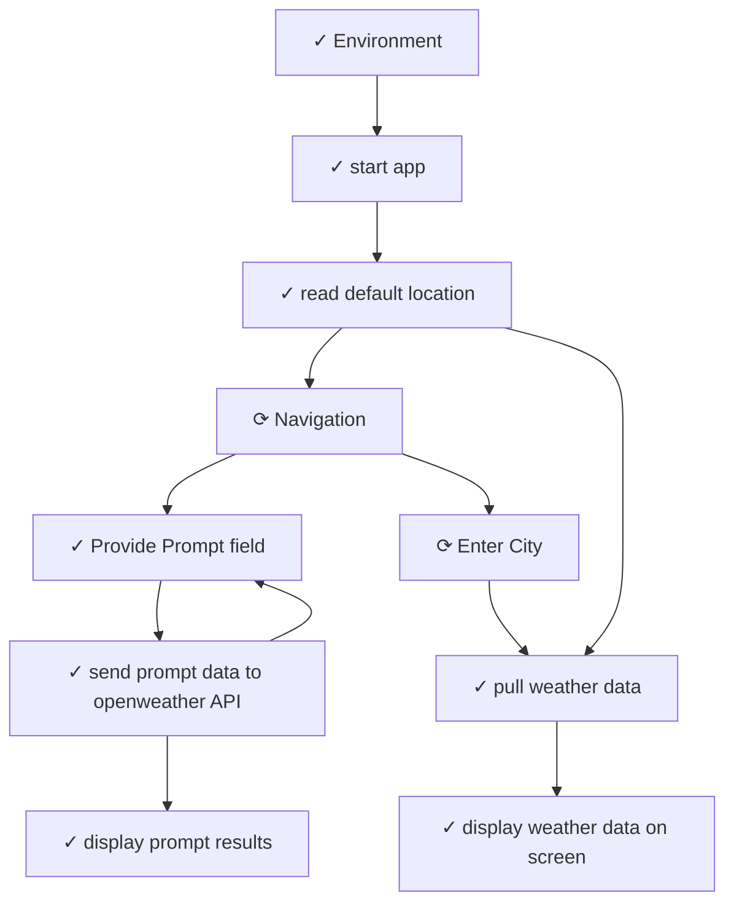

# Storyboard Index: HelloWorldWeather

## Metadata
- **Workspace**: HelloWorldWeather
- **Generated**: 12/19/2025, 11:47:27 AM
- **Total Cards**: 92
- **Total Connections**: 11

## Complete Flow Diagram

## Story Cards

| # | Title | Status | X | Y | File | Dependencies |
|---|-------|--------|---|---|------|-------------|
| 1 | [start app](./STORY-START-APP.md) | Completed | 128 | 305 | STORY-START-APP.md | 2 |
| 2 | [pull weather data](./STORY-PULL-WEATHER-DATA.md) | Completed | 573 | 789 | STORY-PULL-WEATHER-DATA.md | 3 |
| 3 | [display weather data on screen](./STORY-DISPLAY-WEATHER-DATA-ON-SCREEN.md) | Completed | 1032 | 1096 | STORY-DISPLAY-WEATHER-DATA-ON-SCREEN.md | 1 |
| 4 | [read default location](./STORY-READ-DEFAULT-LOCATION.md) | Completed | 128 | 552 | STORY-READ-DEFAULT-LOCATION.md | 3 |
| 5 | [display weather data on screen](./STORY-DISPLAY-WEATHER-DATA-ON-SCREEN.md) | Completed | 1032 | 1096 | STORY-DISPLAY-WEATHER-DATA-ON-SCREEN.md | 1 |
| 6 | [pull weather data](./STORY-PULL-WEATHER-DATA.md) | Completed | 573 | 789 | STORY-PULL-WEATHER-DATA.md | 3 |
| 7 | [read default location](./STORY-READ-DEFAULT-LOCATION.md) | Completed | 128 | 552 | STORY-READ-DEFAULT-LOCATION.md | 3 |
| 8 | [start app](./STORY-START-APP.md) | Completed | 128 | 305 | STORY-START-APP.md | 2 |
| 9 | [display weather data on screen](./STORY-DISPLAY-WEATHER-DATA-ON-SCREEN.md) | Completed | 1032 | 1096 | STORY-DISPLAY-WEATHER-DATA-ON-SCREEN.md | 1 |
| 10 | [Environment](./STORY-ENVIRONMENT.md) | Completed | 127 | 58 | STORY-ENVIRONMENT.md | 1 |
| 11 | [pull weather data](./STORY-PULL-WEATHER-DATA.md) | Completed | 573 | 789 | STORY-PULL-WEATHER-DATA.md | 3 |
| 12 | [read default location](./STORY-READ-DEFAULT-LOCATION.md) | Completed | 128 | 552 | STORY-READ-DEFAULT-LOCATION.md | 3 |
| 13 | [start app](./STORY-START-APP.md) | Completed | 128 | 305 | STORY-START-APP.md | 2 |
| 14 | [display weather data on screen](./STORY-DISPLAY-WEATHER-DATA-ON-SCREEN.md) | Completed | 1032 | 1096 | STORY-DISPLAY-WEATHER-DATA-ON-SCREEN.md | 1 |
| 15 | [Environment](./STORY-ENVIRONMENT.md) | Completed | 127 | 58 | STORY-ENVIRONMENT.md | 1 |
| 16 | [pull weather data](./STORY-PULL-WEATHER-DATA.md) | Completed | 573 | 789 | STORY-PULL-WEATHER-DATA.md | 3 |
| 17 | [read default location](./STORY-READ-DEFAULT-LOCATION.md) | Completed | 128 | 552 | STORY-READ-DEFAULT-LOCATION.md | 3 |
| 18 | [start app](./STORY-START-APP.md) | Completed | 128 | 305 | STORY-START-APP.md | 2 |
| 19 | [display weather data on screen](./STORY-DISPLAY-WEATHER-DATA-ON-SCREEN.md) | Completed | 1032 | 1096 | STORY-DISPLAY-WEATHER-DATA-ON-SCREEN.md | 1 |
| 20 | [Environment](./STORY-ENVIRONMENT.md) | Completed | 127 | 58 | STORY-ENVIRONMENT.md | 1 |
| 21 | [Provide Prompt field](./STORY-PROVIDE-PROMPT-FIELD.md) | Completed | 127 | 1265 | STORY-PROVIDE-PROMPT-FIELD.md | 3 |
| 22 | [pull weather data](./STORY-PULL-WEATHER-DATA.md) | Completed | 573 | 789 | STORY-PULL-WEATHER-DATA.md | 3 |
| 23 | [read default location](./STORY-READ-DEFAULT-LOCATION.md) | Completed | 128 | 552 | STORY-READ-DEFAULT-LOCATION.md | 3 |
| 24 | [start app](./STORY-START-APP.md) | Completed | 128 | 305 | STORY-START-APP.md | 2 |
| 25 | [display prompt results](./STORY-DISPLAY-PROMPT-RESULTS.md) | Completed | 127 | 1773 | STORY-DISPLAY-PROMPT-RESULTS.md | 1 |
| 26 | [display weather data on screen](./STORY-DISPLAY-WEATHER-DATA-ON-SCREEN.md) | Completed | 1032 | 1096 | STORY-DISPLAY-WEATHER-DATA-ON-SCREEN.md | 1 |
| 27 | [Environment](./STORY-ENVIRONMENT.md) | Completed | 127 | 58 | STORY-ENVIRONMENT.md | 1 |
| 28 | [Provide Prompt field](./STORY-PROVIDE-PROMPT-FIELD.md) | Completed | 127 | 1265 | STORY-PROVIDE-PROMPT-FIELD.md | 3 |
| 29 | [pull weather data](./STORY-PULL-WEATHER-DATA.md) | Completed | 573 | 789 | STORY-PULL-WEATHER-DATA.md | 3 |
| 30 | [read default location](./STORY-READ-DEFAULT-LOCATION.md) | Completed | 128 | 552 | STORY-READ-DEFAULT-LOCATION.md | 3 |
| 31 | [send prompt data to openweather API](./STORY-SEND-PROMPT-DATA-TO-OPENWEATHER-API.md) | Completed | 127 | 1520 | STORY-SEND-PROMPT-DATA-TO-OPENWEATHER-API.md | 3 |
| 32 | [start app](./STORY-START-APP.md) | Completed | 128 | 305 | STORY-START-APP.md | 2 |
| 33 | [display prompt results](./STORY-DISPLAY-PROMPT-RESULTS.md) | Completed | 127 | 1773 | STORY-DISPLAY-PROMPT-RESULTS.md | 1 |
| 34 | [display weather data on screen](./STORY-DISPLAY-WEATHER-DATA-ON-SCREEN.md) | Completed | 1032 | 1096 | STORY-DISPLAY-WEATHER-DATA-ON-SCREEN.md | 1 |
| 35 | [Environment](./STORY-ENVIRONMENT.md) | Completed | 127 | 58 | STORY-ENVIRONMENT.md | 1 |
| 36 | [Provide Prompt field](./STORY-PROVIDE-PROMPT-FIELD.md) | Completed | 127 | 1265 | STORY-PROVIDE-PROMPT-FIELD.md | 3 |
| 37 | [pull weather data](./STORY-PULL-WEATHER-DATA.md) | Completed | 573 | 789 | STORY-PULL-WEATHER-DATA.md | 3 |
| 38 | [read default location](./STORY-READ-DEFAULT-LOCATION.md) | Completed | 128 | 552 | STORY-READ-DEFAULT-LOCATION.md | 3 |
| 39 | [send prompt data to openweather API](./STORY-SEND-PROMPT-DATA-TO-OPENWEATHER-API.md) | Completed | 127 | 1520 | STORY-SEND-PROMPT-DATA-TO-OPENWEATHER-API.md | 3 |
| 40 | [start app](./STORY-START-APP.md) | Completed | 128 | 305 | STORY-START-APP.md | 2 |
| 41 | [display prompt results](./STORY-DISPLAY-PROMPT-RESULTS.md) | Completed | 127 | 1773 | STORY-DISPLAY-PROMPT-RESULTS.md | 1 |
| 42 | [display weather data on screen](./STORY-DISPLAY-WEATHER-DATA-ON-SCREEN.md) | Completed | 1032 | 1096 | STORY-DISPLAY-WEATHER-DATA-ON-SCREEN.md | 1 |
| 43 | [Environment](./STORY-ENVIRONMENT.md) | Completed | 127 | 58 | STORY-ENVIRONMENT.md | 1 |
| 44 | [Provide Prompt field](./STORY-PROVIDE-PROMPT-FIELD.md) | Completed | 127 | 1265 | STORY-PROVIDE-PROMPT-FIELD.md | 3 |
| 45 | [pull weather data](./STORY-PULL-WEATHER-DATA.md) | Completed | 573 | 789 | STORY-PULL-WEATHER-DATA.md | 3 |
| 46 | [read default location](./STORY-READ-DEFAULT-LOCATION.md) | Completed | 128 | 552 | STORY-READ-DEFAULT-LOCATION.md | 3 |
| 47 | [send prompt data to openweather API](./STORY-SEND-PROMPT-DATA-TO-OPENWEATHER-API.md) | Completed | 127 | 1520 | STORY-SEND-PROMPT-DATA-TO-OPENWEATHER-API.md | 3 |
| 48 | [start app](./STORY-START-APP.md) | Completed | 128 | 305 | STORY-START-APP.md | 2 |
| 49 | [display prompt results](./STORY-DISPLAY-PROMPT-RESULTS.md) | Completed | 127 | 1773 | STORY-DISPLAY-PROMPT-RESULTS.md | 1 |
| 50 | [display weather data on screen](./STORY-DISPLAY-WEATHER-DATA-ON-SCREEN.md) | Completed | 1032 | 1096 | STORY-DISPLAY-WEATHER-DATA-ON-SCREEN.md | 1 |
| 51 | [Environment](./STORY-ENVIRONMENT.md) | Completed | 127 | 58 | STORY-ENVIRONMENT.md | 1 |
| 52 | [Provide Prompt field](./STORY-PROVIDE-PROMPT-FIELD.md) | Completed | 127 | 1265 | STORY-PROVIDE-PROMPT-FIELD.md | 3 |
| 53 | [pull weather data](./STORY-PULL-WEATHER-DATA.md) | Completed | 573 | 789 | STORY-PULL-WEATHER-DATA.md | 3 |
| 54 | [read default location](./STORY-READ-DEFAULT-LOCATION.md) | Completed | 128 | 552 | STORY-READ-DEFAULT-LOCATION.md | 3 |
| 55 | [send prompt data to openweather API](./STORY-SEND-PROMPT-DATA-TO-OPENWEATHER-API.md) | Completed | 127 | 1520 | STORY-SEND-PROMPT-DATA-TO-OPENWEATHER-API.md | 3 |
| 56 | [start app](./STORY-START-APP.md) | Completed | 128 | 305 | STORY-START-APP.md | 2 |
| 57 | [display prompt results](./STORY-DISPLAY-PROMPT-RESULTS.md) | Completed | 127 | 1773 | STORY-DISPLAY-PROMPT-RESULTS.md | 1 |
| 58 | [display weather data on screen](./STORY-DISPLAY-WEATHER-DATA-ON-SCREEN.md) | Completed | 1032 | 1096 | STORY-DISPLAY-WEATHER-DATA-ON-SCREEN.md | 1 |
| 59 | [Environment](./STORY-ENVIRONMENT.md) | Completed | 127 | 58 | STORY-ENVIRONMENT.md | 1 |
| 60 | [Provide Prompt field](./STORY-PROVIDE-PROMPT-FIELD.md) | Completed | 127 | 1265 | STORY-PROVIDE-PROMPT-FIELD.md | 3 |
| 61 | [pull weather data](./STORY-PULL-WEATHER-DATA.md) | Completed | 573 | 789 | STORY-PULL-WEATHER-DATA.md | 3 |
| 62 | [read default location](./STORY-READ-DEFAULT-LOCATION.md) | Completed | 128 | 552 | STORY-READ-DEFAULT-LOCATION.md | 3 |
| 63 | [send prompt data to openweather API](./STORY-SEND-PROMPT-DATA-TO-OPENWEATHER-API.md) | Completed | 127 | 1520 | STORY-SEND-PROMPT-DATA-TO-OPENWEATHER-API.md | 3 |
| 64 | [start app](./STORY-START-APP.md) | Completed | 128 | 305 | STORY-START-APP.md | 2 |
| 65 | [display prompt results](./STORY-DISPLAY-PROMPT-RESULTS.md) | Completed | 127 | 1773 | STORY-DISPLAY-PROMPT-RESULTS.md | 1 |
| 66 | [display weather data on screen](./STORY-DISPLAY-WEATHER-DATA-ON-SCREEN.md) | Completed | 1032 | 1096 | STORY-DISPLAY-WEATHER-DATA-ON-SCREEN.md | 1 |
| 67 | [Environment](./STORY-ENVIRONMENT.md) | Completed | 127 | 58 | STORY-ENVIRONMENT.md | 1 |
| 68 | [Provide Prompt field](./STORY-PROVIDE-PROMPT-FIELD.md) | Completed | 127 | 1265 | STORY-PROVIDE-PROMPT-FIELD.md | 3 |
| 69 | [pull weather data](./STORY-PULL-WEATHER-DATA.md) | Completed | 573 | 789 | STORY-PULL-WEATHER-DATA.md | 3 |
| 70 | [read default location](./STORY-READ-DEFAULT-LOCATION.md) | Completed | 128 | 552 | STORY-READ-DEFAULT-LOCATION.md | 3 |
| 71 | [send prompt data to openweather API](./STORY-SEND-PROMPT-DATA-TO-OPENWEATHER-API.md) | Completed | 127 | 1520 | STORY-SEND-PROMPT-DATA-TO-OPENWEATHER-API.md | 3 |
| 72 | [start app](./STORY-START-APP.md) | Completed | 128 | 305 | STORY-START-APP.md | 2 |
| 73 | [display prompt results](./STORY-DISPLAY-PROMPT-RESULTS.md) | Completed | 127 | 1773 | STORY-DISPLAY-PROMPT-RESULTS.md | 1 |
| 74 | [display weather data on screen](./STORY-DISPLAY-WEATHER-DATA-ON-SCREEN.md) | Completed | 1032 | 1096 | STORY-DISPLAY-WEATHER-DATA-ON-SCREEN.md | 1 |
| 75 | [Environment](./STORY-ENVIRONMENT.md) | Completed | 127 | 58 | STORY-ENVIRONMENT.md | 1 |
| 76 | [Provide Prompt field](./STORY-PROVIDE-PROMPT-FIELD.md) | Completed | 127 | 1265 | STORY-PROVIDE-PROMPT-FIELD.md | 3 |
| 77 | [pull weather data](./STORY-PULL-WEATHER-DATA.md) | Completed | 573 | 789 | STORY-PULL-WEATHER-DATA.md | 3 |
| 78 | [read default location](./STORY-READ-DEFAULT-LOCATION.md) | Completed | 128 | 552 | STORY-READ-DEFAULT-LOCATION.md | 3 |
| 79 | [send prompt data to openweather API](./STORY-SEND-PROMPT-DATA-TO-OPENWEATHER-API.md) | Completed | 127 | 1520 | STORY-SEND-PROMPT-DATA-TO-OPENWEATHER-API.md | 3 |
| 80 | [start app](./STORY-START-APP.md) | Completed | 128 | 305 | STORY-START-APP.md | 2 |
| 81 | [Navigation](./STORY-NAVIGATION.md) | In Progress | 128 | 963 | STORY-NAVIGATION.md | 3 |
| 82 | [Enter City](./STORY-ENTER-CITY.md) | In Progress | 570 | 1194 | STORY-ENTER-CITY.md | 2 |
| 83 | [display prompt results](./STORY-DISPLAY-PROMPT-RESULTS.md) | Completed | 127 | 1773 | STORY-DISPLAY-PROMPT-RESULTS.md | 1 |
| 84 | [display weather data on screen](./STORY-DISPLAY-WEATHER-DATA-ON-SCREEN.md) | Completed | 1032 | 1096 | STORY-DISPLAY-WEATHER-DATA-ON-SCREEN.md | 1 |
| 85 | [Enter City](./STORY-ENTER-CITY.md) | In Progress | 570 | 1194 | STORY-ENTER-CITY.md | 2 |
| 86 | [Environment](./STORY-ENVIRONMENT.md) | Completed | 127 | 58 | STORY-ENVIRONMENT.md | 1 |
| 87 | [Navigation](./STORY-NAVIGATION.md) | In Progress | 128 | 963 | STORY-NAVIGATION.md | 3 |
| 88 | [Provide Prompt field](./STORY-PROVIDE-PROMPT-FIELD.md) | Completed | 127 | 1265 | STORY-PROVIDE-PROMPT-FIELD.md | 3 |
| 89 | [pull weather data](./STORY-PULL-WEATHER-DATA.md) | Completed | 573 | 789 | STORY-PULL-WEATHER-DATA.md | 3 |
| 90 | [read default location](./STORY-READ-DEFAULT-LOCATION.md) | Completed | 128 | 552 | STORY-READ-DEFAULT-LOCATION.md | 3 |
| 91 | [send prompt data to openweather API](./STORY-SEND-PROMPT-DATA-TO-OPENWEATHER-API.md) | Completed | 127 | 1520 | STORY-SEND-PROMPT-DATA-TO-OPENWEATHER-API.md | 3 |
| 92 | [start app](./STORY-START-APP.md) | Completed | 128 | 305 | STORY-START-APP.md | 2 |

## Connections Data

| Connection ID | From Card ID | To Card ID |
|---------------|--------------|------------|
| conn-card-1765937081415-card-1765937281984-1765937306332 | card-1765937081415 | card-1765937281984 |
| conn-card-1765937126217-card-1765937186735-1765937310448 | card-1765937126217 | card-1765937186735 |
| conn-card-1765937824816-card-1765937081415-1765943098502 | card-1765937824816 | card-1765937081415 |
| conn-card-1765937186735-card-1765940802459-1765943147768 | card-1765942941837 | card-1765940802459 |
| conn-card-1765940802459-card-1765942941837-1765943149452 | card-1765940802459 | card-1765942941837 |
| conn-card-1765942941837-card-1765943031022-1765943150785 | card-1765942941837 | card-1765943031022 |
| conn-card-1766171779671-card-1765940802459-1766171796084 | card-1766171779671 | card-1765940802459 |
| conn-card-1765937281984-card-1766171779671-1766171941036 | card-1765937281984 | card-1766171779671 |
| conn-card-1766171779671-card-1766171921085-1766171960476 | card-1766171779671 | card-1766171921085 |
| conn-card-1766171921085-card-1765937126217-1766171965052 | card-1766171921085 | card-1765937126217 |
| conn-card-1765937281984-card-1765937126217-1766172037213 | card-1765937281984 | card-1765937126217 |

## Card Positions Data

| Card ID | Title | X | Y | Status |
|---------|-------|---|---|--------|
| card-1765937081415 | start app | 128 | 305 | completed |
| card-1765937126217 | pull weather data | 573 | 789 | completed |
| card-1765937186735 | display weather data on screen | 1032 | 1096 | completed |
| card-1765937281984 | read default location | 128 | 552 | completed |
| card-1765937186735 | display weather data on screen | 1032 | 1096 | completed |
| card-1765937126217 | pull weather data | 573 | 789 | completed |
| card-1765937281984 | read default location | 128 | 552 | completed |
| card-1765937081415 | start app | 128 | 305 | completed |
| card-1765937186735 | display weather data on screen | 1032 | 1096 | completed |
| card-1765937824816 | Environment | 127 | 58 | completed |
| card-1765937126217 | pull weather data | 573 | 789 | completed |
| card-1765937281984 | read default location | 128 | 552 | completed |
| card-1765937081415 | start app | 128 | 305 | completed |
| card-1765937186735 | display weather data on screen | 1032 | 1096 | completed |
| card-1765937824816 | Environment | 127 | 58 | completed |
| card-1765937126217 | pull weather data | 573 | 789 | completed |
| card-1765937281984 | read default location | 128 | 552 | completed |
| card-1765937081415 | start app | 128 | 305 | completed |
| card-1765937186735 | display weather data on screen | 1032 | 1096 | completed |
| card-1765937824816 | Environment | 127 | 58 | completed |
| card-1765940802459 | Provide Prompt field | 127 | 1265 | completed |
| card-1765937126217 | pull weather data | 573 | 789 | completed |
| card-1765937281984 | read default location | 128 | 552 | completed |
| card-1765937081415 | start app | 128 | 305 | completed |
| card-1765943031022 | display prompt results | 127 | 1773 | completed |
| card-1765937186735 | display weather data on screen | 1032 | 1096 | completed |
| card-1765937824816 | Environment | 127 | 58 | completed |
| card-1765940802459 | Provide Prompt field | 127 | 1265 | completed |
| card-1765937126217 | pull weather data | 573 | 789 | completed |
| card-1765937281984 | read default location | 128 | 552 | completed |
| card-1765942941837 | send prompt data to openweather API | 127 | 1520 | completed |
| card-1765937081415 | start app | 128 | 305 | completed |
| card-1765943031022 | display prompt results | 127 | 1773 | completed |
| card-1765937186735 | display weather data on screen | 1032 | 1096 | completed |
| card-1765937824816 | Environment | 127 | 58 | completed |
| card-1765940802459 | Provide Prompt field | 127 | 1265 | completed |
| card-1765937126217 | pull weather data | 573 | 789 | completed |
| card-1765937281984 | read default location | 128 | 552 | completed |
| card-1765942941837 | send prompt data to openweather API | 127 | 1520 | completed |
| card-1765937081415 | start app | 128 | 305 | completed |
| card-1765943031022 | display prompt results | 127 | 1773 | completed |
| card-1765937186735 | display weather data on screen | 1032 | 1096 | completed |
| card-1765937824816 | Environment | 127 | 58 | completed |
| card-1765940802459 | Provide Prompt field | 127 | 1265 | completed |
| card-1765937126217 | pull weather data | 573 | 789 | completed |
| card-1765937281984 | read default location | 128 | 552 | completed |
| card-1765942941837 | send prompt data to openweather API | 127 | 1520 | completed |
| card-1765937081415 | start app | 128 | 305 | completed |
| card-1765943031022 | display prompt results | 127 | 1773 | completed |
| card-1765937186735 | display weather data on screen | 1032 | 1096 | completed |
| card-1765937824816 | Environment | 127 | 58 | completed |
| card-1765940802459 | Provide Prompt field | 127 | 1265 | completed |
| card-1765937126217 | pull weather data | 573 | 789 | completed |
| card-1765937281984 | read default location | 128 | 552 | completed |
| card-1765942941837 | send prompt data to openweather API | 127 | 1520 | completed |
| card-1765937081415 | start app | 128 | 305 | completed |
| card-1765943031022 | display prompt results | 127 | 1773 | completed |
| card-1765937186735 | display weather data on screen | 1032 | 1096 | completed |
| card-1765937824816 | Environment | 127 | 58 | completed |
| card-1765940802459 | Provide Prompt field | 127 | 1265 | completed |
| card-1765937126217 | pull weather data | 573 | 789 | completed |
| card-1765937281984 | read default location | 128 | 552 | completed |
| card-1765942941837 | send prompt data to openweather API | 127 | 1520 | completed |
| card-1765937081415 | start app | 128 | 305 | completed |
| card-1765943031022 | display prompt results | 127 | 1773 | completed |
| card-1765937186735 | display weather data on screen | 1032 | 1096 | completed |
| card-1765937824816 | Environment | 127 | 58 | completed |
| card-1765940802459 | Provide Prompt field | 127 | 1265 | completed |
| card-1765937126217 | pull weather data | 573 | 789 | completed |
| card-1765937281984 | read default location | 128 | 552 | completed |
| card-1765942941837 | send prompt data to openweather API | 127 | 1520 | completed |
| card-1765937081415 | start app | 128 | 305 | completed |
| card-1765943031022 | display prompt results | 127 | 1773 | completed |
| card-1765937186735 | display weather data on screen | 1032 | 1096 | completed |
| card-1765937824816 | Environment | 127 | 58 | completed |
| card-1765940802459 | Provide Prompt field | 127 | 1265 | completed |
| card-1765937126217 | pull weather data | 573 | 789 | completed |
| card-1765937281984 | read default location | 128 | 552 | completed |
| card-1765942941837 | send prompt data to openweather API | 127 | 1520 | completed |
| card-1765937081415 | start app | 128 | 305 | completed |
| card-1766171779671 | Navigation | 128 | 963 | in-progress |
| card-1766171921085 | Enter City | 570 | 1194 | in-progress |
| card-1765943031022 | display prompt results | 127 | 1773 | completed |
| card-1765937186735 | display weather data on screen | 1032 | 1096 | completed |
| card-1766171921085 | Enter City | 570 | 1194 | in-progress |
| card-1765937824816 | Environment | 127 | 58 | completed |
| card-1766171779671 | Navigation | 128 | 963 | in-progress |
| card-1765940802459 | Provide Prompt field | 127 | 1265 | completed |
| card-1765937126217 | pull weather data | 573 | 789 | completed |
| card-1765937281984 | read default location | 128 | 552 | completed |
| card-1765942941837 | send prompt data to openweather API | 127 | 1520 | completed |
| card-1765937081415 | start app | 128 | 305 | completed |
