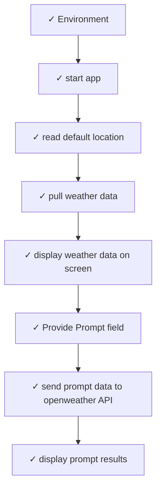

# Storyboard Index: HelloWeatherWorld

## Metadata
- **Workspace**: HelloWeatherWorld
- **Generated**: 12/16/2025, 7:46:24 PM
- **Total Cards**: 32
- **Total Connections**: 7

## Complete Flow Diagram

## Story Cards

| # | Title | Status | X | Y | File | Dependencies |
|---|-------|--------|---|---|------|-------------|
| 1 | [start app](./STORY-START-APP.md) | Completed | 121 | 362 | STORY-START-APP.md | 2 |
| 2 | [pull weather data](./STORY-PULL-WEATHER-DATA.md) | Completed | 538 | 588 | STORY-PULL-WEATHER-DATA.md | 2 |
| 3 | [display weather data on screen](./STORY-DISPLAY-WEATHER-DATA-ON-SCREEN.md) | Completed | 963 | 663 | STORY-DISPLAY-WEATHER-DATA-ON-SCREEN.md | 2 |
| 4 | [read default location](./STORY-READ-DEFAULT-LOCATION.md) | Completed | 120 | 553 | STORY-READ-DEFAULT-LOCATION.md | 2 |
| 5 | [display weather data on screen](./STORY-DISPLAY-WEATHER-DATA-ON-SCREEN.md) | Completed | 963 | 663 | STORY-DISPLAY-WEATHER-DATA-ON-SCREEN.md | 2 |
| 6 | [pull weather data](./STORY-PULL-WEATHER-DATA.md) | Completed | 538 | 588 | STORY-PULL-WEATHER-DATA.md | 2 |
| 7 | [read default location](./STORY-READ-DEFAULT-LOCATION.md) | Completed | 120 | 553 | STORY-READ-DEFAULT-LOCATION.md | 2 |
| 8 | [start app](./STORY-START-APP.md) | Completed | 121 | 362 | STORY-START-APP.md | 2 |
| 9 | [display weather data on screen](./STORY-DISPLAY-WEATHER-DATA-ON-SCREEN.md) | Completed | 963 | 663 | STORY-DISPLAY-WEATHER-DATA-ON-SCREEN.md | 2 |
| 10 | [Environment](./STORY-ENVIRONMENT.md) | Completed | 121 | 141 | STORY-ENVIRONMENT.md | 1 |
| 11 | [pull weather data](./STORY-PULL-WEATHER-DATA.md) | Completed | 538 | 588 | STORY-PULL-WEATHER-DATA.md | 2 |
| 12 | [read default location](./STORY-READ-DEFAULT-LOCATION.md) | Completed | 120 | 553 | STORY-READ-DEFAULT-LOCATION.md | 2 |
| 13 | [start app](./STORY-START-APP.md) | Completed | 121 | 362 | STORY-START-APP.md | 2 |
| 14 | [display weather data on screen](./STORY-DISPLAY-WEATHER-DATA-ON-SCREEN.md) | Completed | 963 | 663 | STORY-DISPLAY-WEATHER-DATA-ON-SCREEN.md | 2 |
| 15 | [Environment](./STORY-ENVIRONMENT.md) | Completed | 121 | 141 | STORY-ENVIRONMENT.md | 1 |
| 16 | [pull weather data](./STORY-PULL-WEATHER-DATA.md) | Completed | 538 | 588 | STORY-PULL-WEATHER-DATA.md | 2 |
| 17 | [read default location](./STORY-READ-DEFAULT-LOCATION.md) | Completed | 120 | 553 | STORY-READ-DEFAULT-LOCATION.md | 2 |
| 18 | [start app](./STORY-START-APP.md) | Completed | 121 | 362 | STORY-START-APP.md | 2 |
| 19 | [display weather data on screen](./STORY-DISPLAY-WEATHER-DATA-ON-SCREEN.md) | Completed | 963 | 663 | STORY-DISPLAY-WEATHER-DATA-ON-SCREEN.md | 2 |
| 20 | [Environment](./STORY-ENVIRONMENT.md) | Completed | 121 | 141 | STORY-ENVIRONMENT.md | 1 |
| 21 | [Provide Prompt field](./STORY-PROVIDE-PROMPT-FIELD.md) | Completed | 97 | 940 | STORY-PROVIDE-PROMPT-FIELD.md | 2 |
| 22 | [pull weather data](./STORY-PULL-WEATHER-DATA.md) | Completed | 538 | 588 | STORY-PULL-WEATHER-DATA.md | 2 |
| 23 | [read default location](./STORY-READ-DEFAULT-LOCATION.md) | Completed | 120 | 553 | STORY-READ-DEFAULT-LOCATION.md | 2 |
| 24 | [start app](./STORY-START-APP.md) | Completed | 121 | 362 | STORY-START-APP.md | 2 |
| 25 | [display prompt results](./STORY-DISPLAY-PROMPT-RESULTS.md) | Completed | 972 | 1132 | STORY-DISPLAY-PROMPT-RESULTS.md | 1 |
| 26 | [display weather data on screen](./STORY-DISPLAY-WEATHER-DATA-ON-SCREEN.md) | Completed | 963 | 663 | STORY-DISPLAY-WEATHER-DATA-ON-SCREEN.md | 2 |
| 27 | [Environment](./STORY-ENVIRONMENT.md) | Completed | 121 | 141 | STORY-ENVIRONMENT.md | 1 |
| 28 | [Provide Prompt field](./STORY-PROVIDE-PROMPT-FIELD.md) | Completed | 97 | 940 | STORY-PROVIDE-PROMPT-FIELD.md | 2 |
| 29 | [pull weather data](./STORY-PULL-WEATHER-DATA.md) | Completed | 538 | 588 | STORY-PULL-WEATHER-DATA.md | 2 |
| 30 | [read default location](./STORY-READ-DEFAULT-LOCATION.md) | Completed | 120 | 553 | STORY-READ-DEFAULT-LOCATION.md | 2 |
| 31 | [send prompt data to openweather API](./STORY-SEND-PROMPT-DATA-TO-OPENWEATHER-API.md) | Completed | 543 | 1026 | STORY-SEND-PROMPT-DATA-TO-OPENWEATHER-API.md | 2 |
| 32 | [start app](./STORY-START-APP.md) | Completed | 121 | 362 | STORY-START-APP.md | 2 |

## Connections Data

| Connection ID | From Card ID | To Card ID |
|---------------|--------------|------------|
| conn-card-1765937081415-card-1765937281984-1765937306332 | card-1765937081415 | card-1765937281984 |
| conn-card-1765937281984-card-1765937126217-1765937308600 | card-1765937281984 | card-1765937126217 |
| conn-card-1765937126217-card-1765937186735-1765937310448 | card-1765937126217 | card-1765937186735 |
| conn-card-1765937824816-card-1765937081415-1765943098502 | card-1765937824816 | card-1765937081415 |
| conn-card-1765937186735-card-1765940802459-1765943147768 | card-1765937186735 | card-1765940802459 |
| conn-card-1765940802459-card-1765942941837-1765943149452 | card-1765940802459 | card-1765942941837 |
| conn-card-1765942941837-card-1765943031022-1765943150785 | card-1765942941837 | card-1765943031022 |

## Card Positions Data

| Card ID | Title | X | Y | Status |
|---------|-------|---|---|--------|
| card-1765937081415 | start app | 121 | 362 | completed |
| card-1765937126217 | pull weather data | 538 | 588 | completed |
| card-1765937186735 | display weather data on screen | 963 | 663 | completed |
| card-1765937281984 | read default location | 120 | 553 | completed |
| card-1765937186735 | display weather data on screen | 963 | 663 | completed |
| card-1765937126217 | pull weather data | 538 | 588 | completed |
| card-1765937281984 | read default location | 120 | 553 | completed |
| card-1765937081415 | start app | 121 | 362 | completed |
| card-1765937186735 | display weather data on screen | 963 | 663 | completed |
| card-1765937824816 | Environment | 121 | 141 | completed |
| card-1765937126217 | pull weather data | 538 | 588 | completed |
| card-1765937281984 | read default location | 120 | 553 | completed |
| card-1765937081415 | start app | 121 | 362 | completed |
| card-1765937186735 | display weather data on screen | 963 | 663 | completed |
| card-1765937824816 | Environment | 121 | 141 | completed |
| card-1765937126217 | pull weather data | 538 | 588 | completed |
| card-1765937281984 | read default location | 120 | 553 | completed |
| card-1765937081415 | start app | 121 | 362 | completed |
| card-1765937186735 | display weather data on screen | 963 | 663 | completed |
| card-1765937824816 | Environment | 121 | 141 | completed |
| card-1765940802459 | Provide Prompt field | 97 | 940 | completed |
| card-1765937126217 | pull weather data | 538 | 588 | completed |
| card-1765937281984 | read default location | 120 | 553 | completed |
| card-1765937081415 | start app | 121 | 362 | completed |
| card-1765943031022 | display prompt results | 972 | 1132 | completed |
| card-1765937186735 | display weather data on screen | 963 | 663 | completed |
| card-1765937824816 | Environment | 121 | 141 | completed |
| card-1765940802459 | Provide Prompt field | 97 | 940 | completed |
| card-1765937126217 | pull weather data | 538 | 588 | completed |
| card-1765937281984 | read default location | 120 | 553 | completed |
| card-1765942941837 | send prompt data to openweather API | 543 | 1026 | completed |
| card-1765937081415 | start app | 121 | 362 | completed |
