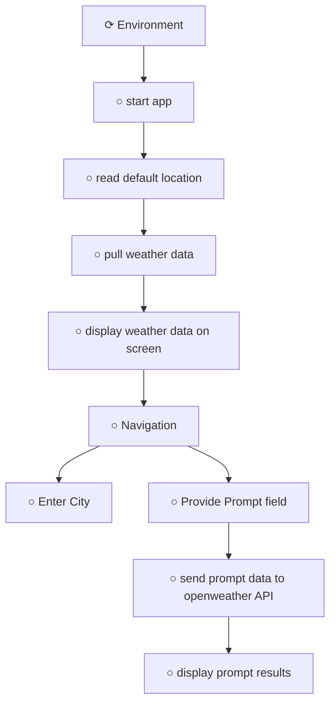

# Storyboard Index: HelloWorldWeather

## Metadata
- **Workspace**: HelloWorldWeather
- **Generated**: 12/25/2025, 9:15:17 PM
- **Total Cards**: 60
- **Total Connections**: 9

## Complete Flow Diagram

## Story Cards

| # | Title | Lifecycle | X | Y | File | Dependencies |
|---|-------|-----------|---|---|------|-------------|
| 1 | [display prompt results](./STORY-DISPLAY-PROMPT-RESULTS.md) | Draft | 1624 | 654 | STORY-DISPLAY-PROMPT-RESULTS.md | 1 |
| 2 | [display weather data on screen](./STORY-DISPLAY-WEATHER-DATA-ON-SCREEN.md) | Draft | 615 | 282 | STORY-DISPLAY-WEATHER-DATA-ON-SCREEN.md | 2 |
| 3 | [Enter City](./STORY-ENTER-CITY.md) | Draft | 96 | 1061 | STORY-ENTER-CITY.md | 1 |
| 4 | [Environment](./STORY-ENVIRONMENT.md) | Active | 139 | 10 | STORY-ENVIRONMENT.md | 1 |
| 5 | [Navigation](./STORY-NAVIGATION.md) | Draft | 97 | 652 | STORY-NAVIGATION.md | 3 |
| 6 | [Provide Prompt field](./STORY-PROVIDE-PROMPT-FIELD.md) | Draft | 675 | 665 | STORY-PROVIDE-PROMPT-FIELD.md | 2 |
| 7 | [pull weather data](./STORY-PULL-WEATHER-DATA.md) | Draft | 129 | 303 | STORY-PULL-WEATHER-DATA.md | 2 |
| 8 | [read default location](./STORY-READ-DEFAULT-LOCATION.md) | Draft | 955 | 6 | STORY-READ-DEFAULT-LOCATION.md | 2 |
| 9 | [send prompt data to openweather API](./STORY-SEND-PROMPT-DATA-TO-OPENWEATHER-API.md) | Draft | 1152 | 651 | STORY-SEND-PROMPT-DATA-TO-OPENWEATHER-API.md | 2 |
| 10 | [start app](./STORY-START-APP.md) | Draft | 549 | 20 | STORY-START-APP.md | 2 |
| 11 | [display prompt results](./STORY-DISPLAY-PROMPT-RESULTS.md) | Draft | 1624 | 654 | STORY-DISPLAY-PROMPT-RESULTS.md | 1 |
| 12 | [display weather data on screen](./STORY-DISPLAY-WEATHER-DATA-ON-SCREEN.md) | Draft | 615 | 282 | STORY-DISPLAY-WEATHER-DATA-ON-SCREEN.md | 2 |
| 13 | [Enter City](./STORY-ENTER-CITY.md) | Draft | 96 | 1061 | STORY-ENTER-CITY.md | 1 |
| 14 | [Environment](./STORY-ENVIRONMENT.md) | Active | 139 | 10 | STORY-ENVIRONMENT.md | 1 |
| 15 | [Navigation](./STORY-NAVIGATION.md) | Draft | 97 | 652 | STORY-NAVIGATION.md | 3 |
| 16 | [Provide Prompt field](./STORY-PROVIDE-PROMPT-FIELD.md) | Draft | 675 | 665 | STORY-PROVIDE-PROMPT-FIELD.md | 2 |
| 17 | [pull weather data](./STORY-PULL-WEATHER-DATA.md) | Draft | 129 | 303 | STORY-PULL-WEATHER-DATA.md | 2 |
| 18 | [read default location](./STORY-READ-DEFAULT-LOCATION.md) | Draft | 955 | 6 | STORY-READ-DEFAULT-LOCATION.md | 2 |
| 19 | [send prompt data to openweather API](./STORY-SEND-PROMPT-DATA-TO-OPENWEATHER-API.md) | Draft | 1152 | 651 | STORY-SEND-PROMPT-DATA-TO-OPENWEATHER-API.md | 2 |
| 20 | [start app](./STORY-START-APP.md) | Draft | 549 | 20 | STORY-START-APP.md | 2 |
| 21 | [display prompt results](./STORY-DISPLAY-PROMPT-RESULTS.md) | Draft | 1624 | 654 | STORY-DISPLAY-PROMPT-RESULTS.md | 1 |
| 22 | [display weather data on screen](./STORY-DISPLAY-WEATHER-DATA-ON-SCREEN.md) | Draft | 615 | 282 | STORY-DISPLAY-WEATHER-DATA-ON-SCREEN.md | 2 |
| 23 | [Enter City](./STORY-ENTER-CITY.md) | Draft | 96 | 1061 | STORY-ENTER-CITY.md | 1 |
| 24 | [Environment](./STORY-ENVIRONMENT.md) | Active | 139 | 10 | STORY-ENVIRONMENT.md | 1 |
| 25 | [Navigation](./STORY-NAVIGATION.md) | Draft | 97 | 652 | STORY-NAVIGATION.md | 3 |
| 26 | [Provide Prompt field](./STORY-PROVIDE-PROMPT-FIELD.md) | Draft | 675 | 665 | STORY-PROVIDE-PROMPT-FIELD.md | 2 |
| 27 | [pull weather data](./STORY-PULL-WEATHER-DATA.md) | Draft | 129 | 303 | STORY-PULL-WEATHER-DATA.md | 2 |
| 28 | [read default location](./STORY-READ-DEFAULT-LOCATION.md) | Draft | 955 | 6 | STORY-READ-DEFAULT-LOCATION.md | 2 |
| 29 | [send prompt data to openweather API](./STORY-SEND-PROMPT-DATA-TO-OPENWEATHER-API.md) | Draft | 1152 | 651 | STORY-SEND-PROMPT-DATA-TO-OPENWEATHER-API.md | 2 |
| 30 | [start app](./STORY-START-APP.md) | Draft | 549 | 20 | STORY-START-APP.md | 2 |
| 31 | [display prompt results](./STORY-DISPLAY-PROMPT-RESULTS.md) | Draft | 1624 | 654 | STORY-DISPLAY-PROMPT-RESULTS.md | 1 |
| 32 | [display weather data on screen](./STORY-DISPLAY-WEATHER-DATA-ON-SCREEN.md) | Draft | 615 | 282 | STORY-DISPLAY-WEATHER-DATA-ON-SCREEN.md | 2 |
| 33 | [Enter City](./STORY-ENTER-CITY.md) | Draft | 96 | 1061 | STORY-ENTER-CITY.md | 1 |
| 34 | [Environment](./STORY-ENVIRONMENT.md) | Active | 139 | 10 | STORY-ENVIRONMENT.md | 1 |
| 35 | [Navigation](./STORY-NAVIGATION.md) | Draft | 97 | 652 | STORY-NAVIGATION.md | 3 |
| 36 | [Provide Prompt field](./STORY-PROVIDE-PROMPT-FIELD.md) | Draft | 675 | 665 | STORY-PROVIDE-PROMPT-FIELD.md | 2 |
| 37 | [pull weather data](./STORY-PULL-WEATHER-DATA.md) | Draft | 129 | 303 | STORY-PULL-WEATHER-DATA.md | 2 |
| 38 | [read default location](./STORY-READ-DEFAULT-LOCATION.md) | Draft | 955 | 6 | STORY-READ-DEFAULT-LOCATION.md | 2 |
| 39 | [send prompt data to openweather API](./STORY-SEND-PROMPT-DATA-TO-OPENWEATHER-API.md) | Draft | 1152 | 651 | STORY-SEND-PROMPT-DATA-TO-OPENWEATHER-API.md | 2 |
| 40 | [start app](./STORY-START-APP.md) | Draft | 549 | 20 | STORY-START-APP.md | 2 |
| 41 | [display prompt results](./STORY-DISPLAY-PROMPT-RESULTS.md) | Draft | 1624 | 654 | STORY-DISPLAY-PROMPT-RESULTS.md | 1 |
| 42 | [display weather data on screen](./STORY-DISPLAY-WEATHER-DATA-ON-SCREEN.md) | Draft | 615 | 282 | STORY-DISPLAY-WEATHER-DATA-ON-SCREEN.md | 2 |
| 43 | [Enter City](./STORY-ENTER-CITY.md) | Draft | 96 | 1061 | STORY-ENTER-CITY.md | 1 |
| 44 | [Environment](./STORY-ENVIRONMENT.md) | Active | 139 | 10 | STORY-ENVIRONMENT.md | 1 |
| 45 | [Navigation](./STORY-NAVIGATION.md) | Draft | 97 | 652 | STORY-NAVIGATION.md | 3 |
| 46 | [Provide Prompt field](./STORY-PROVIDE-PROMPT-FIELD.md) | Draft | 675 | 665 | STORY-PROVIDE-PROMPT-FIELD.md | 2 |
| 47 | [pull weather data](./STORY-PULL-WEATHER-DATA.md) | Draft | 129 | 303 | STORY-PULL-WEATHER-DATA.md | 2 |
| 48 | [read default location](./STORY-READ-DEFAULT-LOCATION.md) | Draft | 955 | 6 | STORY-READ-DEFAULT-LOCATION.md | 2 |
| 49 | [send prompt data to openweather API](./STORY-SEND-PROMPT-DATA-TO-OPENWEATHER-API.md) | Draft | 1152 | 651 | STORY-SEND-PROMPT-DATA-TO-OPENWEATHER-API.md | 2 |
| 50 | [start app](./STORY-START-APP.md) | Draft | 549 | 20 | STORY-START-APP.md | 2 |
| 51 | [display prompt results](./STORY-DISPLAY-PROMPT-RESULTS.md) | Draft | 1624 | 654 | STORY-DISPLAY-PROMPT-RESULTS.md | 1 |
| 52 | [display weather data on screen](./STORY-DISPLAY-WEATHER-DATA-ON-SCREEN.md) | Draft | 615 | 282 | STORY-DISPLAY-WEATHER-DATA-ON-SCREEN.md | 2 |
| 53 | [Enter City](./STORY-ENTER-CITY.md) | Draft | 96 | 1061 | STORY-ENTER-CITY.md | 1 |
| 54 | [Environment](./STORY-ENVIRONMENT.md) | Active | 139 | 10 | STORY-ENVIRONMENT.md | 1 |
| 55 | [Navigation](./STORY-NAVIGATION.md) | Draft | 97 | 652 | STORY-NAVIGATION.md | 3 |
| 56 | [Provide Prompt field](./STORY-PROVIDE-PROMPT-FIELD.md) | Draft | 675 | 665 | STORY-PROVIDE-PROMPT-FIELD.md | 2 |
| 57 | [pull weather data](./STORY-PULL-WEATHER-DATA.md) | Draft | 129 | 303 | STORY-PULL-WEATHER-DATA.md | 2 |
| 58 | [read default location](./STORY-READ-DEFAULT-LOCATION.md) | Draft | 955 | 6 | STORY-READ-DEFAULT-LOCATION.md | 2 |
| 59 | [send prompt data to openweather API](./STORY-SEND-PROMPT-DATA-TO-OPENWEATHER-API.md) | Draft | 1152 | 651 | STORY-SEND-PROMPT-DATA-TO-OPENWEATHER-API.md | 2 |
| 60 | [start app](./STORY-START-APP.md) | Draft | 549 | 20 | STORY-START-APP.md | 2 |

## Connections Data

| Connection ID | From Card ID | To Card ID |
|---------------|--------------|------------|
| conn-card-1765937824816-card-1765937081415-1766592640190 | card-1765937824816 | card-1765937081415 |
| conn-card-1765937081415-card-1765937281984-1766592644023 | card-1765937081415 | card-1765937281984 |
| conn-card-1765937281984-card-1765937126217-1766592652857 | card-1765937281984 | card-1765937126217 |
| conn-card-1766171779671-card-1766171921085-1766592677207 | card-1766171779671 | card-1766171921085 |
| conn-card-1765937126217-card-1765937186735-1766592690758 | card-1765937126217 | card-1765937186735 |
| conn-card-1766171779671-card-1765940802459-1766592713342 | card-1766171779671 | card-1765940802459 |
| conn-card-1765937186735-card-1766171779671-1766592715623 | card-1765937186735 | card-1766171779671 |
| conn-card-1765940802459-card-1765942941837-1766592781859 | card-1765940802459 | card-1765942941837 |
| conn-card-1765942941837-card-1765943031022-1766592785308 | card-1765942941837 | card-1765943031022 |

## Card Positions Data

| Card ID | Title | X | Y |
|---------|-------|---|---|
| card-1765943031022 | display prompt results | 1624 | 654 |
| card-1765937186735 | display weather data on screen | 615 | 282 |
| card-1766171921085 | Enter City | 96 | 1061 |
| card-1765937824816 | Environment | 139 | 10 |
| card-1766171779671 | Navigation | 97 | 652 |
| card-1765940802459 | Provide Prompt field | 675 | 665 |
| card-1765937126217 | pull weather data | 129 | 303 |
| card-1765937281984 | read default location | 955 | 6 |
| card-1765942941837 | send prompt data to openweather API | 1152 | 651 |
| card-1765937081415 | start app | 549 | 20 |
| card-1765943031022 | display prompt results | 1624 | 654 |
| card-1765937186735 | display weather data on screen | 615 | 282 |
| card-1766171921085 | Enter City | 96 | 1061 |
| card-1765937824816 | Environment | 139 | 10 |
| card-1766171779671 | Navigation | 97 | 652 |
| card-1765940802459 | Provide Prompt field | 675 | 665 |
| card-1765937126217 | pull weather data | 129 | 303 |
| card-1765937281984 | read default location | 955 | 6 |
| card-1765942941837 | send prompt data to openweather API | 1152 | 651 |
| card-1765937081415 | start app | 549 | 20 |
| card-1765943031022 | display prompt results | 1624 | 654 |
| card-1765937186735 | display weather data on screen | 615 | 282 |
| card-1766171921085 | Enter City | 96 | 1061 |
| card-1765937824816 | Environment | 139 | 10 |
| card-1766171779671 | Navigation | 97 | 652 |
| card-1765940802459 | Provide Prompt field | 675 | 665 |
| card-1765937126217 | pull weather data | 129 | 303 |
| card-1765937281984 | read default location | 955 | 6 |
| card-1765942941837 | send prompt data to openweather API | 1152 | 651 |
| card-1765937081415 | start app | 549 | 20 |
| card-1765943031022 | display prompt results | 1624 | 654 |
| card-1765937186735 | display weather data on screen | 615 | 282 |
| card-1766171921085 | Enter City | 96 | 1061 |
| card-1765937824816 | Environment | 139 | 10 |
| card-1766171779671 | Navigation | 97 | 652 |
| card-1765940802459 | Provide Prompt field | 675 | 665 |
| card-1765937126217 | pull weather data | 129 | 303 |
| card-1765937281984 | read default location | 955 | 6 |
| card-1765942941837 | send prompt data to openweather API | 1152 | 651 |
| card-1765937081415 | start app | 549 | 20 |
| card-1765943031022 | display prompt results | 1624 | 654 |
| card-1765937186735 | display weather data on screen | 615 | 282 |
| card-1766171921085 | Enter City | 96 | 1061 |
| card-1765937824816 | Environment | 139 | 10 |
| card-1766171779671 | Navigation | 97 | 652 |
| card-1765940802459 | Provide Prompt field | 675 | 665 |
| card-1765937126217 | pull weather data | 129 | 303 |
| card-1765937281984 | read default location | 955 | 6 |
| card-1765942941837 | send prompt data to openweather API | 1152 | 651 |
| card-1765937081415 | start app | 549 | 20 |
| card-1765943031022 | display prompt results | 1624 | 654 |
| card-1765937186735 | display weather data on screen | 615 | 282 |
| card-1766171921085 | Enter City | 96 | 1061 |
| card-1765937824816 | Environment | 139 | 10 |
| card-1766171779671 | Navigation | 97 | 652 |
| card-1765940802459 | Provide Prompt field | 675 | 665 |
| card-1765937126217 | pull weather data | 129 | 303 |
| card-1765937281984 | read default location | 955 | 6 |
| card-1765942941837 | send prompt data to openweather API | 1152 | 651 |
| card-1765937081415 | start app | 549 | 20 |
