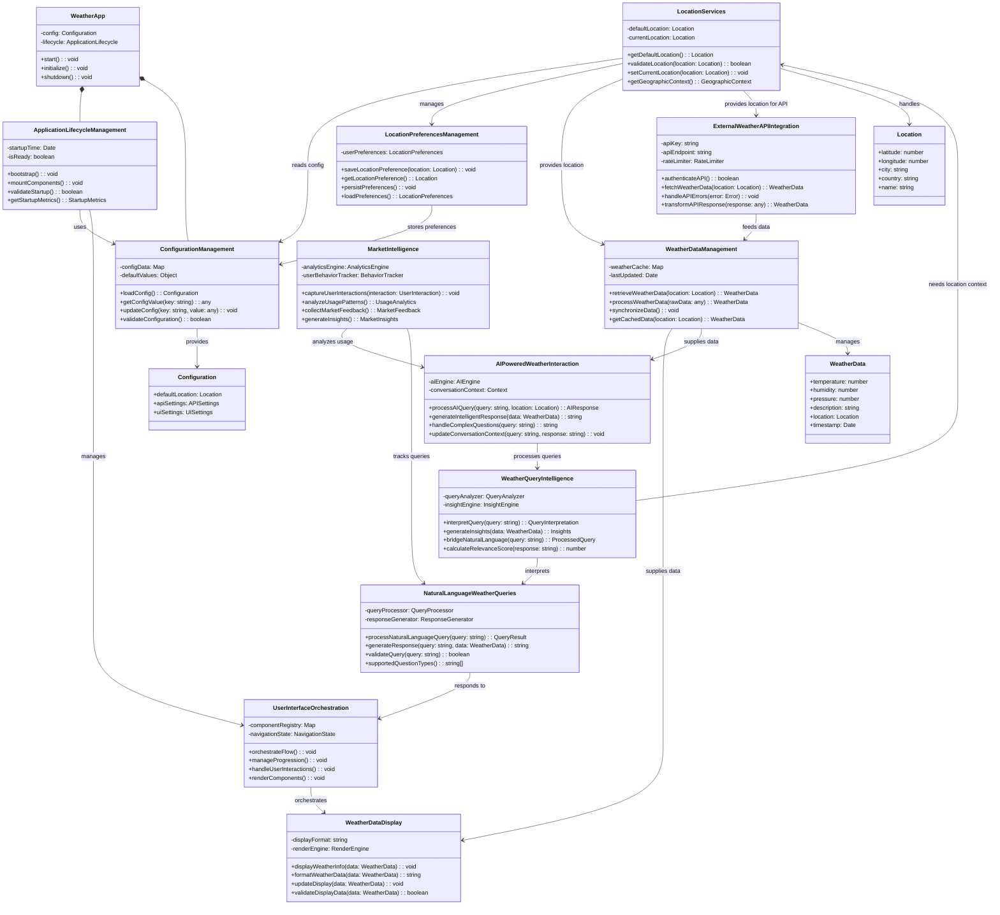

# Class Diagram

## Metadata
- **Type**: Class Diagram
- **Workspace**: HelloWeatherWorld
- **Generated**: 12/16/2025, 8:34:12 PM

## Diagram

```mermaid
classDiagram
    class WeatherApp {
        -config: Configuration
        -lifecycle: ApplicationLifecycle
        +start(): void
        +initialize(): void
        +shutdown(): void
    }

    class ApplicationLifecycleManagement {
        -startupTime: Date
        -isReady: boolean
        +bootstrap(): void
        +mountComponents(): void
        +validateStartup(): boolean
        +getStartupMetrics(): StartupMetrics
    }

    class ConfigurationManagement {
        -configData: Map
        -defaultValues: Object
        +loadConfig(): Configuration
        +getConfigValue(key: string): any
        +updateConfig(key: string, value: any): void
        +validateConfiguration(): boolean
    }

    class LocationServices {
        -defaultLocation: Location
        -currentLocation: Location
        +getDefaultLocation(): Location
        +validateLocation(location: Location): boolean
        +setCurrentLocation(location: Location): void
        +getGeographicContext(): GeographicContext
    }

    class LocationPreferencesManagement {
        -userPreferences: LocationPreferences
        +saveLocationPreference(location: Location): void
        +getLocationPreference(): Location
        +persistPreferences(): void
        +loadPreferences(): LocationPreferences
    }

    class ExternalWeatherAPIIntegration {
        -apiKey: string
        -apiEndpoint: string
        -rateLimiter: RateLimiter
        +authenticateAPI(): boolean
        +fetchWeatherData(location: Location): WeatherData
        +handleAPIErrors(error: Error): void
        +transformAPIResponse(response: any): WeatherData
    }

    class WeatherDataManagement {
        -weatherCache: Map
        -lastUpdated: Date
        +retrieveWeatherData(location: Location): WeatherData
        +processWeatherData(rawData: any): WeatherData
        +synchronizeData(): void
        +getCachedData(location: Location): WeatherData
    }

    class WeatherDataDisplay {
        -displayFormat: string
        -renderEngine: RenderEngine
        +displayWeatherInfo(data: WeatherData): void
        +formatWeatherData(data: WeatherData): string
        +updateDisplay(data: WeatherData): void
        +validateDisplayData(data: WeatherData): boolean
    }

    class UserInterfaceOrchestration {
        -componentRegistry: Map
        -navigationState: NavigationState
        +orchestrateFlow(): void
        +manageProgression(): void
        +handleUserInteractions(): void
        +renderComponents(): void
    }

    class NaturalLanguageWeatherQueries {
        -queryProcessor: QueryProcessor
        -responseGenerator: ResponseGenerator
        +processNaturalLanguageQuery(query: string): QueryResult
        +generateResponse(query: string, data: WeatherData): string
        +validateQuery(query: string): boolean
        +supportedQuestionTypes(): string[]
    }

    class AIPoweredWeatherInteraction {
        -aiEngine: AIEngine
        -conversationContext: Context
        +processAIQuery(query: string, location: Location): AIResponse
        +generateIntelligentResponse(data: WeatherData): string
        +handleComplexQuestions(query: string): string
        +updateConversationContext(query: string, response: string): void
    }

    class WeatherQueryIntelligence {
        -queryAnalyzer: QueryAnalyzer
        -insightEngine: InsightEngine
        +interpretQuery(query: string): QueryInterpretation
        +generateInsights(data: WeatherData): Insights
        +bridgeNaturalLanguage(query: string): ProcessedQuery
        +calculateRelevanceScore(response: string): number
    }

    class MarketIntelligence {
        -analyticsEngine: AnalyticsEngine
        -userBehaviorTracker: BehaviorTracker
        +captureUserInteractions(interaction: UserInteraction): void
        +analyzeUsagePatterns(): UsageAnalytics
        +collectMarketFeedback(): MarketFeedback
        +generateInsights(): MarketInsights
    }

    %% Core Application Structure
    WeatherApp *-- ApplicationLifecycleManagement
    WeatherApp *-- ConfigurationManagement
    
    %% Configuration Dependencies
    ApplicationLifecycleManagement --> ConfigurationManagement : uses
    LocationServices --> ConfigurationManagement : reads config
    LocationPreferencesManagement --> ConfigurationManagement : stores preferences
    
    %% Location Services Flow
    LocationServices --> LocationPreferencesManagement : manages
    LocationServices --> WeatherDataManagement : provides location
    
    %% Weather Data Flow
    ExternalWeatherAPIIntegration --> WeatherDataManagement : feeds data
    WeatherDataManagement --> WeatherDataDisplay : supplies data
    WeatherDataManagement --> AIPoweredWeatherInteraction : supplies data
    
    %% User Interface Coordination
    UserInterfaceOrchestration --> WeatherDataDisplay : orchestrates
    ApplicationLifecycleManagement --> UserInterfaceOrchestration : manages
    
    %% AI and Query Processing
    AIPoweredWeatherInteraction --> WeatherQueryIntelligence : processes queries
    WeatherQueryIntelligence --> NaturalLanguageWeatherQueries : interprets
    NaturalLanguageWeatherQueries --> UserInterfaceOrchestration : responds to
    
    %% External Dependencies
    LocationServices --> ExternalWeatherAPIIntegration : provides location for API
    WeatherQueryIntelligence --> LocationServices : needs location context
    
    %% Analytics and Intelligence
    MarketIntelligence --> AIPoweredWeatherInteraction : analyzes usage
    MarketIntelligence --> NaturalLanguageWeatherQueries : tracks queries
    
    %% Data Classes
    class WeatherData {
        +temperature: number
        +humidity: number
        +pressure: number
        +description: string
        +location: Location
        +timestamp: Date
    }
    
    class Location {
        +latitude: number
        +longitude: number
        +city: string
        +country: string
        +name: string
    }
    
    class Configuration {
        +defaultLocation: Location
        +apiSettings: APISettings
        +uiSettings: UISettings
    }
    
    WeatherDataManagement --> WeatherData : manages
    LocationServices --> Location : handles
    ConfigurationManagement --> Configuration : provides
```
