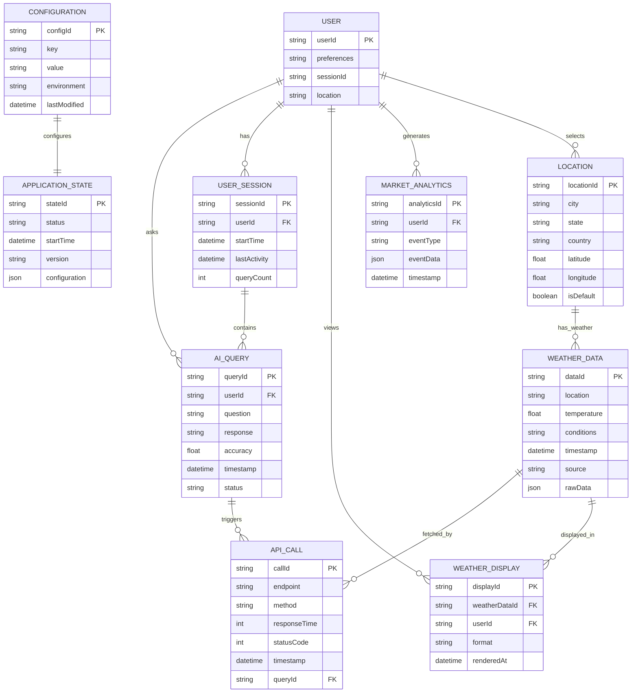

# Data Model

## Metadata
- **Type**: Data Model
- **Workspace**: HelloWeatherWorld
- **Generated**: 12/16/2025, 8:33:42 PM

## Diagram

```mermaid
erDiagram
    USER {
        string userId PK
        string preferences
        string sessionId
        string location
    }
    
    WEATHER_DATA {
        string dataId PK
        string location
        float temperature
        string conditions
        datetime timestamp
        string source
        json rawData
    }
    
    LOCATION {
        string locationId PK
        string city
        string state
        string country
        float latitude
        float longitude
        boolean isDefault
    }
    
    CONFIGURATION {
        string configId PK
        string key
        string value
        string environment
        datetime lastModified
    }
    
    AI_QUERY {
        string queryId PK
        string userId FK
        string question
        string response
        float accuracy
        datetime timestamp
        string status
    }
    
    API_CALL {
        string callId PK
        string endpoint
        string method
        int responseTime
        int statusCode
        datetime timestamp
        string queryId FK
    }
    
    APPLICATION_STATE {
        string stateId PK
        string status
        datetime startTime
        string version
        json configuration
    }
    
    WEATHER_DISPLAY {
        string displayId PK
        string weatherDataId FK
        string userId FK
        string format
        datetime renderedAt
    }
    
    USER_SESSION {
        string sessionId PK
        string userId FK
        datetime startTime
        datetime lastActivity
        int queryCount
    }
    
    MARKET_ANALYTICS {
        string analyticsId PK
        string userId FK
        string eventType
        json eventData
        datetime timestamp
    }
    
    USER ||--o{ AI_QUERY : "asks"
    USER ||--o{ USER_SESSION : "has"
    USER ||--o{ WEATHER_DISPLAY : "views"
    USER ||--o{ MARKET_ANALYTICS : "generates"
    
    LOCATION ||--o{ WEATHER_DATA : "has_weather"
    USER ||--o{ LOCATION : "selects"
    
    AI_QUERY ||--o{ API_CALL : "triggers"
    WEATHER_DATA ||--o{ API_CALL : "fetched_by"
    
    WEATHER_DATA ||--o{ WEATHER_DISPLAY : "displayed_in"
    
    CONFIGURATION ||--|| APPLICATION_STATE : "configures"
    
    USER_SESSION ||--o{ AI_QUERY : "contains"
```
