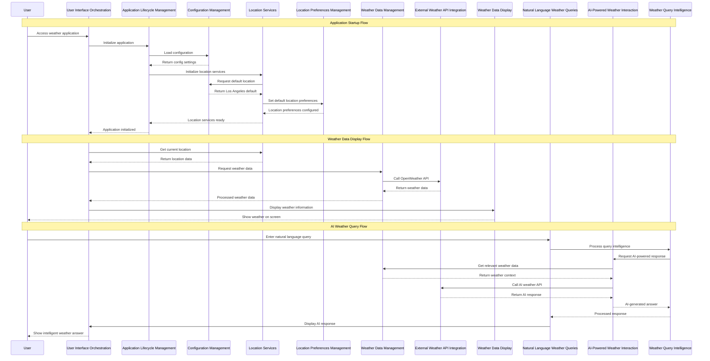

# Sequence Diagram

## Metadata
- **Type**: Sequence Diagram
- **Workspace**: HelloWeatherWorld
- **Generated**: 12/16/2025, 8:33:21 PM

## Diagram

```mermaid
sequenceDiagram
    participant User
    participant UI as User Interface Orchestration
    participant ALM as Application Lifecycle Management
    participant CM as Configuration Management
    participant LS as Location Services
    participant LPM as Location Preferences Management
    participant WDM as Weather Data Management
    participant EWAI as External Weather API Integration
    participant WDD as Weather Data Display
    participant NLWQ as Natural Language Weather Queries
    participant APWI as AI-Powered Weather Interaction
    participant WQI as Weather Query Intelligence

    Note over User,WQI: Application Startup Flow
    User->>UI: Access weather application
    UI->>ALM: Initialize application
    ALM->>CM: Load configuration
    CM-->>ALM: Return config settings
    ALM->>LS: Initialize location services
    LS->>CM: Request default location
    CM-->>LS: Return Los Angeles default
    LS->>LPM: Set default location preferences
    LPM-->>LS: Location preferences configured
    LS-->>ALM: Location services ready
    ALM-->>UI: Application initialized

    Note over User,WQI: Weather Data Display Flow
    UI->>LS: Get current location
    LS-->>UI: Return location data
    UI->>WDM: Request weather data
    WDM->>EWAI: Call OpenWeather API
    EWAI-->>WDM: Return weather data
    WDM-->>UI: Processed weather data
    UI->>WDD: Display weather information
    WDD-->>User: Show weather on screen

    Note over User,WQI: AI Weather Query Flow
    User->>NLWQ: Enter natural language query
    NLWQ->>WQI: Process query intelligence
    WQI->>APWI: Request AI-powered response
    APWI->>WDM: Get relevant weather data
    WDM-->>APWI: Return weather context
    APWI->>EWAI: Call AI weather API
    EWAI-->>APWI: Return AI response
    APWI-->>WQI: AI-generated answer
    WQI-->>NLWQ: Processed response
    NLWQ->>UI: Display AI response
    UI-->>User: Show intelligent weather answer
```
