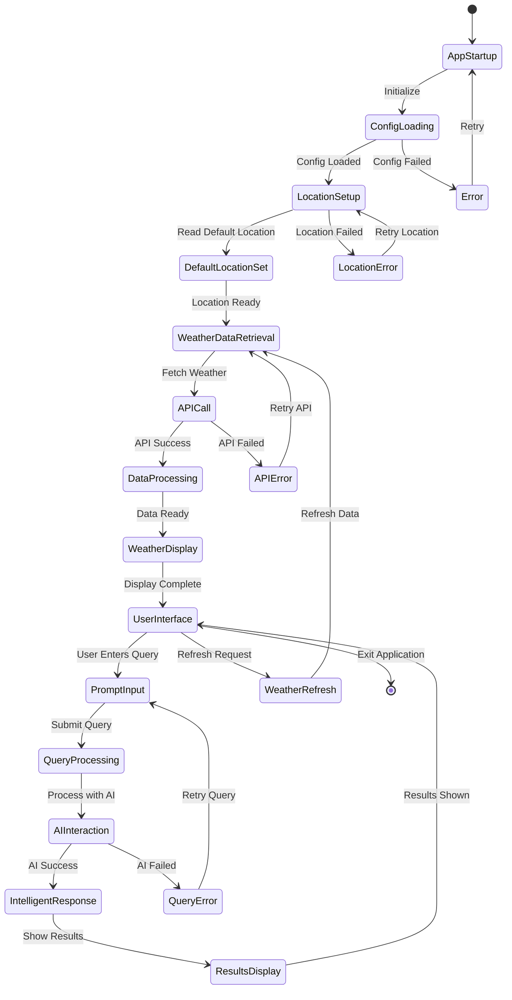

# State Diagram

## Metadata
- **Type**: State Diagram
- **Workspace**: HelloWeatherWorld
- **Generated**: 12/16/2025, 8:32:32 PM

## Diagram

```mermaid
stateDiagram-v2
    [*] --> AppStartup
    
    AppStartup --> ConfigLoading : Initialize
    ConfigLoading --> LocationSetup : Config Loaded
    ConfigLoading --> Error : Config Failed
    
    LocationSetup --> DefaultLocationSet : Read Default Location
    LocationSetup --> LocationError : Location Failed
    
    DefaultLocationSet --> WeatherDataRetrieval : Location Ready
    
    WeatherDataRetrieval --> APICall : Fetch Weather
    APICall --> DataProcessing : API Success
    APICall --> APIError : API Failed
    
    DataProcessing --> WeatherDisplay : Data Ready
    WeatherDisplay --> UserInterface : Display Complete
    
    UserInterface --> PromptInput : User Enters Query
    UserInterface --> WeatherRefresh : Refresh Request
    
    PromptInput --> QueryProcessing : Submit Query
    QueryProcessing --> AIInteraction : Process with AI
    AIInteraction --> IntelligentResponse : AI Success
    AIInteraction --> QueryError : AI Failed
    
    IntelligentResponse --> ResultsDisplay : Show Results
    ResultsDisplay --> UserInterface : Results Shown
    
    WeatherRefresh --> WeatherDataRetrieval : Refresh Data
    
    Error --> AppStartup : Retry
    LocationError --> LocationSetup : Retry Location
    APIError --> WeatherDataRetrieval : Retry API
    QueryError --> PromptInput : Retry Query
    
    UserInterface --> [*] : Exit Application
```
